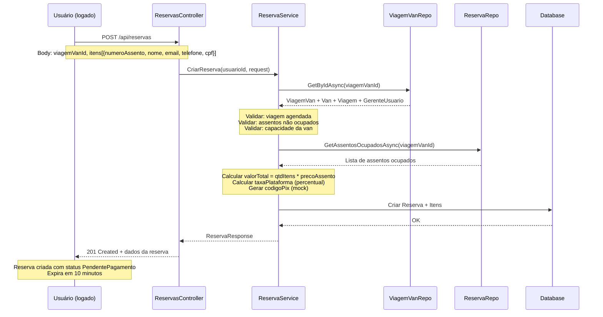

# Plano de Implementação — Dev 1 — Sprint 3 ✅ Implementado

> **Baseado no** [`docs/technical-plan.md`](docs/technical-plan.md)
> **Sprint 3:** Reservas e Pagamento (Depende da Sprint 2 — viagens com vans alocadas)
> **Dev 1:** US09 (Criar Reserva — 8 SP) + US14 (Ver Minhas Reservas — 2 SP)
> **Total:** 10 Story Points — **✅ 100% implementado**

---

## Sumário das Tarefas

| # | US | Descrição | SP | Depends | Status |
|---|----|-----------|----|---------|--------|
| 3.1 | **US09** | Criar Reserva | 8 | Sprint 2 (viagens + vans) | ✅ |
| 3.2 | **US14** | Ver Minhas Reservas | 2 | US09 | ✅ |

### Mapa de Sub-tarefas

| Sub | SP | Descrição | US | Status |
|-----|----|-----------|----|--------|
| 3.1.1 | 1.5 | Domain + Configs EF | US09 | ✅ |
| 3.1.2 | 1.5 | Repository | US09 | ✅ |
| 3.1.3 | 3.0 | DTOs + Validator + Mapping + Service | US09 | ✅ |
| 3.1.4 | 2.0 | Controller + DI + Migration | US09 | ✅ |
| 3.2.1 | 1.0 | Service (listar + obter) | US14 | ✅ |
| 3.2.2 | 1.0 | Controller + Migration + Test | US14 | ✅ |

---

## US09 — Criar Reserva (8 SP)

### Objetivo Geral

Implementar o endpoint `POST /api/reservas` que permite a qualquer usuário **autenticado** criar uma reserva de assentos em uma van alocada em uma viagem. A reserva nasce com status `PendentePagamento` e expira em 10 minutos.

### Regras de Negócio (Checklist)

- [✅] Apenas usuários **autenticados** podem criar reservas (qualquer `TipoUsuario`)
- [✅] A `ViagemVan` deve existir e pertencer a uma viagem com status `Agendada`
- [✅] A Van deve estar **ativa**
- [✅] Os assentos solicitados não podem estar ocupados (verificar `ItemReserva` existentes filtrando apenas reservas com status `PendentePagamento` ou `Confirmada`)
- [✅] A quantidade de assentos não pode exceder a capacidade disponível (`Van.Capacidade - 1`)
- [✅] O número do assento deve ser >= 1 e <= `Van.Capacidade - 1`
- [✅] `ValorTotal` = quantidade de itens × `Viagem.PrecoAssento`
- [✅] `TaxaPlataforma` = `ValorTotal × (Viagem.GerenteUsuario.TaxaPlataforma / 100)` — se `TaxaPlataforma` for `null`, considerar 0
- [✅] `CodigoPix` = string mock (ex: `"pix-mock-{reservaId:N}"`) — integração real com gateway será na US10 (Dev 2)
- [✅] Reserva expira em `CriadoEm + 10 minutos` (validação de expiração será feita no momento do pagamento — US10)
- [✅] Transação com `IUnitOfWork.BeginTransactionAsync` por segurança

### Fluxo



---

### Sub-tarefa 3.1.1 — Domain + Configs EF (1.5 SP)

**Objetivo:** Criar as configurações do Entity Framework para as entidades `Reserva` e `ItemReserva`, e atualizar o `AppDbContext` para expor os DbSets e aplicar as configurações.

#### Arquivos a criar

| # | Arquivo | Caminho |
|---|---------|---------|
| 1 | `ReservaConfiguration.cs` | `VanBora.Infrastructure/Data/Configurations/ReservaConfiguration.cs` |
| 2 | `ItemReservaConfiguration.cs` | `VanBora.Infrastructure/Data/Configurations/ItemReservaConfiguration.cs` |

#### Arquivos a modificar

| # | Arquivo | Caminho |
|---|---------|---------|
| 1 | `AppDbContext.cs` | `VanBora.Infrastructure/Data/AppDbContext.cs` |

---

#### 1. [`ReservaConfiguration.cs`](VanBora.Infrastructure/Data/Configurations/ReservaConfiguration.cs)

```csharp
// Configuração EF Core para Reserva:
// - ToTable("reservas")
// - Id (ValueGeneratedNever)
// - UsuarioId (FK → Usuarios)
// - ViagemVanId (FK → ViagemVans)
// - Status (HasConversion<string>, max 20)
// - ValorTotal (decimal(10,2))
// - TaxaPlataforma (decimal(10,2)) — mesmo precision de ValorTotal para evitar overflow em reservas grandes
// - CodigoPix (max 255)
// - TransacaoId (max 100, nullable)
// - PagoEm (nullable)
// - CriadoEm
// - ExpiraEm
// - Relacionamentos:
//     HasOne(r => r.Usuario).WithMany().HasForeignKey(r => r.UsuarioId).OnDelete(DeleteBehavior.Restrict)
//     HasOne(r => r.ViagemVan).WithMany(vv => vv.Reservas).HasForeignKey(r => r.ViagemVanId).OnDelete(DeleteBehavior.Restrict)
//     HasMany(r => r.Itens).WithOne(i => i.Reserva).HasForeignKey(i => i.ReservaId).OnDelete(DeleteBehavior.Cascade)
```

#### 2. [`ItemReservaConfiguration.cs`](VanBora.Infrastructure/Data/Configurations/ItemReservaConfiguration.cs)

```csharp
// Configuração EF Core para ItemReserva:
// - ToTable("itens_reserva")
// - Id (ValueGeneratedNever)
// - ReservaId (FK → Reservas, Cascade)
// - NumeroAssento (int, required)
// - PrecoAssento (decimal(10,2)) — mapped from Dinheiro.Value
// - NomePassageiro (max 100)
// - EmailPassageiro — usar OwnsOne ou HasConversion (ver Notas Técnicas)
// - TelefonePassageiro — usar OwnsOne (DDD + Numero)
// - CPFPassageiro — usar OwnsOne ou HasConversion
// - Índice único: (ReservaId, NumeroAssento) para garantir unicidade na mesma reserva
//
// ⚠️ ATENÇÃO com Value Objects:
// O ItemReserva possui Email, Telefone e CPF como Value Objects (VanBora.Domain.ValueObjects).
// Recomenda-se usar OwnsOne com nomes de coluna DISTINTOS para evitar conflito com UsuarioConfiguration:
//   - email_passageiro_valor (não apenas "email_valor")
//   - telefone_passageiro_ddd, telefone_passageiro_valor
//   - cpf_passageiro_valor
// Alternativa: HasConversion (mais simples para CPF e Email de coluna única).
```

> **Decisão de implementação:** Veja [Notas Técnicas sobre Value Objects](#value-objects-no-itemreserva) para detalhes sobre `OwnsOne` vs `HasConversion`.

#### 3. [`AppDbContext.cs`](VanBora.Infrastructure/Data/AppDbContext.cs) — Alterações

**Remover** as linhas que ignoram `Reserva` e `ItemReserva` (herança do Sprint 1 quando ainda não existiam):

```diff
- modelBuilder.Ignore<ItemReserva>();
- modelBuilder.Ignore<Reserva>();
```

**Adicionar** `DbSet`:

```csharp
public DbSet<Reserva> Reservas => Set<Reserva>();
public DbSet<ItemReserva> ItensReserva => Set<ItemReserva>();
```

**Adicionar** as configurações no `OnModelCreating`:

```csharp
modelBuilder.ApplyConfiguration(new ReservaConfiguration());
modelBuilder.ApplyConfiguration(new ItemReservaConfiguration());
```

---

### Sub-tarefa 3.1.2 — Repository (1.5 SP)

**Objetivo:** Criar o repositório de `Reserva` com todos os métodos necessários para o serviço, incluindo a consulta de assentos ocupados.

#### Arquivos a criar

| # | Arquivo | Caminho |
|---|---------|---------|
| 1 | `ReservaRepository.cs` | `VanBora.Infrastructure/Repositories/ReservaRepository.cs` |

> **Nota:** Não é necessário criar `IReservaRepository` — a interface já deve existir em `VanBora.Domain/Interfaces/IReservaRepository.cs`. Caso não exista, criá-la com os métodos abaixo.

#### Métodos a implementar

| Método | Descrição | Inclui |
|--------|-----------|--------|
| `GetByIdAsync(Guid id, CancellationToken)` | Busca reserva por ID com todas as navigations | Itens, ViagemVan→Van, ViagemVan→Viagem→GerenteUsuario, Usuario |
| `GetByUsuarioIdAsync(Guid usuarioId, CancellationToken)` | Lista reservas do usuário ordenado por `CriadoEm DESC` | Itens, ViagemVan→Van, ViagemVan→Viagem |
| `GetByViagemVanIdAsync(Guid viagemVanId, CancellationToken)` | Lista reservas de uma ViagemVan específica | — |
| `GetByViagemIdAsync(Guid viagemId, CancellationToken)` | Lista reservas de uma viagem (via ViagemVan) | ViagemVan |
| `GetAssentosOcupadosAsync(Guid viagemVanId, CancellationToken)` | Retorna `List<int>` dos `NumeroAssento` ocupados | Filtra reservas com status `PendentePagamento` ou `Confirmada` (reservas `Cancelada` ou `Expirada` liberam o assento) |
| `AddAsync(Reserva reserva, CancellationToken)` | Adiciona nova reserva ao contexto | — |
| `Update(Reserva reserva)` | Atualiza reserva existente | — |

#### ⚠️ Includes obrigatórios no `GetByIdAsync`

O `GetByIdAsync` precisa de `.Include()` completo para que o serviço `CriarReservaAsync` funcione corretamente:

```csharp
public async Task<Reserva?> GetByIdAsync(Guid id, CancellationToken cancellationToken = default)
{
    return await _context.Reservas
        .Include(r => r.Itens)
        .Include(r => r.ViagemVan)
            .ThenInclude(vv => vv.Van)
        .Include(r => r.ViagemVan)
            .ThenInclude(vv => vv.Viagem)
                .ThenInclude(v => v.GerenteUsuario)  // Necessário para acessar TaxaPlataforma
        .Include(r => r.Usuario)
        .FirstOrDefaultAsync(r => r.Id == id, cancellationToken);
}
```

> ⚠️ **Importante:** O `GerenteUsuario` (dono da viagem) é necessário no serviço `CriarReservaAsync` para calcular `TaxaPlataforma`. Sem esse include, a navegação `ViagemVan.Viagem.GerenteUsuario` retornará `null` e o cálculo falhará.

---

### Sub-tarefa 3.1.3 — DTOs + Validator + Mapping + Service (3 SP)

**Objetivo:** Criar os artefatos da camada Application: DTOs de request/response, validador FluentValidation, perfil do AutoMapper, interface do serviço e a implementação do serviço com o método `CriarReservaAsync`.

#### Arquivos a criar

| # | Arquivo | Caminho |
|---|---------|---------|
| 1 | `CriarReservaRequest.cs` | `VanBora.Application/DTOs/Reservas/CriarReservaRequest.cs` |
| 2 | `ReservaResponse.cs` | `VanBora.Application/DTOs/Reservas/ReservaResponse.cs` |
| 3 | `CriarReservaValidator.cs` | `VanBora.Application/Validators/CriarReservaValidator.cs` |
| 4 | `ReservaProfile.cs` | `VanBora.Application/Mappings/ReservaProfile.cs` |
| 5 | `IReservaService.cs` | `VanBora.Application/Interfaces/IReservaService.cs` |
| 6 | `ReservaService.cs` | `VanBora.Application/Services/ReservaService.cs` |

---

#### 1. [`CriarReservaRequest.cs`](VanBora.Application/DTOs/Reservas/CriarReservaRequest.cs)

```csharp
namespace VanBora.Application.DTOs.Reservas;

public record CriarReservaRequest(
    Guid ViagemVanId,
    List<ItemReservaRequest> Itens);

public record ItemReservaRequest(
    int NumeroAssento,
    string NomePassageiro,
    string EmailPassageiro,
    string TelefonePassageiro,
    string CpfPassageiro);
```

| Campo | Tipo | Regras |
|-------|------|--------|
| `ViagemVanId` | `Guid` | Obrigatório, deve existir |
| `Itens` | `List<ItemReservaRequest>` | Mínimo 1 item |
| `Itens[].NumeroAssento` | `int` | >= 1, <= capacidade-1, não pode estar ocupado |
| `Itens[].NomePassageiro` | `string` | Obrigatório, não vazio, max 100 |
| `Itens[].EmailPassageiro` | `string` | Email válido |
| `Itens[].TelefonePassageiro` | `string` | Telefone válido (11 dígitos) |
| `Itens[].CpfPassageiro` | `string` | CPF válido (11 dígitos) |

---

#### 2. [`ReservaResponse.cs`](VanBora.Application/DTOs/Reservas/ReservaResponse.cs)

```csharp
namespace VanBora.Application.DTOs.Reservas;

public class ReservaResponse
{
    public Guid Id { get; init; }
    public Guid UsuarioId { get; init; }
    public Guid ViagemVanId { get; init; }
    public string Status { get; init; } = string.Empty;
    public decimal ValorTotal { get; init; }
    public decimal TaxaPlataforma { get; init; }
    public string CodigoPix { get; init; } = string.Empty;
    public DateTime CriadoEm { get; init; }
    public DateTime ExpiraEm { get; init; }
    public List<ItemReservaResponse> Itens { get; init; } = [];
}

public class ItemReservaResponse
{
    public Guid Id { get; init; }
    public int NumeroAssento { get; init; }
    public decimal PrecoAssento { get; init; }
    public string NomePassageiro { get; init; } = string.Empty;
}
```

---

#### 3. [`CriarReservaValidator.cs`](VanBora.Application/Validators/CriarReservaValidator.cs)

```csharp
public class CriarReservaValidator : AbstractValidator<CriarReservaRequest>
{
    public CriarReservaValidator()
    {
        RuleFor(x => x.ViagemVanId)
            .NotEmpty().WithMessage("ViagemVanId é obrigatório.");

        RuleFor(x => x.Itens)
            .NotEmpty().WithMessage("Deve haver pelo menos um item na reserva.");

        RuleForEach(x => x.Itens).ChildRules(item =>
        {
            item.RuleFor(i => i.NumeroAssento)
                .GreaterThanOrEqualTo(1).WithMessage("Número do assento deve ser >= 1.");

            item.RuleFor(i => i.NomePassageiro)
                .NotEmpty().WithMessage("Nome do passageiro é obrigatório.")
                .MaximumLength(100);

            item.RuleFor(i => i.EmailPassageiro)
                .NotEmpty().WithMessage("Email do passageiro é obrigatório.")
                .EmailAddress().WithMessage("Email inválido.");

            item.RuleFor(i => i.TelefonePassageiro)
                .NotEmpty().WithMessage("Telefone do passageiro é obrigatório.")
                .Matches(@"^\d{10,11}$").WithMessage("Telefone deve ter 10 ou 11 dígitos (DDD + número).");

            item.RuleFor(i => i.CpfPassageiro)
                .NotEmpty().WithMessage("CPF do passageiro é obrigatório.")
                .Matches(@"^\d{11}$").WithMessage("CPF deve ter 11 dígitos.");
        });

        // Validar que não há assentos duplicados no request
        RuleFor(x => x.Itens)
            .Must(itens => itens.Select(i => i.NumeroAssento).Distinct().Count() == itens.Count)
            .WithMessage("Não pode haver dois itens com o mesmo número de assento.");
    }
}
```

---

#### 4. [`ReservaProfile.cs`](VanBora.Application/Mappings/ReservaProfile.cs)

```csharp
public sealed class ReservaProfile : Profile
{
    public ReservaProfile()
    {
        CreateMap<Reserva, ReservaResponse>()
            .ForMember(dest => dest.Status, opt => opt.MapFrom(src => src.Status.ToString()))
            .ForMember(dest => dest.Itens, opt => opt.MapFrom(src => src.Itens));

        CreateMap<ItemReserva, ItemReservaResponse>()
            .ForMember(dest => dest.PrecoAssento, opt => opt.MapFrom(src => src.PrecoAssento.Valor));
    }
}
```

> O `ReservaProfile` está no mesmo assembly (`VanBora.Application`) que os profiles existentes `VanProfile` e `ViagemProfile`. Ele será automaticamente descoberto pelo `AddAutoMapper(typeof(VanProfile).Assembly)`. **Nenhuma alteração adicional necessária no `Program.cs`.**

---

#### 5. [`IReservaService.cs`](VanBora.Application/Interfaces/IReservaService.cs)

```csharp
using VanBora.Application.DTOs.Reservas;
using VanBora.Domain.Common;

namespace VanBora.Application.Interfaces;

public interface IReservaService
{
    Task<Result<ReservaResponse>> CriarReservaAsync(
        Guid usuarioId,
        CriarReservaRequest request,
        CancellationToken cancellationToken = default);

    Task<Result<List<ReservaResponse>>> ListarMinhasReservasAsync(
        Guid usuarioId,
        CancellationToken cancellationToken = default);

    Task<Result<ReservaResponse>> ObterReservaPorIdAsync(
        Guid usuarioId,
        Guid reservaId,
        CancellationToken cancellationToken = default);
}
```

---

#### 6. [`ReservaService.cs`](VanBora.Application/Services/ReservaService.cs) — Método `CriarReservaAsync`

**Estrutura do método `CriarReservaAsync`:**

```
 1. Validar request com CriarReservaValidator
 2. Buscar ViagemVan por ID (incluindo Van + Viagem + GerenteUsuario)
 3. Se não encontrada → Error.NotFound("VIAGEMVAN_NAO_ENCONTRADA")
 4. Validar que a Viagem está Agendada
 5. Validar que a Van está Ativa
 6. Buscar assentos ocupados (GetAssentosOcupadosAsync)
    - Filtrar apenas reservas com status PendentePagamento ou Confirmada
    - Reservas Cancelada/Expirada liberam o assento
    - ⚠️ **Decisão:** Para liberar assentos de reservas expiradas automaticamente, o filtro da query deve incluir `ExpiraEm >= DateTime.UtcNow`. Dessa forma, reservas com status `PendentePagamento` mas com `ExpiraEm` no passado são desconsideradas, evitando que assentos expirados fiquem bloqueados. **Não** usar `ExpiracaoAutomatica()` no repositório, pois isso causaria efeito colateral em método de consulta (quebra do princípio CQRS).
 7. Validar que nenhum assento solicitado está ocupado
 8. ⚠️ Validar que cada `NumeroAssento <= Van.Capacidade - 1` (individualmente, não apenas o total)
    - Usar `viagemVan.ObterQuantidadeAssentosParaReserva()` como limite superior
    - Exemplo: se `Van.Capacidade = 20`, assentos válidos são 1 a 19
    - Retornar `Error.Validation("ASSENTO_INVALIDO", "Assento {numero} não existe.")` se exceder
 9. Validar que não excede capacidade disponível (quantidade de itens <= Van.Capacidade - 1)
10. Obter TaxaPlataforma do GerenteUsuario (Viagem.GerenteUsuario)
    - Se null → usar 0
11. Calcular valorTotal e taxaPlataforma
12. ⚠️ Gerar reservaId (Guid.NewGuid()) — necessário antes do codigoPix
13. ⚠️ Gerar codigoPix mock usando reservaId ("pix-mock-{reservaId:N}")
14. Iniciar transação (IUnitOfWork.BeginTransactionAsync)
15. Envolver as operações em try-catch-finally para garantir rollback em caso de falha:
    ```csharp
    try
    {
        // ... passos 16 a 18 dentro do try
    }
    catch
    {
        await _unitOfWork.RollbackAsync(cancellationToken);
        throw; // Re-lança para o ExceptionMiddleware tratar
    }
    ```
16. ⚠️ Criar entidade `Reserva(usuarioId, viagemVanId, valorTotal, taxaPlataforma, codigoPix)` — TODOS os 5 parâmetros do construtor são obrigatórios
    - O construtor da Reserva (linha 44) gera Id = Guid.NewGuid() internamente
    - ⚠️ O Id gerado internamente não baterá com o reservaId usado no codigoPix
    - Isso é intencional: o codigoPix é um mock que não precisa referenciar o Id real
17. Para cada item:
    a. Criar Dinheiro via Dinheiro.Criar(viagem.PrecoAssento) — retorna Result<Dinheiro>
    b. Se falhar → propagar erro
    c. ⚠️ Converter strings do request para Value Objects:
        - Email.Criar(email) → retorna Result<Email>
        - Telefone.Criar(telefone) → retorna Result<Telefone> (usar sobrecarga que aceita string completa de 10 ou 11 dígitos)
        - CPF.Criar(cpf) → retorna Result<CPF>
       Cada conversão deve verificar IsFailure e propagar erro se falhar.
    d. Criar ItemReserva(numeroAssento, precoAssentoResult.Value, nome, emailResult.Value, telefoneResult.Value, cpfResult.Value)
    e. Adicionar à reserva via reserva.AdicionarItem(item)
    (EF Core preenche ReservaId automaticamente quando o item é adicionado à coleção)
18. Salvar (reservaRepo.AddAsync + _unitOfWork.SaveChangesAsync)
19. Commitar transação
20. Mapear para ReservaResponse e retornar Success
```

**Cálculos:**

```
valorTotal = itens.Count * viagem.PrecoAssento
taxaPlataforma = valorTotal * ((gerente?.TaxaPlataforma ?? 0m) / 100m)
codigoPix = $"pix-mock-{reservaId:N}"      // ← usa reservaId gerado manualmente, não reserva.Id
```

> ⚠️ **Chicken-and-egg entre `reserva.Id` e `codigoPix`:** O construtor de [`Reserva`](VanBora.Domain/Entities/Reserva.cs:44) gera `Id = Guid.NewGuid()` internamente. O parâmetro `codigoPix` é exigido no construtor (linha 50) e `CodigoPix` tem `private set` (linha 14). Portanto, é impossível gerar `codigoPix` usando `reserva.Id` antes de construir a reserva. A solução é **gerar o `reservaId` manualmente** com `Guid.NewGuid()` ANTES de criar a entidade, e usar esse Id no mock do codigoPix. O Id interno gerado pelo construtor será diferente, e isso é aceitável pois o mock não precisa referenciar o Id real — quando o gateway real for integrado (US10), o codigoPix virá do provedor de pagamento.

> ⚠️ **`Dinheiro.Criar()` — factory method obrigatório:** O construtor de `Dinheiro` é privado. Para criar um `Dinheiro` para o `ItemReserva`:
> ```csharp
> var precoAssentoResult = Dinheiro.Criar(viagem.PrecoAssento);
> if (precoAssentoResult.IsFailure)
>     return Result<ReservaResponse>.Failure(precoAssentoResult.Error!);
> ```
> O `ItemReserva.PrecoAssento` é do tipo `Dinheiro`, não `decimal`.

> ⚠️ **Conversão de strings para Value Objects no ItemReserva:** O construtor de `ItemReserva` espera `Email`, `Telefone` e `CPF` (Value Objects), não `string`. O request (`CriarReservaRequest`) fornece strings, então é necessário convertê-las usando os factory methods **antes** de criar o `ItemReserva`:
> ```csharp
> // Cada ItemReservaRequest tem: email, telefone, cpf (strings)
> var emailResult = Email.Criar(item.EmailPassageiro);
> if (emailResult.IsFailure)
>     return Result<ReservaResponse>.Failure(emailResult.Error!);
>
> var telefoneResult = Telefone.Criar(item.TelefonePassageiro);
> if (telefoneResult.IsFailure)
>     return Result<ReservaResponse>.Failure(telefoneResult.Error!);
>
> var cpfResult = CPF.Criar(item.CpfPassageiro);
> if (cpfResult.IsFailure)
>     return Result<ReservaResponse>.Failure(cpfResult.Error!);
>
> var itemReserva = new ItemReserva(
>     item.NumeroAssento,
>     precoAssentoResult.Value,
>     item.NomePassageiro,
>     emailResult.Value,
>     telefoneResult.Value,
>     cpfResult.Value);
> ```

**Tratamento de erros:**

| Erro | Error Code | HTTP Status |
|------|-----------|-------------|
| ViagemVan não encontrada | `VIAGEMVAN_NAO_ENCONTRADA` | 404 |
| Viagem não está Agendada | `VIAGEM_NAO_AGENDADA` | 400 |
| Van inativa | `VAN_INATIVA` | 400 |
| Assento já ocupado | `ASSENTO_OCUPADO` | 409 |
| Capacidade excedida | `CAPACIDADE_EXCEDIDA` | 400 |
| Request inválido | `*` (do validator) | 400 |
| Acesso negado (US14) | `ACESSO_NEGADO` | 403 |

> ⚠️ **TaxaPlataforma nullable:** `GerenteUsuario.TaxaPlataforma` é `decimal?` (nullable). O serviço deve verificar se é nulo e, nesse caso, considerar taxa 0. `Viagem.PrecoAssento` é `decimal` (não `Dinheiro`), então o cálculo usa o valor decimal diretamente.

**Dependências do construtor:**

```csharp
public class ReservaService : IReservaService
{
    private readonly IReservaRepository _reservaRepo;
    private readonly IViagemVanRepository _viagemVanRepo;
    private readonly IValidator<CriarReservaRequest> _validator;
    private readonly IMapper _mapper;
    private readonly IUnitOfWork _unitOfWork;

    public ReservaService(
        IReservaRepository reservaRepo,
        IViagemVanRepository viagemVanRepo,
        IValidator<CriarReservaRequest> validator,
        IMapper mapper,
        IUnitOfWork unitOfWork)
    {
        _reservaRepo = reservaRepo;
        _viagemVanRepo = viagemVanRepo;
        _validator = validator;
        _mapper = mapper;
        _unitOfWork = unitOfWork;
    }
}
```

---

### Sub-tarefa 3.1.4 — Controller + DI + Migration (2 SP)

**Objetivo:** Criar o controller de reservas com o endpoint `POST /api/reservas`, registrar as dependências no container DI, gerar a migration do EF Core e testar via Swagger.

#### Arquivos a criar

| # | Arquivo | Caminho |
|---|---------|---------|
| 1 | `ReservasController.cs` | `Api/Controllers/ReservasController.cs` |

#### Arquivos a modificar

| # | Arquivo | Caminho | Alteração |
|---|---------|---------|-----------|
| 1 | `ServiceCollectionExtensions.cs` | `VanBora.Infrastructure/Extensions/ServiceCollectionExtensions.cs` | AddScoped `IReservaRepository → ReservaRepository` |
| 2 | `Program.cs` | `Api/Program.cs` | AddScoped `IReservaService → ReservaService` e `IValidator<CriarReservaRequest> → CriarReservaValidator` |
| 3 | `ViagemVanRepository.cs` | `VanBora.Infrastructure/Repositories/ViagemVanRepository.cs` | Adicionar `.ThenInclude(v => v.GerenteUsuario)` no `GetByIdAsync` |

---

#### 1. [`ReservasController.cs`](Api/Controllers/ReservasController.cs) — Endpoint POST

> ⚠️ **Usings necessários:** O código abaixo usa `ClaimTypes.NameIdentifier` (namespace `System.Security.Claims`). Certifique-se de adicionar `using System.Security.Claims;` no topo do arquivo.

```csharp
[ApiController]
[Authorize]
[Route("api/[controller]")]
public class ReservasController : ControllerBase
{
    private readonly IReservaService _reservaService;

    public ReservasController(IReservaService reservaService)
    {
        _reservaService = reservaService;
    }

    [HttpPost]
    [ProducesResponseType(typeof(ReservaResponse), StatusCodes.Status201Created)]
    [ProducesResponseType(StatusCodes.Status400BadRequest)]
    [ProducesResponseType(StatusCodes.Status404NotFound)]
    [ProducesResponseType(StatusCodes.Status409Conflict)]
    public async Task<IActionResult> CriarReserva(
        [FromBody] CriarReservaRequest request,
        CancellationToken cancellationToken)
    {
        var usuarioId = ObterUsuarioId();
        var result = await _reservaService.CriarReservaAsync(usuarioId, request, cancellationToken);

        // ResultFilter intercepta ObjectResult cujo Value implemente IAppResult
        if (result.IsFailure)
            return new ObjectResult(result);

        return Created(string.Empty, result.Value);
    }

    private Guid ObterUsuarioId()
    {
        var claim = User.FindFirstValue(ClaimTypes.NameIdentifier);
        return Guid.TryParse(claim, out var id) ? id : Guid.Empty;
    }
}
```

> ⚠️ **`Result<T>` não tem `implicit operator` para `IActionResult`:** O `ResultFilter` (filtro global registrado em `Program.cs`) intercepta automaticamente `ObjectResult` cujo `Value` implemente `IAppResult`. Por isso o padrão é retornar `new ObjectResult(result)` para casos de falha. A sintaxe `return result;` NÃO funciona porque `Result<ReservaResponse>` não possui conversão implícita para `IActionResult`. Use o padrão `if (result.IsFailure) return new ObjectResult(result);` conforme já feito em [`ViagensController`](Api/Controllers/ViagensController.cs:33).

#### 2. [`ServiceCollectionExtensions.cs`](VanBora.Infrastructure/Extensions/ServiceCollectionExtensions.cs) — DI (Infrastructure)

Adicionar o registro do repositório (APENAS o repositório — a camada Infrastructure registra apenas repositórios e serviços de infraestrutura):

```csharp
services.AddScoped<IReservaRepository, ReservaRepository>();
```

#### 3. [`Program.cs`](Api/Program.cs) — DI (Application)

Adicionar os registros dos serviços da camada Application e validators:

```csharp
builder.Services.AddScoped<IReservaService, ReservaService>();
builder.Services.AddScoped<IValidator<CriarReservaRequest>, CriarReservaValidator>();
```

> ⚠️ **Importante:** `ReservaService` pertence à camada **Application** (mesmo assembly que `ViagemService`, `VanService`, `AuthService`). Por isso deve ser registrado **APENAS em `Program.cs`**, não em `ServiceCollectionExtensions.cs` (que registra apenas serviços da Infrastructure: repositórios e `TokenService`). Registrar em ambos causaria duplicação acidental de instâncias.

#### 3.5 — Modificar `ViagemVanRepository.GetByIdAsync`

O [`ViagemVanRepository.GetByIdAsync`](VanBora.Infrastructure/Repositories/ViagemVanRepository.cs:17) existente precisa ser modificado para incluir `Viagem.GerenteUsuario`, necessário para o `ReservaService` acessar `GerenteUsuario.TaxaPlataforma` no cálculo da taxa da plataforma:

```diff
 public async Task<ViagemVan?> GetByIdAsync(Guid id, CancellationToken cancellationToken = default)
 {
     return await _context.ViagemVans
         .Include(vv => vv.Viagem)
+            .ThenInclude(v => v.GerenteUsuario)
         .Include(vv => vv.Van)
         .Include(vv => vv.MotoristaUsuario)
         .FirstOrDefaultAsync(vv => vv.Id == id, cancellationToken);
 }
```

> **Nota:** Esta modificação é no `ViagemVanRepository` existente (criado na Sprint 2), não na criação de um novo repositório. Sem este `ThenInclude`, a navegação `ViagemVan.Viagem.GerenteUsuario` retornará `null` e o cálculo da `TaxaPlataforma` falhará.

#### 4. Migration

```bash
# No terminal, no diretório da Infrastructure:
Add-Migration AddReservas
Update-Database
```

> A migration deve capturar as novas tabelas `reservas` e `itens_reserva`, além de remover os `modelBuilder.Ignore<Reserva>()` e `modelBuilder.Ignore<ItemReserva>()` do `AppDbContext`.

#### 5. Teste via Swagger

1. Executar a aplicação
2. Fazer login como qualquer usuário autenticado
3. Testar `POST /api/reservas` com um `viagemVanId` válido e itens
4. Verificar retorno `201 Created` com os dados da reserva
5. Testar cenários de erro (assento ocupado, viagemVan inválida, etc.)

---

## US14 — Ver Minhas Reservas (2 SP)

### Objetivo Geral

Implementar endpoints para que o usuário logado possa visualizar suas próprias reservas.

### Regras de Negócio

- [✅] Apenas o **dono da reserva** pode visualizá-la
- [✅] A listagem retorna **todas** as reservas do usuário, independente do status
- [✅] Ordenação da listagem: mais recentes primeiro (`CriadoEm DESC`)
- [✅] O detalhe inclui os itens da reserva com dados dos passageiros

### Endpoints

| Método | Rota | Descrição |
|--------|------|-----------|
| `GET` | `/api/reservas/minhas` | Lista todas as reservas do usuário autenticado |
| `GET` | `/api/reservas/{reservaId:guid}` | Detalhes de uma reserva específica (apenas se for do usuário) |

---

### Sub-tarefa 3.2.1 — Service (listar + obter) (1 SP)

**Objetivo:** Adicionar os métodos `ListarMinhasReservasAsync` e `ObterReservaPorIdAsync` no `ReservaService`.

#### Arquivos a modificar

| # | Arquivo | Caminho | Alteração |
|---|---------|---------|-----------|
| 1 | `ReservaService.cs` | `VanBora.Application/Services/ReservaService.cs` | Adicionar 2 métodos |

> **DTO de resposta:** Usar o mesmo [`ReservaResponse`](VanBora.Application/DTOs/Reservas/ReservaResponse.cs) criado na Sub-tarefa 3.1.3 para ambos os endpoints. A estrutura é a mesma. Se quiser um DTO simplificado para listagem (apenas resumo), pode criar `MinhasReservasResponse.cs` opcionalmente.

#### Métodos a adicionar

```csharp
// === LISTAR MINHAS RESERVAS ===
public async Task<Result<List<ReservaResponse>>> ListarMinhasReservasAsync(
    Guid usuarioId,
    CancellationToken cancellationToken)
{
    var reservas = await _reservaRepo.GetByUsuarioIdAsync(usuarioId, cancellationToken);
    var response = _mapper.Map<List<ReservaResponse>>(reservas);
    return Result<List<ReservaResponse>>.Success(response);
}

// === OBTER RESERVA POR ID (com validação de dono) ===
public async Task<Result<ReservaResponse>> ObterReservaPorIdAsync(
    Guid usuarioId,
    Guid reservaId,
    CancellationToken cancellationToken)
{
    var reserva = await _reservaRepo.GetByIdAsync(reservaId, cancellationToken);

    if (reserva is null)
        return Result<ReservaResponse>.Failure(
            Error.NotFound("RESERVA_NAO_ENCONTRADA", "Reserva não encontrada."));

    if (reserva.UsuarioId != usuarioId)
        return Result<ReservaResponse>.Failure(
            Error.Forbidden("ACESSO_NEGADO", "Você não tem permissão para visualizar esta reserva."));

    var response = _mapper.Map<ReservaResponse>(reserva);
    return Result<ReservaResponse>.Success(response);
}
```

> O `ObterReservaPorIdAsync` já usa os includes completos configurados no `GetByIdAsync` do `ReservaRepository` (Sub-tarefa 3.1.2), incluindo `ViagemVan.Viagem.GerenteUsuario` — necessário para exibir dados do gerente quando a interface consumir.

---

### Sub-tarefa 3.2.2 — Controller + Migration + Test (1 SP)

**Objetivo:** Adicionar os endpoints GET no `ReservasController` e testar via Swagger.

#### Arquivos a modificar

| # | Arquivo | Caminho | Alteração |
|---|---------|---------|-----------|
| 1 | `ReservasController.cs` | `Api/Controllers/ReservasController.cs` | Adicionar 2 endpoints GET |

#### Endpoints a adicionar no [`ReservasController.cs`](Api/Controllers/ReservasController.cs)

```csharp
[HttpGet("minhas")]
[ProducesResponseType(typeof(List<ReservaResponse>), StatusCodes.Status200OK)]
public async Task<IActionResult> ListarMinhasReservas(CancellationToken cancellationToken)
{
    var usuarioId = ObterUsuarioId();
    var result = await _reservaService.ListarMinhasReservasAsync(usuarioId, cancellationToken);

    // ResultFilter intercepta ObjectResult cujo Value implemente IAppResult
    if (result.IsFailure)
        return new ObjectResult(result);

    return Ok(result.Value);
}

[HttpGet("{reservaId:guid}")]
[ProducesResponseType(typeof(ReservaResponse), StatusCodes.Status200OK)]
[ProducesResponseType(StatusCodes.Status404NotFound)]
[ProducesResponseType(StatusCodes.Status403Forbidden)]
public async Task<IActionResult> ObterReservaPorId(
    Guid reservaId,
    CancellationToken cancellationToken)
{
    var usuarioId = ObterUsuarioId();
    var result = await _reservaService.ObterReservaPorIdAsync(usuarioId, reservaId, cancellationToken);

    // ResultFilter intercepta ObjectResult cujo Value implemente IAppResult
    if (result.IsFailure)
        return new ObjectResult(result);

    return Ok(result.Value);
}
```

> **Migration:** Como os endpoints GET são apenas leitura e não alteram o banco de dados, nenhuma migration adicional é necessária. A migration gerada na Sub-tarefa 3.1.4 já contempla todas as tabelas necessárias.

#### Teste via Swagger

1. Executar a aplicação
2. Fazer login como usuário com pelo menos uma reserva criada
3. Testar `GET /api/reservas/minhas` — deve retornar `200 OK` com a lista
4. Testar `GET /api/reservas/{id}` com um ID válido — deve retornar `200 OK`
5. Testar `GET /api/reservas/{id}` com um ID de outro usuário — deve retornar `403 Forbidden`
6. Testar `GET /api/reservas/{id}` com um ID inexistente — deve retornar `404 NotFound`

---

## Ordem de Implementação Sugerida

Para minimizar bloqueios e permitir testes incrementais:

> ⚠️ **A ordem abaixo já inclui o registro de DI (`IReservaRepository`, `IReservaService`, validators) ANTES de gerar migration e testar.** A migration e os testes exigem que os services e repositórios estejam registrados no container DI.

```
========== [ SUB-TAREFA 3.1.1 — Domain + Configs EF ] ==========
Step  1: Infrastructure — Criar ReservaConfiguration.cs
Step  2: Infrastructure — Criar ItemReservaConfiguration.cs
Step  3: Infrastructure — Atualizar AppDbContext (remover Ignore + add DbSet + ApplyConfiguration)

========== [ SUB-TAREFA 3.1.2 — Repository ] ==========
Step  4: Infrastructure — Criar ReservaRepository.cs (todos os métodos)

========== [ SUB-TAREFA 3.1.3 — DTOs + Validator + Mapping + Service ] ==========
Step  5: Application — Criar CriarReservaRequest.cs
Step  6: Application — Criar ReservaResponse.cs
Step  7: Application — Criar CriarReservaValidator.cs
Step  8: Application — Criar ReservaProfile.cs
Step  9: Application — Criar IReservaService.cs
Step 10: Application — Criar ReservaService.cs (método CriarReservaAsync)

========== [ SUB-TAREFA 3.1.4 — Controller + DI + Migration + Test ] ==========
Step 11: API — Criar ReservasController.cs (POST /api/reservas)
Step 12: *** REGISTRAR DI ***
         - ServiceCollectionExtensions.cs → AddScoped<IReservaRepository, ReservaRepository>
         - Program.cs → AddScoped<IReservaService, ReservaService>
         - Program.cs → AddScoped<IValidator<CriarReservaRequest>, CriarReservaValidator>
Step 13: Infrastructure — Modificar ViagemVanRepository.GetByIdAsync (adicionar ThenInclude GerenteUsuario)
Step 14: Gerar migration EF Core (Add-Migration AddReservas + Update-Database)
Step 15: Testar POST /api/reservas via Swagger

========== [ SUB-TAREFA 3.2.1 — Service (listar + obter) ] ==========
Step 16: Application — Adicionar ListarMinhasReservasAsync + ObterReservaPorIdAsync no ReservaService

========== [ SUB-TAREFA 3.2.2 — Controller + Test ] ==========
Step 17: API — Adicionar GET /api/reservas/minhas + GET /api/reservas/{id} no ReservasController
Step 18: Testar endpoints GET via Swagger
```

---

## Dependências com Outros Devs

| Dependência | Dev | Descrição |
|-------------|-----|-----------|
| `POST /api/reservas/{id}/pagar` (US10) | **Dev 2** | Webhook de pagamento e confirmação — depende do endpoint POST que o Dev 1 cria |
| `POST /api/reservas/{id}/cancelar` (US11) | **Dev 2** | Cancelamento de reserva — atualiza status da reserva criada pelo Dev 1 |
| `ReservaService.GerarPagamento` | **Dev 2** | Método no ReservaService que o Dev 2 implementa após o Dev 1 criar a classe |
| Gestão de reservas no relatório financeiro | **Dev 3** | US12 depende das reservas estarem persistidas |

---

## Notas Técnicas

### Value Objects no ItemReserva

O [`ItemReserva`](VanBora.Domain/Entities/ItemReserva.cs) usa `Email`, `Telefone`, `CPF` e `Dinheiro` como Value Objects (`VanBora.Domain.ValueObjects`). Existem duas abordagens para configurar no EF Core:

**Opção 1 — `OwnsOne` (recomendado por consistência):**

```csharp
// ItemReservaConfiguration.cs

// --- PrecoAssento (Dinheiro) ---
builder.OwnsOne(i => i.PrecoAssento, dinheiro =>
{
    dinheiro.Property(d => d.Valor)
        .HasColumnType("decimal(10,2)")
        .HasColumnName("preco_assento_valor")
        .IsRequired();

    // Para manter coerência com o uso de BRL, a Moeda pode ser ignorada (sempre "BRL")
    // Caso queira armazenar, adicione:
    // dinheiro.Property(d => d.Moeda).HasMaxLength(3).HasColumnName("preco_assento_moeda").HasDefaultValue("BRL");
});

// --- EmailPassageiro ---
builder.OwnsOne(i => i.EmailPassageiro, email =>
{
    email.Property(e => e.Valor).HasMaxLength(254).HasColumnName("email_passageiro");
});

// --- TelefonePassageiro ---
builder.OwnsOne(i => i.TelefonePassageiro, tel =>
{
    tel.Property(t => t.DDD).HasMaxLength(2).HasColumnName("telefone_passageiro_ddd");
    tel.Property(t => t.Numero).HasMaxLength(9).HasColumnName("telefone_passageiro_valor");
});

// --- CPFPassageiro ---
builder.OwnsOne(i => i.CPFPassageiro, cpf =>
{
    cpf.Property(c => c.Valor).HasMaxLength(11).HasColumnName("cpf_passageiro");
});
```

> ⚠️ **Nomes de coluna distintos:** Os nomes das colunas (`email_passageiro`, `cpf_passageiro`, `telefone_passageiro_ddd`, `telefone_passageiro_valor`, `preco_assento_valor`) são propositalmente diferentes dos usados em `UsuarioConfiguration` (`email_valor`, `cpf_valor`, `telefone_ddd`, `telefone_valor`) para evitar conflito de colunas.

**Opção 2 — `HasConversion` (mais simples):**

```csharp
builder.Property(i => i.CPFPassageiro)
    .HasConversion(cpf => cpf.Valor, value => CPF.Criar(value).GetValueOrThrow())
    .HasMaxLength(11)
    .HasColumnName("cpf_passageiro");

builder.Property(i => i.PrecoAssento)
    .HasConversion(dinheiro => dinheiro.Valor, value => Dinheiro.Criar(value).GetValueOrThrow())
    .HasColumnType("decimal(10,2)")
    .HasColumnName("preco_assento");
```

> ⚠️ **`HasConversion` perde a moeda:** Ao usar `HasConversion` com `Dinheiro`, apenas o `Valor` (decimal) é persistido. A `Moeda` é perdida, o que é aceitável pois todas as reservas usam BRL.

> **Recomendação:** Usar `OwnsOne` para consistência com o resto do projeto, a menos que ocorra conflito com outras configurações.

### Índice de Unicidade

Adicionar um índice composto em `ItemReserva` para garantir que o mesmo assento não seja reservado duas vezes na mesma `Reserva`:

```csharp
// Em ItemReservaConfiguration:
builder.HasIndex(i => new { i.ReservaId, i.NumeroAssento })
    .IsUnique()
    .HasDatabaseName("ix_itens_reserva_reserva_id_assento");
```

> ⚠️ **Este índice EVITA duplicidade DENTRO da mesma reserva, não entre reservas diferentes.** Para prevenir concorrência (dois usuários booking o mesmo assento simultaneamente), a lógica de `GetAssentosOcupadosAsync` + transação não é suficiente (TOCTOU — Time-of-check Time-of-use). Recomenda-se usar **`BeginTransactionAsync` com `IsolationLevel.Serializable`** ou **usar `_context.Database.ExecuteSqlRaw` com `SELECT ... FOR UPDATE`** na `ViagemVan` dentro da transação para travar a linha.
>
> ⚠️ **`IUnitOfWork.BeginTransactionAsync` atual não suporta `IsolationLevel`.** Será necessário:
> - Adicionar uma sobrecarga: `Task BeginTransactionAsync(IsolationLevel isolationLevel, CancellationToken cancellationToken = default)` na interface `IUnitOfWork`, implementar em `UnitOfWork` e `AppDbContext`.
> - Ou usar `_context.Database.ExecuteSqlInterpolatedAsync($"SELECT 1 FROM \"ViagemVans\" WHERE \"Id\" = {viagemVanId} FOR UPDATE")` diretamente no `ReservaService`.

### Mock do Código Pix

Enquanto o gateway de pagamento não é implementado (US10 — Dev 2), o `CodigoPix` será um mock seguindo o formato abaixo. O código usa o `reservaId` gerado manualmente no passo 11 (antes da criação da entidade), **não** `reserva.Id` (que só existe após a construção da entidade):

```csharp
// reservaId foi gerado manualmente com Guid.NewGuid() no passo 11
var codigoPix = $"pix-mock-{reservaId:N}";
```

### ⚠️ Bug no `Guard.AgainstInvalidState` em 5 métodos de `Reserva.cs` ✅ Corrigido

O método `Guard.AgainstInvalidState(condition, message)` em [`VanBora.Domain/Common/Guard.cs`](VanBora.Domain/Common/Guard.cs) lança uma `InvalidOperationException` se a `condition` for **`true`**. A condição deve representar o **estado INVÁLIDO** para a operação.

O código existente em [`Reserva.cs`](VanBora.Domain/Entities/Reserva.cs) possui esse bug em **5 métodos**. Abaixo, a correção para cada um:

#### a) `ConfirmarPagamento()` — Linha 64

```csharp
// ❌ ATUAL (bug): impede confirmação quando está PendentePagamento
Guard.AgainstInvalidState(
    Status == StatusReserva.PendentePagamento,
    "Apenas reservas pendentes de pagamento podem ser confirmadas.");

// ✅ CORRETO: estado inválido = NÃO estar pendente
Guard.AgainstInvalidState(
    Status != StatusReserva.PendentePagamento,
    "Apenas reservas pendentes de pagamento podem ser confirmadas.");
```

#### b) `Cancelar()` — Linha 74

```csharp
// ❌ ATUAL (bug): permite cancelar apenas quando NÃO está Concluida
// (impede cancelamento de PendentePagamento, Confirmada, EmAndamento...)
Guard.AgainstInvalidState(
    Status != StatusReserva.Concluida,
    "Reserva já concluída não pode ser cancelada.");

// ✅ CORRETO: estado inválido = ESTAR concluída
Guard.AgainstInvalidState(
    Status == StatusReserva.Concluida,
    "Reserva já concluída não pode ser cancelada.");
```

#### c) `Cancelar()` — Linha 75

```csharp
// ❌ ATUAL (bug): permite cancelar apenas quando NÃO está Cancelada
// (impede cancelamento de PendentePagamento, Confirmada...)
Guard.AgainstInvalidState(
    Status != StatusReserva.Cancelada,
    "Reserva já está cancelada.");

// ✅ CORRETO: estado inválido = JÁ estar cancelada
Guard.AgainstInvalidState(
    Status == StatusReserva.Cancelada,
    "Reserva já está cancelada.");
```

#### d) `IniciarViagem()` — Linha 82

```csharp
// ❌ ATUAL (bug): impede iniciar viagem quando está Confirmada
Guard.AgainstInvalidState(
    Status == StatusReserva.Confirmada,
    "Apenas reservas confirmadas podem iniciar a viagem.");

// ✅ CORRETO: estado inválido = NÃO estar confirmada
Guard.AgainstInvalidState(
    Status != StatusReserva.Confirmada,
    "Apenas reservas confirmadas podem iniciar a viagem.");
```

#### e) `Concluir()` — Linha 89

```csharp
// ❌ ATUAL (bug): impede concluir quando está EmAndamento
Guard.AgainstInvalidState(
    Status == StatusReserva.EmAndamento,
    "Apenas reservas em andamento podem ser concluídas.");

// ✅ CORRETO: estado inválido = NÃO estar em andamento
Guard.AgainstInvalidState(
    Status != StatusReserva.EmAndamento,
    "Apenas reservas em andamento podem ser concluídas.");
```

> ⚠️ **Impacto no Dev 1:** Esses bugs impedem o fluxo básico de reserva (criar reserva → pagar → confirmar) e também afetam o cancelamento, início e conclusão de viagem. Recomenda-se corrigir todos os 5 métodos **antes** de implementar a US09. O arquivo a modificar é [`VanBora.Domain/Entities/Reserva.cs`](VanBora.Domain/Entities/Reserva.cs).

### ⚠️ Mesmo bug se repete em [`Viagem.cs`](VanBora.Domain/Entities/Viagem.cs) ✅ Corrigido

O mesmo padrão de `Guard.AgainstInvalidState` com condição invertida também existe em [`Viagem.cs`](VanBora.Domain/Entities/Viagem.cs), nos métodos `Iniciar()`, `Concluir()`, `Cancelar()`, `AtualizarDados()` e no construtor:

| Método | Linha | ❌ Atual (bug) | ✅ Correção |
|--------|-------|----------------|-------------|
| Construtor | 47 | `dataPartida < dataEvento` | `dataPartida >= dataEvento` |
| `AtualizarDados()` | 74 | `dataPartida < dataEvento` | `dataPartida >= dataEvento` |
| `Iniciar()` | 86 | `Status == StatusViagem.Agendada` | `Status != StatusViagem.Agendada` |
| `Concluir()` | 93 | `Status == StatusViagem.EmAndamento` | `Status != StatusViagem.EmAndamento` |
| `Cancelar()` (1º) | 100 | `Status != StatusViagem.Concluida` | `Status == StatusViagem.Concluida` |
| `Cancelar()` (2º) | 101 | `Status != StatusViagem.Cancelada` | `Status == StatusViagem.Cancelada` |

> 🔴 **Recomendação:** Corrigir também os Guards de [`Viagem.cs`](VanBora.Domain/Entities/Viagem.cs) neste mesmo Sprint, pois são o mesmo padrão de erro e o fluxo de reserva depende do status da `Viagem` (`Agendada`). Sem essa correção, métodos como `Viagem.Iniciar()` lançarão exceção mesmo com status válido, comprometendo o fluxo completo.
>
> ✅ **Status:** Ambos os bugs (`Reserva.cs` e `Viagem.cs`) foram corrigidos. Todos os `Guard.AgainstInvalidState` agora validam corretamente o estado inválido, não o válido.
