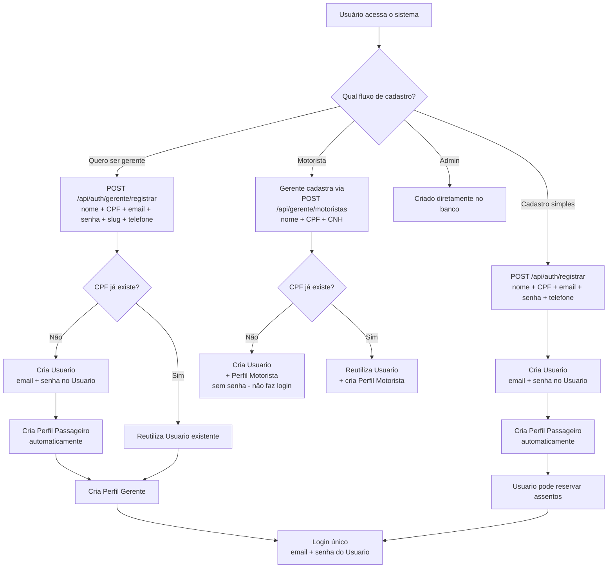
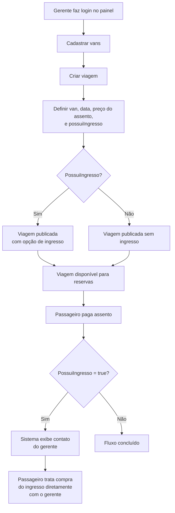
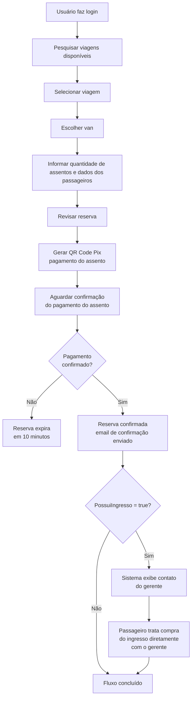
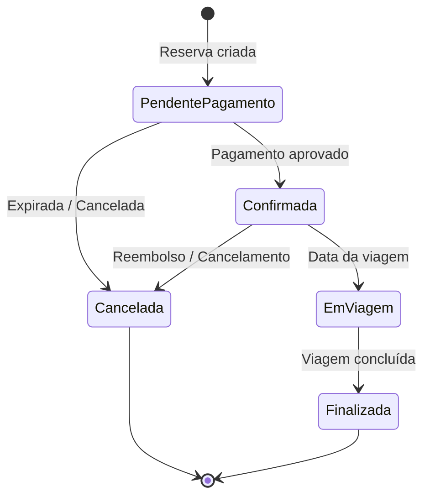

# VanBora — Sistema SaaS de Reserva de Vans

## 1. Visão Geral

O **VanBora** é uma plataforma **SaaS (Software as a Service)** que conecta passageiros a vans para transporte em eventos. O sistema permite que usuários reservem assentos em vans para qualquer tipo de evento (jogos, shows, passeios turísticos).

> **Propósito:** Oferecer uma solução completa de transporte para eventos, onde gerentes de van criam suas viagens e usuários reservam assentos — tudo em um único lugar. Para viagens com ingresso oficial, o sistema exibe o contato do gerente para que passageiro e gerente tratem a compra diretamente.

---

## 2. Modelo de Negócio (SaaS)

| Característica | Detalhe |
|----------------|---------|
| 🏢 **Modelo** | Multi-tenant — cada gerente de van é um inquilino independente |
| 💰 **Receita** | Taxa por reserva (comissão) |
| 🆓 **Primeiros clientes** | Isentos de taxa (0800) |
| 👥 **Público** | Qualquer tipo de evento: jogos, shows, passeios turísticos |

---

## 3. Atores do Sistema

| Ator | Descrição |
|------|-----------|
| **👤 Usuário** | Pessoa física com **CPF único**. Possui **Email** e **Senha** para login único (exceto Motoristas que ainda não ativaram a conta). Pode ter múltiplos perfis (Passageiro, Gerente, Motorista, Admin) |
| **👤 Passageiro (Perfil)** | Perfil padrão que permite reservar assentos em viagens. Criado automaticamente ao registrar um Usuario |
| **👨‍💼 Gerente (Perfil)** | Perfil de tenant — responsável por criar viagens, gerenciar vans, definir preços. Cada gerente opera **independentemente** (multi-tenant). Também pode reservar assentos como passageiro |
| **🔧 Motorista (Perfil)** | Perfil cadastrado por um Gerente, sem login próprio inicialmente. O Motorista pode depois **ativar a conta** registrando-se como Passageiro (mesmo CPF) — ao definir email e senha, ganha acesso ao sistema e pode reservar assentos. Alocado nas viagens |
| **🔧 Administrador (Perfil)** | Perfil de admin do sistema, criado diretamente no banco de dados. Também pode reservar assentos |

> **Login único:** O **Usuario** possui um único email e senha para acesso. Todos os perfis do usuário compartilham o mesmo login. **Qualquer usuário logado pode reservar assentos**, independentemente do tipo de perfil — Passageiro, Gerente e Admin têm essa capacidade.

---

## 4. Conceitos de Negócio

### 4.1. Tenant (Inquilino)
Cada **gerente de van** ou **empresa de transporte** é um tenant no sistema. Cada tenant:
- Gerencia suas próprias vans, viagens e preços
- Tem seu próprio painel administrativo
- Não enxerga os dados de outros tenants

### 4.2. Van
Veículo utilizado para o transporte. Cada van possui:
- Capacidade total de assentos
- Identificação (placa, modelo, etc.)
- Tenant proprietário

### 4.3. Viagem (Trip)
Rota programada para uma data/hora específica. Exemplos:

> **"Flamengo x Vasco — 15/06/2026 às 16:00"**
> **"Rock in Rio — 10/09/2026 às 14:00"**
> **"Tour Costa Verde — 20/07/2026 às 08:00"**

Cada viagem está associada a:
- Uma van específica
- Um evento (nome, data, local)
- Data e horário de partida
- Preço do assento (definido pelo gerente)
- Indicador `PossuiIngresso` — se `true`, o sistema exibe o contato do gerente para o passageiro tratar a compra do ingresso diretamente

### 4.4. Assento
Unidade individual dentro da van. O usuário pode reservar **um ou mais assentos** por reserva.

### 4.5. Reserva
Registro da intenção do usuário de ocupar assentos em uma viagem.

**Características:**

| Característica | Detalhe |
|----------------|---------|
| 👤 **Responsável** | Usuário logado que cria a reserva |
| 🪑 **Múltiplos assentos** | Pode conter 1 ou mais assentos |
| 👥 **Passageiros** | Apenas o responsável precisa ter conta; os demais passageiros informam: **CPF, Nome, Telefone e Email** |

### 4.6. Ingresso (Ticket)

Ingresso oficial do evento. **O VanBora não vende ingressos** — o sistema apenas indica se a viagem oferece essa opção (`PossuiIngresso`) e, caso positivo, exibe o contato do gerente para que o passageiro trate a compra diretamente com ele.

**Fluxo do ingresso:**

```
Passageiro paga assento (Pix -> VanBora)
  -> Confirmação da reserva
  -> PossuiIngresso = true?
  -> Sistema exibe o contato do gerente
  -> Passageiro e gerente tratam a compra do ingresso diretamente
     (fora da plataforma VanBora)
```

> **Nota:** O VanBora não processa pagamento de ingresso, não gerencia prazos de compra, não lida com Face ID, nem se responsabiliza pela transação entre passageiro e gerente. Toda a negociação e compra do ingresso é feita externamente à plataforma.

### 4.7. Pagamento

O pagamento cobre **apenas o assento**, processado via **QR Code Pix** dentro da plataforma VanBora (valor integral do assento + taxa da plataforma).

**Fluxo de pagamento:**

```
Reserva criada -> QR Code Pix gerado (assento)
  -> Passageiro paga o assento -> Confirmação
  -> Se viagem possui ingresso (PossuiIngresso = true):
       Sistema exibe contato do gerente
  -> Confirmação de reserva enviada por email
```

> **Nota:** O ingresso, se aplicável, é pago diretamente ao gerente (fora da plataforma VanBora). O VanBora não processa nem retém este valor.

---

## 5. Fluxos Principais

### 5.1. Fluxo de Cadastro (Usuario + Perfil)



### 5.2. Fluxo do Gerente da Van (Tenant)



### 5.3. Fluxo do Usuário (Passageiro)



### 5.4. Diagrama de Estados da Reserva



---

## 6. Regras de Negócio

| # | Regra |
|---|-------|
| RN01 | O sistema é **multi-tenant**: cada gerente de van opera independentemente |
| RN02 | O **gerente da van** define o preço do assento, indica se a viagem possui ingresso (`PossuiIngresso`), e cria suas próprias viagens |
| RN03 | O VanBora ganha uma **taxa por reserva**. Os **2 primeiros gerentes** cadastrados na plataforma são **gratuitos** (taxa = 0). O Admin pode ajustar a taxa de cada gerente individualmente |
| RN04 | O **usuário precisa ter uma conta** para fazer uma reserva |
| RN05 | O usuário pode reservar **1 ou mais assentos** em uma única reserva |
| RN06 | Apenas o **responsável pela reserva** precisa estar logado; os demais passageiros informam **CPF, Nome, Telefone e Email** |
| RN07 | O sistema atende **qualquer tipo de evento** (jogos, shows, passeios turísticos) |
| RN08 | Se a reserva for **somente assento**, o usuário recebe apenas a confirmação da reserva por email |
| RN09 | A **capacidade da van** não pode ser alterada após a criação — é uma característica física fixa do veículo |
| RN10 | O **CPF** é único e imutável. Cada pessoa física tem **um único Usuario** no sistema. Qualquer cadastro (Passageiro, Gerente, Motorista) **reutiliza o Usuario existente** pelo CPF — nunca retorna erro de CPF duplicado. O **Slug do gerente** também é imutável |
| RN11 | A **exclusão de conta** é **soft delete** (desativação lógica). Requer **confirmação por código enviado por email**. O usuário pode desativar o **Usuario** (impede login) ou apenas **perfis específicos** (ex: desativar Gerente mas manter Passageiro ativo) |
| RN12 | O **gerente** pode cadastrar, listar, atualizar e remover **motoristas** vinculados ao seu perfil. A remoção de motorista é **soft delete** (Ativo = false) apenas se ele **não estiver alocado em nenhuma ViagemVan futura**; caso contrário, retorna erro 422 |
| RN13 | O **passageiro tem 10 minutos** para efetuar o pagamento da reserva após criá-la. Após esse prazo, a reserva expira automaticamente e os assentos são liberados |
| RN14 | O **gerente pode cancelar** suas próprias viagens a qualquer momento. Se a viagem tiver **reservas confirmadas**, todas devem ser **reembolsadas integralmente via Pix (automático)** e o status alterado para "Cancelada" |
| RN15 | Ao **remover uma van de uma viagem**, se a van tiver **reservas confirmadas**, todas devem ser **reembolsadas integralmente via Pix (automático)** antes da desalocação |
| RN16 | Um **Usuario** pode ter **múltiplos Perfis** (Passageiro, Gerente, Motorista, Admin) associados ao mesmo CPF |
| RN17 | O **Motorista não possui login inicialmente** — é cadastrado pelo Gerente com `SenhaHash = null`. O Motorista pode depois **ativar a conta** registrando-se como Passageiro com o mesmo CPF (define email e senha), ganhando acesso ao sistema e podendo reservar assentos |
| RN18 | Email é único **no Usuario**. Login é feito com email + senha do Usuario. Diferente do modelo anterior, não existe mais email por Perfil |
| RN19 | Se a viagem tiver `PossuiIngresso = true`, após o pagamento da reserva o sistema exibe o contato do gerente para o passageiro. Toda a negociação e compra do ingresso é feita diretamente entre passageiro e gerente, fora da plataforma VanBora |
| RN20 | O **VanBora não se responsabiliza** pelo ingresso — a transação é entre passageiro e gerente. O sistema apenas exibe o contato do gerente quando aplicável |

---

## 7. Premissas Técnicas

- **Arquitetura:** Clean Architecture (.NET 9) — já iniciada
- **API:** RESTful com ASP.NET Core
- **Multi-tenant:** Isolamento por Tenant (database ou schema)
- **Banco de Dados:** **PostgreSQL**
- **ORM:** **Entity Framework Core**
- **Pagamento:** Integração com gateway Pix (QR Code)
- **Email:** Serviço de envio de emails transacionais
- **Autenticação:** JWT com claims de perfis

---

## 8. Glossário

| Termo | Significado |
|-------|-------------|
| **SaaS** | Software as a Service — modelo de assinatura/software sob demanda |
| **Tenant** | Inquilino — cada gerente/empresa de van no sistema |
| **Multi-tenant** | Múltiplos inquilinos isolados na mesma plataforma |
| **Usuario** | Entidade base — pessoa física identificada por CPF único |
| **Perfil** | Papel que um Usuario pode ter (Passageiro, Gerente, Motorista, Admin) |
| **Passageiro** | Perfil de usuário final que reserva assentos |
| **0800** | Gratuito, sem custo |
| **QR Code** | Código para pagamento via Pix |

---

## 9. Próximos Passos

1. ✅ Documento base criado e revisado
2. ✅ Modelo Usuario + Perfil definido
3. ⬜ Detalhar entidades de domínio (Domain layer)
4. ⬜ Mapear relacionamentos entre entidades
5. ⬜ Definir endpoints da API
6. ⬜ Criar plano de implementação com tasks detalhadas
