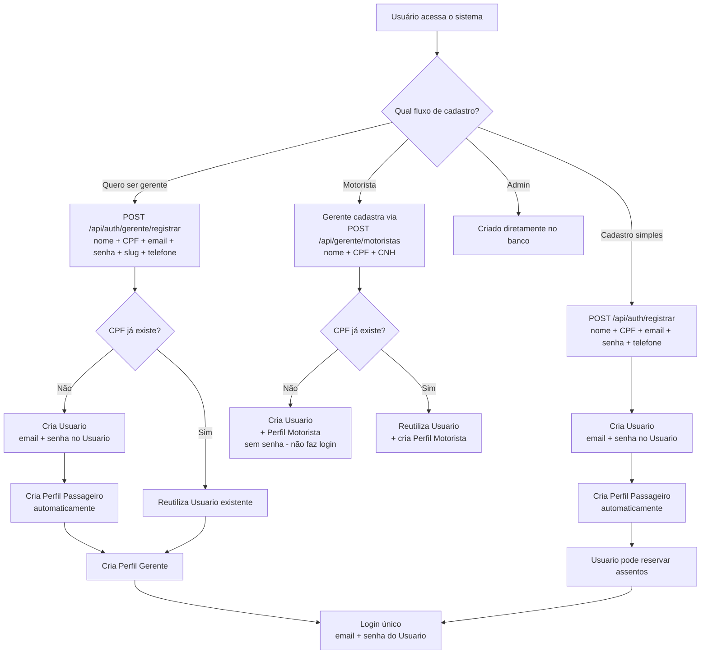
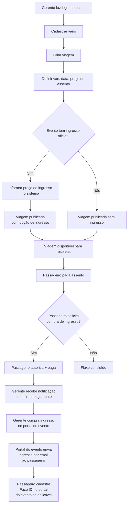
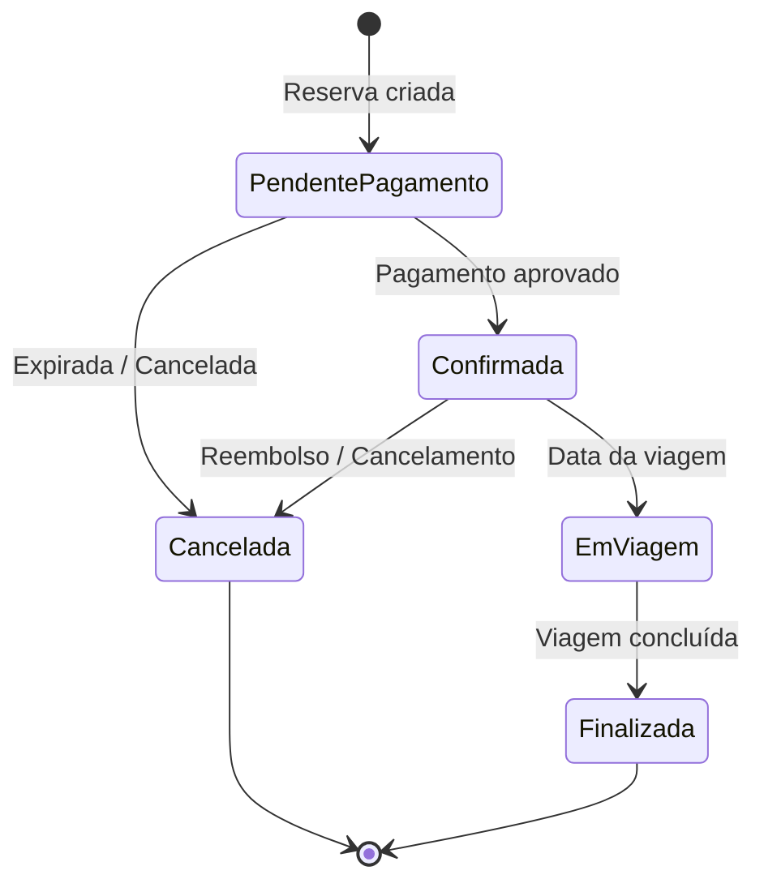

# VanBora — Sistema SaaS de Reserva de Vans

## 1. Visão Geral

O **VanBora** é uma plataforma **SaaS (Software as a Service)** que conecta passageiros a vans para transporte em eventos. O sistema permite que usuários reservem assentos em vans para qualquer tipo de evento (jogos, shows, passeios turísticos), com a opção de solicitar que o gerente compre também o ingresso oficial do evento quando aplicável.

> **Propósito:** Oferecer uma solução completa de transporte + facilitação de ingresso para eventos, onde gerentes de van criam suas viagens e usuários reservam assentos — tudo em um único lugar. **O VanBora não vende ingressos** — apenas facilita a solicitação entre passageiro e gerente.

---

## 2. Modelo de Negócio (SaaS)

| Característica | Detalhe |
|----------------|---------|
| 🏢 **Modelo** | Multi-tenant — cada gerente de van é um inquilino independente |
| 💰 **Receita** | Taxa por reserva (comissão) |
| 🆓 **Primeiros clientes** | Isentos de taxa (0800) |
| 👥 **Público** | Qualquer tipo de evento: jogos, shows, passeios turísticos |

---

## 3. Atores do Sistema

| Ator | Descrição |
|------|-----------|
| **👤 Usuário** | Pessoa física com **CPF único**. Possui **Email** e **Senha** para login único (exceto Motoristas que ainda não ativaram a conta). Pode ter múltiplos perfis (Passageiro, Gerente, Motorista, Admin) |
| **👤 Passageiro (Perfil)** | Perfil padrão que permite reservar assentos em viagens. Criado automaticamente ao registrar um Usuario |
| **👨‍💼 Gerente (Perfil)** | Perfil de tenant — responsável por criar viagens, gerenciar vans, definir preços. Cada gerente opera **independentemente** (multi-tenant). Também pode reservar assentos como passageiro |
| **🔧 Motorista (Perfil)** | Perfil cadastrado por um Gerente, sem login próprio inicialmente. O Motorista pode depois **ativar a conta** registrando-se como Passageiro (mesmo CPF) — ao definir email e senha, ganha acesso ao sistema e pode reservar assentos. Alocado nas viagens |
| **🔧 Administrador (Perfil)** | Perfil de admin do sistema, criado diretamente no banco de dados. Também pode reservar assentos |

> **Login único:** O **Usuario** possui um único email e senha para acesso. Todos os perfis do usuário compartilham o mesmo login. **Qualquer usuário logado pode reservar assentos**, independentemente do tipo de perfil — Passageiro, Gerente e Admin têm essa capacidade.

---

## 4. Conceitos de Negócio

### 4.1. Tenant (Inquilino)
Cada **gerente de van** ou **empresa de transporte** é um tenant no sistema. Cada tenant:
- Gerencia suas próprias vans, viagens e preços
- Tem seu próprio painel administrativo
- Não enxerga os dados de outros tenants

### 4.2. Van
Veículo utilizado para o transporte. Cada van possui:
- Capacidade total de assentos
- Identificação (placa, modelo, etc.)
- Tenant proprietário

### 4.3. Viagem (Trip)
Rota programada para uma data/hora específica. Exemplos:

> **"Flamengo x Vasco — 15/06/2026 às 16:00"**
> **"Rock in Rio — 10/09/2026 às 14:00"**
> **"Tour Costa Verde — 20/07/2026 às 08:00"**

Cada viagem está associada a:
- Uma van específica
- Um evento (nome, data, local)
- Data e horário de partida
- Preço do assento (definido pelo gerente)
- Quantidade de ingressos oficiais disponíveis (comprados pelo gerente fora do sistema)
- Preço do ingresso (definido pelo gerente, quando aplicável)

### 4.4. Assento
Unidade individual dentro da van. O usuário pode reservar **um ou mais assentos** por reserva.

### 4.5. Reserva
Registro da intenção do usuário de ocupar assentos em uma viagem.

**Características:**

| Característica | Detalhe |
|----------------|---------|
| 👤 **Responsável** | Usuário logado que cria a reserva |
| 🪑 **Múltiplos assentos** | Pode conter 1 ou mais assentos |
| 🎫 **Ingresso opcional** | Após pagar o assento, o passageiro pode solicitar que o gerente compre o ingresso para ele (separado do pagamento do assento) |
| 🔀 **Mistura permitida** | Em uma reserva com 3 assentos: 2 solicitam ingresso, 1 não |
| 👥 **Passageiros** | Apenas o responsável precisa ter conta; os demais passageiros informam: **CPF, Nome, Telefone e Email** |

### 4.6. Ingresso (Ticket)

Ingresso oficial do evento. **O VanBora não vende ingressos** — o VanBora apenas facilita a solicitação de compra entre o passageiro e o gerente da van.

**Conceito:** O passageiro paga o ingresso **diretamente ao gerente** (via Pix), e o gerente compra o ingresso no **portal do evento** (site oficial de venda de ingressos) informando o email do passageiro no momento da compra. O **portal do evento** envia automaticamente o ingresso por email para o passageiro, junto com instruções para cadastro de Face ID (se aplicável). O **próprio passageiro cadastra o Face ID no portal do evento** — o VanBora não processa o pagamento do ingresso, não cadastra Face ID, nem se responsabiliza por eles.

**Fluxo do ingresso:**

```
Passageiro paga assento (Pix -> VanBora)
  -> Confirmação da reserva
  -> Opção: "Deseja que o gerente compre o ingresso para você?"
  -> Se sim: Tela de autorização com 3 checkboxes
     [1] Autorizo o gerente [nome] a comprar meu ingresso
     [2] Concordo que após receber o ingresso no email,
         não terei direito a reembolso (CDC Art. 49)
     [3] Autorizo o cadastro do meu Face ID para acesso ao evento
  -> Passageiro informa email para receber o ingresso
  -> Passageiro paga o valor do ingresso via Pix do gerente
  -> Gerente recebe a notificação + pagamento
  -> Gerente compra o ingresso no portal do evento
     (informa o email do passageiro no portal)
  -> Portal do evento envia ingresso automaticamente por email
  -> Passageiro cadastra o próprio Face ID no portal do evento (se aplicável)
  -> Reembolso do ingresso: indisponível
```

**Regras importantes:**

| Regra | Descrição |
|-------|-----------|
| 🚫 VanBora não vende ingresso | VanBora apenas facilita a solicitação. A transação é entre passageiro e gerente |
| 🛒 Quem compra | O **gerente da van** compra o ingresso no **portal do evento** (site oficial de venda de ingressos) **em nome do passageiro** |
| 💰 Pagamento separado | **Assento** → Pix VanBora. **Ingresso** → Pix Gerente (fora da plataforma) |
| ✅ Autorização obrigatória | Passageiro marca **3 checkboxes** autorizando a compra antes de pagar |
| 📧 Entrega do ingresso | **Portal do evento** envia o ingresso automaticamente por email para o passageiro assim que o gerente concluir a compra |
| 🚫 Sem reembolso | Após o ingresso ser recebido por email, **não há direito ao reembolso** (CDC Art. 49 — serviço já prestado / exceção contratual) |
| 🖥️ Face ID | Passageiro **autoriza** o cadastro no VanBora (checkbox 3). Quem cadastra é o **próprio passageiro no portal do evento**. O portal envia o link de cadastro junto com o ingresso por email |
| 🏟️ Entrada | No evento, o passageiro passa pelo **Face ID** cadastrado no portal oficial |
| ⏱️ Prazo para compra | O gerente tem **24 horas** (ou prazo definido) para comprar o ingresso após receber o pagamento do passageiro; caso não compre, o valor é reembolsado |

### 4.7. Pagamento

O pagamento é **dividido em duas transações independentes**:

1. **Pagamento do assento** — Processado via **QR Code Pix** dentro da plataforma VanBora. Valor integral do assento + taxa da plataforma
2. **Pagamento do ingresso** — Transferência Pix **direta** do passageiro para o gerente (fora da plataforma VanBora). O VanBora não processa nem retém este valor

**Fluxo de pagamento:**

```
Reserva criada -> QR Code Pix gerado (assento)
  -> Passageiro paga o assento -> Confirmação
  -> Opção: "Solicitar ingresso?"
  -> Se sim -> Tela de autorização com 3 checkboxes
    -> Passageiro informa email
    -> Passageiro paga ingresso via Pix do gerente
    -> Gerente compra ingresso no portal do evento
    -> Portal do evento envia ingresso + link Face ID por email
    -> Passageiro cadastra Face ID no portal do evento (se aplicável)
  -> Se não -> Confirmação de reserva enviada por email
```

> **Nota importante:** O VanBora **não processa o pagamento do ingresso**. A transação do ingresso é feita diretamente entre passageiro e gerente. O VanBora apenas notifica o gerente sobre a solicitação e o pagamento recebido.

---

## 5. Fluxos Principais

### 5.1. Fluxo de Cadastro (Usuario + Perfil)



### 5.2. Fluxo do Gerente da Van (Tenant)



### 5.3. Fluxo do Usuário (Passageiro)

```mermaid
flowchart TD
    A[Usuário faz login] --> B[Pesquisar viagens disponíveis]
    B --> C[Selecionar viagem]
    C --> D[Escolher van]
    D --> E[Informar quantidade de assentos e dados dos passageiros]
    E --> F[Revisar reserva]
    F --> G[Gerar QR Code Pix\npagamento do assento]
    G --> H[Aguardar confirmação\ndo pagamento do assento]
    H --> I{Pagamento\nconfirmado?}
    I -->|Não| J[Reserva expira\nem 10 minutos]
    I -->|Sim| K[Reserva confirmada\nemail de confirmação enviado]
    K --> L{Evento possui\ningresso oficial?}
    L -->|Não| M[Fluxo concluído]
    L -->|Sim| N[Oferecer opção:\nDeseja que o gerente\ncompre o ingresso?]
    N -->|Não| M
    N -->|Sim| O[Tela de Autorização]\n[1] Autorizo gerente comprar\n[2] Sem reembolso após receber\n[3] Autorizo Face ID
    O --> P[Informar email para\nreceber o ingresso]
    P --> Q[Passageiro paga ingresso\nvia Pix do gerente]
    Q --> R[Gerente notificado:\npassageiro pagou + autorizou]
    R --> S[Gerente compra ingresso\nno portal do evento]
    S --> T[Portal do evento envia\ningresso por email\nao passageiro]
    T --> U[Passageiro cadastra\nFace ID no portal\ndo evento se aplicável]
    U --> V[Reembolso do ingresso:\nINDISPONÍVEL]
```

### 5.4. Diagrama de Estados da Reserva



---

## 6. Regras de Negócio

| # | Regra |
|---|-------|
| RN01 | O sistema é **multi-tenant**: cada gerente de van opera independentemente |
| RN02 | O **gerente da van** define os preços do assento e do ingresso, e cria suas próprias viagens |
| RN03 | O VanBora ganha uma **taxa por reserva**. Os **2 primeiros gerentes** cadastrados na plataforma são **gratuitos** (taxa = 0). O Admin pode ajustar a taxa de cada gerente individualmente |
| RN04 | O **usuário precisa ter uma conta** para fazer uma reserva |
| RN05 | O usuário pode reservar **1 ou mais assentos** em uma única reserva |
| RN06 | Cada assento pode ter ou não um **ingresso** associado. A solicitação de ingresso ocorre **após** o pagamento do assento, em fluxo separado |
| RN07 | Em uma mesma reserva, é permitido **misturar** itens com e sem ingresso solicitado |
| RN08 | **Ingresso nunca existe sem uma reserva** — é sempre vinculado a um ItemReserva |
| RN09 | Apenas o **responsável pela reserva** precisa estar logado; os demais passageiros informam **CPF, Nome, Telefone e Email** |
| RN10 | O **passageiro autoriza o gerente** a comprar o ingresso em seu nome. O **gerente compra o ingresso APÓS receber o pagamento do passageiro**, informando o email do passageiro no portal do evento. O **portal do evento envia o ingresso automaticamente** por email |
| RN11 | O pagamento do **assento** é processado via **QR Code Pix** pela plataforma VanBora. O pagamento do **ingresso** é feito **diretamente ao gerente** (fora da plataforma) |
| RN12 | O sistema atende **qualquer tipo de evento** (jogos, shows, passeios turísticos) |
| RN13 | O passageiro **autoriza** o cadastro do Face ID durante a tela de autorização do ingresso (checkbox 3), mas quem cadastra é o **próprio passageiro no portal do evento**. Após o gerente comprar o ingresso, o portal do evento envia o ingresso por email junto com instruções para cadastro do Face ID |
| RN14 | Se a reserva for **somente assento**, o usuário recebe apenas a confirmação da reserva por email |
| RN15 | A **capacidade da van** não pode ser alterada após a criação — é uma característica física fixa do veículo |
| RN16 | O **CPF** é único e imutável. Cada pessoa física tem **um único Usuario** no sistema. Qualquer cadastro (Passageiro, Gerente, Motorista) **reutiliza o Usuario existente** pelo CPF — nunca retorna erro de CPF duplicado. O **Slug do gerente** também é imutável |
| RN17 | A **exclusão de conta** é **soft delete** (desativação lógica). Requer **confirmação por código enviado por email**. O usuário pode desativar o **Usuario** (impede login) ou apenas **perfis específicos** (ex: desativar Gerente mas manter Passageiro ativo) |
| RN18 | O **gerente** pode cadastrar, listar, atualizar e remover **motoristas** vinculados ao seu perfil. A remoção de motorista é **soft delete** (Ativo = false) apenas se ele **não estiver alocado em nenhuma ViagemVan futura**; caso contrário, retorna erro 422 |
| RN19 | O **passageiro tem 10 minutos** para efetuar o pagamento da reserva após criá-la. Após esse prazo, a reserva expira automaticamente e os assentos são liberados |
| RN20 | O **gerente pode cancelar** suas próprias viagens a qualquer momento. Se a viagem tiver **reservas confirmadas**, todas devem ser **reembolsadas integralmente via Pix (automático)** e o status alterado para "Cancelada" |
| RN21 | Ao **remover uma van de uma viagem**, se a van tiver **reservas confirmadas**, todas devem ser **reembolsadas integralmente via Pix (automático)** antes da desalocação |
| RN22 | Um **Usuario** pode ter **múltiplos Perfis** (Passageiro, Gerente, Motorista, Admin) associados ao mesmo CPF |
| RN23 | O **Motorista não possui login inicialmente** — é cadastrado pelo Gerente com `SenhaHash = null`. O Motorista pode depois **ativar a conta** registrando-se como Passageiro com o mesmo CPF (define email e senha), ganhando acesso ao sistema e podendo reservar assentos |
| RN24 | Email é único **no Usuario**. Login é feito com email + senha do Usuario. Diferente do modelo anterior, não existe mais email por Perfil |
| RN25 | A **opção de solicitar ingresso** só aparece **após o pagamento do assento ser confirmado**. Enquanto a reserva estiver "PendentePagamento", a opção não fica disponível |
| RN26 | O **número máximo de ingressos** que o passageiro pode solicitar é igual ao **número de assentos na reserva**. Ex: reservou 4 assentos → pode pedir até 4 ingressos |
| RN27 | A **solicitação de ingresso** exige que o passageiro marque **3 checkboxes** de autorização: autorizar gerente a comprar, concordar com a não-devolução após recebimento, e autorizar cadastro de Face ID |
| RN28 | Após o **ingresso ser recebido por email**, **não há direito ao reembolso** do ingresso. O reembolso do assento permanece normal (via VanBora) |
| RN29 | O **gerente tem 24 horas** (ou prazo definido na viagem) para comprar o ingresso após receber a solicitação + pagamento do passageiro; caso não compre no prazo, o valor do ingresso deve ser **reembolsado ao passageiro** |
| RN30 | O **VanBora não se responsabiliza** pelo ingresso — a transação é entre passageiro e gerente. O VanBora apenas facilita a solicitação, autorização e notificação |

---

## 7. Premissas Técnicas

- **Arquitetura:** Clean Architecture (.NET 9) — já iniciada
- **API:** RESTful com ASP.NET Core
- **Multi-tenant:** Isolamento por Tenant (database ou schema)
- **Banco de Dados:** **PostgreSQL**
- **ORM:** **Entity Framework Core**
- **Pagamento:** Integração com gateway Pix (QR Code)
- **Email:** Serviço de envio de emails transacionais
- **Autenticação:** JWT com claims de perfis

---

## 8. Glossário

| Termo | Significado |
|-------|-------------|
| **SaaS** | Software as a Service — modelo de assinatura/software sob demanda |
| **Tenant** | Inquilino — cada gerente/empresa de van no sistema |
| **Multi-tenant** | Múltiplos inquilinos isolados na mesma plataforma |
| **Usuario** | Entidade base — pessoa física identificada por CPF único |
| **Perfil** | Papel que um Usuario pode ter (Passageiro, Gerente, Motorista, Admin) |
| **Passageiro** | Perfil de usuário final que reserva assentos |
| **0800** | Gratuito, sem custo |
| **Face ID** | Autenticação biométrica para acesso ao estádio/evento |
| **QR Code** | Código para pagamento via Pix |

---

## 9. Próximos Passos

1. ✅ Documento base criado e revisado
2. ✅ Modelo Usuario + Perfil definido
3. ⬜ Detalhar entidades de domínio (Domain layer)
4. ⬜ Mapear relacionamentos entre entidades
5. ⬜ Definir endpoints da API
6. ⬜ Criar plano de implementação com tasks detalhadas
