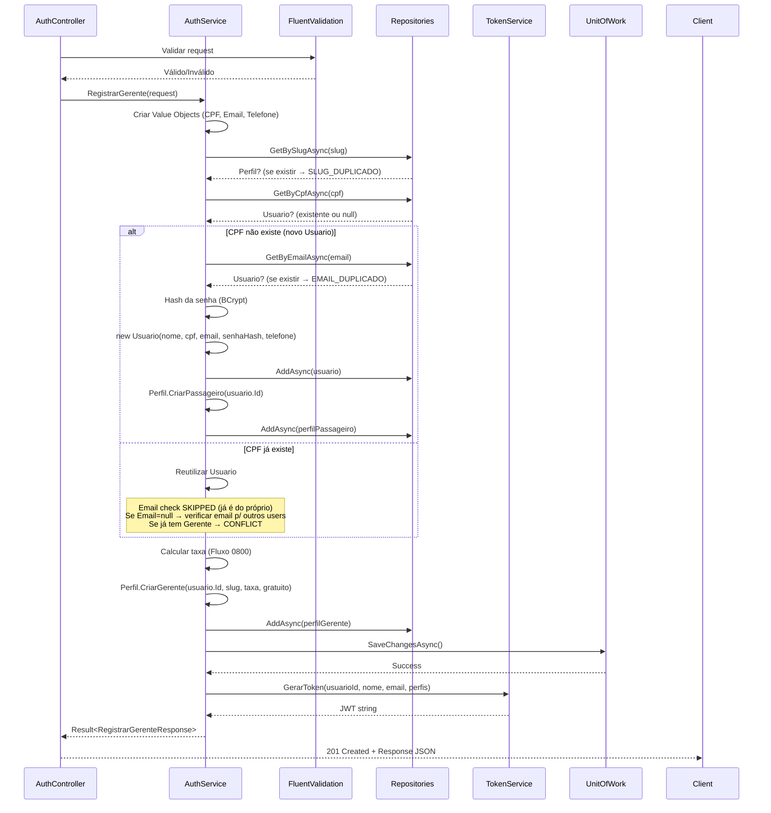
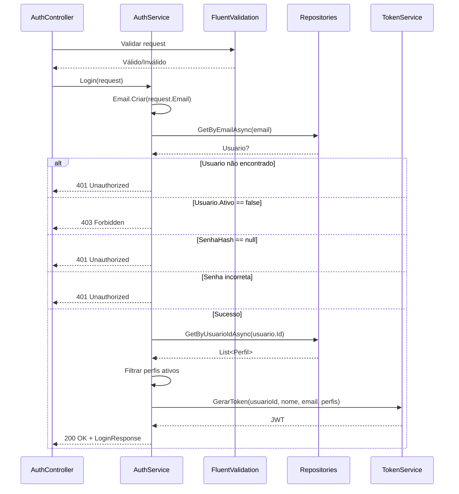

# Plano de Implementação — Autenticação (US01, US02, US04)

> **Autor:** Dev 3  
> **Sprint:** 1 — Fundação + Autenticação  
> **Story Points:** 11  
> **Dependências:** Nenhuma (Sprint inicial)

---

## Índice

1. [Mapeamento de Entidades — EF Core (Fluent API)](#1-mapeamento-de-entidades--ef-core-fluent-api)
2. [Fluxo de Registro do Gerente — US01](#2-fluxo-de-registro-do-gerente--us01)
3. [Fluxo de Login — US02 e US04](#3-fluxo-de-login--us02-e-us04)
4. [TokenService — JWT](#4-tokenservice--jwt)
5. [Dicionário de DTOs](#5-dicionário-de-dtos)
6. [Plano de Migrations](#6-plano-de-migrations)
7. [Regras de Negócio Aplicadas](#7-regras-de-negócio-aplicadas)
8. [Arquivos a Criar/Modificar](#8-arquivos-a-criarmodificar)

---

## 1. Mapeamento de Entidades — EF Core (Fluent API)

### 1.1. Entidade `Usuario`

A classe [`Usuario`](VanBora.Domain/Entities/Usuario.cs:6) já está definida no domínio com as seguintes propriedades que precisam de configuração no EF Core:

| Propriedade | Tipo .NET | Coluna PostgreSQL | Restrições |
|---|---|---|---|
| `Id` | `Guid` | `id` | PK, gen pelo app (`Guid.NewGuid()`) |
| `Nome` | `string` | `nome` | `VARCHAR(100)`, `NOT NULL` |
| `CPF` | `CPF` (VO) | `cpf` | `VARCHAR(11)`, `NOT NULL`, `UNIQUE INDEX` |
| `Email` | `Email?` (VO) | `email` | `VARCHAR(254)`, `UNIQUE INDEX`, nullable |
| `SenhaHash` | `string?` | `senha_hash` | `VARCHAR(255)`, nullable |
| `Telefone` | `Telefone?` (VO) | `telefone_ddd`, `telefone_numero` | `VARCHAR(2)` + `VARCHAR(9)`, nullable |
| `Ativo` | `bool` | `ativo` | `NOT NULL`, default `true` |
| `CriadoEm` | `DateTime` | `criado_em` | `TIMESTAMP`, `NOT NULL` |

#### Owner (Value Object) Configuration

Como `CPF` e `Email` são Value Objects, usaremos **Owned Entity Types** do EF Core para mapeá-los como colunas na própria tabela `usuarios`:

```csharp
// Infrastructure/Data/Configurations/UsuarioConfiguration.cs
public class UsuarioConfiguration : IEntityTypeConfiguration<Usuario>
{
    public void Configure(EntityTypeBuilder<Usuario> builder)
    {
        builder.ToTable("usuarios");

        builder.HasKey(u => u.Id);

        builder.Property(u => u.Id)
            .ValueGeneratedNever()
            .HasColumnName("id");

        builder.Property(u => u.Nome)
            .IsRequired()
            .HasMaxLength(100)
            .HasColumnName("nome");

        builder.OwnsOne(u => u.CPF, cpf =>
        {
            cpf.Property(c => c.Valor)
                .IsRequired()
                .HasMaxLength(11)
                .HasColumnName("cpf");
        });

        builder.OwnsOne(u => u.Email, email =>
        {
            email.Property(e => e.Valor)
                .HasMaxLength(254)
                .HasColumnName("email");
        });

        builder.Property(u => u.SenhaHash)
            .HasMaxLength(255)
            .HasColumnName("senha_hash");

        builder.OwnsOne(u => u.Telefone, telefone =>
        {
            telefone.Property(t => t.DDD)
                .HasMaxLength(2)
                .HasColumnName("telefone_ddd");
            telefone.Property(t => t.Numero)
                .HasMaxLength(9)
                .HasColumnName("telefone_numero");
        });

        builder.Property(u => u.Ativo)
            .IsRequired()
            .HasColumnName("ativo");

        builder.Property(u => u.CriadoEm)
            .IsRequired()
            .HasColumnName("criado_em");

        // Índices únicos
        builder.HasIndex(u => EF.Property<string>(u, "CPF_Valor"))
            .HasDatabaseName("ix_usuarios_cpf")
            .IsUnique();

        builder.HasIndex(u => EF.Property<string>(u, "Email_Valor"))
            .HasDatabaseName("ix_usuarios_email")
            .IsUnique()
            .HasFilter("\"email\" IS NOT NULL");

        // Relacionamento 1:N com Perfil
        builder.HasMany(u => u.Perfis)
            .WithOne(p => p.Usuario)
            .HasForeignKey(p => p.UsuarioId)
            .OnDelete(DeleteBehavior.Restrict);
    }
}
```

> **Nota:** O EF Core gera propriedades sombra (shadow properties) com o padrão `{Navigation}_{Property}` para owned types. Por isso acessamos `CPF_Valor` e `Email_Valor` nos índices.

### 1.2. Entidade `Perfil`

A classe [`Perfil`](VanBora.Domain/Entities/Perfil.cs:7) já está definida. Configuração:

| Propriedade | Tipo .NET | Coluna PostgreSQL | Restrições |
|---|---|---|---|
| `Id` | `Guid` | `id` | PK, gen pelo app |
| `UsuarioId` | `Guid` | `usuario_id` | FK → `usuarios.id`, `NOT NULL` |
| `Tipo` | `TipoPerfil` (enum) | `tipo` | `VARCHAR(20)`, `NOT NULL`, salvo como string |
| `Ativo` | `bool` | `ativo` | `NOT NULL`, default `true` |
| `CriadoPorPerfilId` | `Guid?` | `criado_por_perfil_id` | FK → `perfis.id` (auto-relacionamento), nullable |
| `Slug` | `string?` | `slug` | `VARCHAR(100)`, `UNIQUE INDEX`, nullable |
| `TaxaPlataforma` | `decimal?` | `taxa_plataforma` | `DECIMAL(5,2)`, nullable |
| `Gratuito` | `bool?` | `gratuito` | nullable |
| `CNH` | `CNH?` (VO) | `cnh` | `VARCHAR(11)`, nullable |
| `CriadoEm` | `DateTime` | `criado_em` | `TIMESTAMP`, `NOT NULL` |

#### Owned Type: CNH

Assim como CPF e Email, `CNH` é um Value Object e será mapeado como owned type:

```csharp
// Infrastructure/Data/Configurations/PerfilConfiguration.cs
public class PerfilConfiguration : IEntityTypeConfiguration<Perfil>
{
    public void Configure(EntityTypeBuilder<Perfil> builder)
    {
        builder.ToTable("perfis");

        builder.HasKey(p => p.Id);

        builder.Property(p => p.Id)
            .ValueGeneratedNever()
            .HasColumnName("id");

        builder.Property(p => p.UsuarioId)
            .IsRequired()
            .HasColumnName("usuario_id");

        builder.Property(p => p.Tipo)
            .IsRequired()
            .HasConversion<string>()
            .HasMaxLength(20)
            .HasColumnName("tipo");

        builder.Property(p => p.Ativo)
            .IsRequired()
            .HasColumnName("ativo");

        builder.Property(p => p.CriadoPorPerfilId)
            .HasColumnName("criado_por_perfil_id");

        // Campos específicos do Gerente
        builder.Property(p => p.Slug)
            .HasMaxLength(100)
            .HasColumnName("slug");

        builder.Property(p => p.TaxaPlataforma)
            .HasPrecision(5, 2)
            .HasColumnName("taxa_plataforma");

        builder.Property(p => p.Gratuito)
            .HasColumnName("gratuito");

        // Campo específico do Motorista (Value Object)
        builder.OwnsOne(p => p.CNH, cnh =>
        {
            cnh.Property(c => c.Valor)
                .HasMaxLength(11)
                .HasColumnName("cnh");
        });

        builder.Property(p => p.CriadoEm)
            .IsRequired()
            .HasColumnName("criado_em");

        // Índices
        builder.HasIndex(p => p.Slug)
            .HasDatabaseName("ix_perfis_slug")
            .IsUnique()
            .HasFilter("\"slug\" IS NOT NULL");

        builder.HasIndex(p => p.UsuarioId)
            .HasDatabaseName("ix_perfis_usuario_id");

        // Relacionamentos
        builder.HasOne(p => p.Usuario)
            .WithMany(u => u.Perfis)
            .HasForeignKey(p => p.UsuarioId)
            .OnDelete(DeleteBehavior.Restrict);

        builder.HasOne(p => p.CriadoPorPerfil)
            .WithMany(p => p.MotoristasCriados)
            .HasForeignKey(p => p.CriadoPorPerfilId)
            .OnDelete(DeleteBehavior.Restrict);
    }
}
```

### 1.3. AppDbContext

```csharp
// Infrastructure/Data/AppDbContext.cs
public class AppDbContext : DbContext, IUnitOfWork
{
    public DbSet<Usuario> Usuarios => Set<Usuario>();
    public DbSet<Perfil> Perfis => Set<Perfil>();

    public AppDbContext(DbContextOptions<AppDbContext> options) : base(options) { }

    protected override void OnModelCreating(ModelBuilder modelBuilder)
    {
        modelBuilder.ApplyConfiguration(new UsuarioConfiguration());
        modelBuilder.ApplyConfiguration(new PerfilConfiguration());

        // Demais configurações (Van, Viagem, etc.) serão adicionadas em Sprints futuras
    }

    // Implementação de IUnitOfWork
    public override async Task<int> SaveChangesAsync(CancellationToken ct = default)
    {
        return await base.SaveChangesAsync(ct);
    }

    public async Task BeginTransactionAsync(CancellationToken ct = default)
    {
        await Database.BeginTransactionAsync(ct);
    }

    public async Task CommitAsync(CancellationToken ct = default)
    {
        // Proteção contra chamada sem transação ativa
        if (Database.CurrentTransaction is not null)
            await Database.CommitTransactionAsync(ct);
    }

    public async Task RollbackAsync(CancellationToken ct = default)
    {
        // Proteção contra chamada sem transação ativa
        if (Database.CurrentTransaction is not null)
            await Database.RollbackTransactionAsync(ct);
    }
}
```

---

## 2. Fluxo de Registro do Gerente — US01

### 2.1. Endpoint

**`POST /api/auth/gerente/registrar`**

### 2.2. Lógica do `AuthService.RegistrarGerente`

O método [`RegistrarGerente`](VanBora.Application/Services/AuthService.cs) deve seguir o fluxo abaixo, sempre retornando [`Result<T>`](VanBora.Domain/Common/Result.cs:5):

```csharp
public async Task<Result<RegistrarGerenteResponse>> RegistrarGerente(
    RegistrarGerenteRequest request,
    CancellationToken ct)
```

#### Passo a Passo Detalhado

```
1. VALIDAR DADOS DE ENTRADA
   ├── FluentValidation valida: nome, cpf, email, telefone, senha, slug
   │   (RegistrarGerenteValidator)
   ├── Se inválido → return Error.Validation("DADOS_INVALIDOS", erros)
   │
2. CRIAR VALUE OBJECTS
   ├── Result<CPF> cpfResult = CPF.Criar(request.Cpf)
   │   Se falha → return cpfResult.Error
   ├── Result<Email> emailResult = Email.Criar(request.Email)
   │   Se falha → return emailResult.Error
   ├── Result<Telefone> telefoneResult = Telefone.Criar(request.Telefone)
   │   Se falha → return telefoneResult.Error (opcional)
   │
3. VERIFICAR SLUG ÚNICO
   ├── var perfilExistenteSlug = await _perfilRepo.GetBySlugAsync(request.Slug, ct)
   ├── Se existe → return Error.Conflict("SLUG_DUPLICADO", "Slug já cadastrado")
   │
4. BUSCAR OU CRIAR USUARIO POR CPF
   ├── var usuarioExistente = await _usuarioRepo.GetByCpfAsync(cpfResult.Value, ct)
   │
   ├── SE NÃO EXISTE (novo Usuario):
   │   ├── VERIFICAR EMAIL ÚNICO
   │   │   ├── var usuarioExistenteEmail = await _usuarioRepo.GetByEmailAsync(emailResult.Value, ct)
   │   │   ├── Se existe → return Error.Conflict("EMAIL_DUPLICADO", "Email já cadastrado")
   │   │
   │   ├── string senhaHash = BCrypt.Net.BCrypt.HashPassword(request.Senha)
   │   ├── var usuario = new Usuario(request.Nome, cpfResult.Value, emailResult.Value,
   │   │                              senhaHash, telefoneResult.Value)
   │   ├── await _usuarioRepo.AddAsync(usuario, ct)
   │   ├── Criar Perfil Passageiro automático:
   │   │   var perfilPassageiro = Perfil.CriarPassageiro(usuario.Id)
   │   │   usuario.AdicionarPerfil(perfilPassageiro)
   │   │   await _perfilRepo.AddAsync(perfilPassageiro, ct)
   │   │
   ├── SE JÁ EXISTE:
   │   ├── usuario = usuarioExistente
   │   ├── Verificar se já possui Perfil Gerente:
   │   │   Se sim → return Error.Conflict("GERENTE_EXISTENTE",
   │   │               "Usuário já possui perfil de gerente")
   │   │
   │   ├── NOTA: A verificação de email duplicado é SKIPPADA quando o
   │   │   Usuario já existe pelo CPF, pois o email já pertence a ele
   │   │   (ou é null). Isso permite que um usuário existente adicione
   │   │   o perfil Gerente à própria conta sem falso positivo.
   │   │
   │   ├── SE Usuario existente tem Email = null (ex-Motorista):
   │   │   ├── VERIFICAR EMAIL ÚNICO (o email sendo adicionado não pode
   │   │   │   pertencer a outro usuário)
   │   │   │   ├── var emailDeOutroUsuario = await _usuarioRepo.GetByEmailAsync(emailResult.Value, ct)
   │   │   │   ├── Se existe && emailDeOutroUsuario.Id != usuario.Id
   │   │   │   │   → return Error.Conflict("EMAIL_DUPLICADO", "Email já cadastrado")
   │   │   │
   │   │   ├── Atualizar Email e SenhaHash com os dados do request
   │   │   ├── usuario.AtualizarDados(request.Nome, emailResult.Value, telefoneResult.Value)
   │   │   ├── usuario.DefinirSenha(BCrypt.HashPassword(request.Senha))
   │   │   │
   │   ├── SE Usuario já tem Email (conta completa):
   │   │   │   ├── A senha informada no request é IGNORADA quando o
   │   │   │   │   Usuario já existe, pois ele está apenas adicionando
   │   │   │   │   um perfil — o login continuará usando a senha existente.
   │   │
5. DEFINIR TAXA (Fluxo 0800 — US16)
   ├── var totalGerentes = await _perfilRepo.GetByTipoAsync(TipoPerfil.Gerente, ct)
   ├── bool gratuito = totalGerentes.Count < 2  // Primeiros 2 são 0800
   ├── decimal taxa = gratuito ? 0 : 5.0m       // Default 5% se não for gratuito
   │
6. CRIAR PERFIL GERENTE
   ├── var perfilGerente = Perfil.CriarGerente(usuario.Id, request.Slug, taxa, gratuito)
   ├── usuario.AdicionarPerfil(perfilGerente)
   ├── await _perfilRepo.AddAsync(perfilGerente, ct)
   │
7. PERSISTIR (UNIT OF WORK)
   ├── await _unitOfWork.SaveChangesAsync(ct)
   │
8. GERAR TOKEN JWT
   ├── List<string> perfis = usuario.Perfis.Select(p => p.Tipo.ToString()).ToList()
   ├── string token = _tokenService.GerarToken(usuario.Id, usuario.Nome,
   │                                            emailResult.Value.Valor, perfis)
   │
9. RETORNAR RESPOSTA
   ├── return Result<RegistrarGerenteResponse>.Success(new RegistrarGerenteResponse
   │   {
   │       UsuarioId = usuario.Id,
   │       Nome = usuario.Nome,
   │       Email = usuario.Email?.Valor,
   │       Telefone = usuario.Telefone?.ValorCompleto,
   │       Cpf = usuario.CPF.Valor,
   │       Gerente = new GerenteResponse
   │       {
   │           PerfilId = perfilGerente.Id,
   │           Slug = perfilGerente.Slug!,
   │           TaxaPlataforma = perfilGerente.TaxaPlataforma!.Value,
   │           Gratuito = perfilGerente.Gratuito!.Value,
   │           Ativo = perfilGerente.Ativo
   │       },
   │       Perfis = perfis,
   │       Token = token
   │   })
```

#### Diagrama de Sequência



---

## 3. Fluxo de Login — US02 e US04

### 3.1. Endpoint

**`POST /api/auth/login`** — mesmo endpoint para Passageiros (US04) e Gerentes (US02)

### 3.2. Lógica do `AuthService.Login`

```csharp
public async Task<Result<LoginResponse>> Login(
    LoginRequest request,
    CancellationToken ct)
```

#### Passo a Passo

```
1. VALIDAR DADOS DE ENTRADA
   ├── FluentValidation valida: email, senha
   │
2. CRIAR VALUE OBJECTS
   ├── Result<Email> emailResult = Email.Criar(request.Email)
   │   Se falha → return Error.Validation("EMAIL_INVALIDO", "Formato de email inválido")
   │
3. BUSCAR USUARIO POR EMAIL
   ├── var usuario = await _usuarioRepo.GetByEmailAsync(emailResult.Value, ct)
   ├── Se null → return Error.Unauthorized("CREDENCIAIS_INVALIDAS",
   │       "Email ou senha inválidos")
   │
4. VERIFICAR SE CONTA ESTÁ ATIVA
   ├── if (!usuario.Ativo) → return Error.Forbidden("CONTA_DESATIVADA",
   │       "Conta desativada")
   │
5. VERIFICAR SE USUARIO TEM SENHA (Motorista sem login?)
   ├── if (usuario.SenhaHash == null) → return Error.Unauthorized("CONTA_SEM_SENHA",
   │       "Conta ainda não ativada. Registre-se como passageiro primeiro")
   │
6. VERIFICAR SENHA (BCrypt)
   ├── if (!BCrypt.Net.BCrypt.Verify(request.Senha, usuario.SenhaHash))
   │   → return Error.Unauthorized("CREDENCIAIS_INVALIDAS",
   │       "Email ou senha inválidos")
   │
7. BUSCAR PERFIS ATIVOS DO USUARIO
   ├── var perfis = await _perfilRepo.GetByUsuarioIdAsync(usuario.Id, ct)
   ├── var perfisAtivos = perfis
   │       .Where(p => p.Ativo)
   │       .Select(p => p.Tipo.ToString())
   │       .ToList()
   │
8. GERAR TOKEN JWT
   ├── string token = _tokenService.GerarToken(
   │       usuario.Id, usuario.Nome, usuario.Email!.Valor, perfisAtivos)
   │
9. RETORNAR RESPOSTA
   ├── return Result<LoginResponse>.Success(new LoginResponse
   │   {
   │       UsuarioId = usuario.Id,
   │       Nome = usuario.Nome,
   │       Email = usuario.Email!.Valor,
   │       Perfis = perfisAtivos,
   │       Token = token
   │   })
```

#### Diagrama de Sequência



---

## 4. TokenService — JWT

### 4.1. Interface do Serviço

```csharp
// Application/Interfaces/ITokenService.cs
public interface ITokenService
{
    string GerarToken(Guid usuarioId, string nome, string email, List<string> perfis);
}
```

### 4.2. Implementação

```csharp
// Infrastructure/Services/TokenService.cs
public class TokenService : ITokenService
{
    private readonly JwtSettings _jwtSettings;

    public TokenService(IOptions<JwtSettings> jwtSettings)
    {
        _jwtSettings = jwtSettings.Value;
    }

    public string GerarToken(Guid usuarioId, string nome, string email, List<string> perfis)
    {
        var claims = new List<Claim>
        {
            new(JwtRegisteredClaimNames.Sub, usuarioId.ToString()),      // "sub"
            new(JwtRegisteredClaimNames.Email, email),                   // "email"
            new(ClaimTypes.Name, nome),                                  // "nome"
            new("perfis", JsonSerializer.Serialize(perfis))              // "perfis" como JSON array
        };

        // Opção alternativa: uma claim por perfil
        // foreach (var perfil in perfis)
        //     claims.Add(new Claim("perfil", perfil));

        var key = new SymmetricSecurityKey(
            Encoding.UTF8.GetBytes(_jwtSettings.SecretKey));
        var creds = new SigningCredentials(key, SecurityAlgorithms.HmacSha256);

        var token = new JwtSecurityToken(
            issuer: _jwtSettings.Issuer,
            audience: _jwtSettings.Audience,
            claims: claims,
            expires: DateTime.UtcNow.AddHours(_jwtSettings.ExpiracaoHoras),
            signingCredentials: creds
        );

        return new JwtSecurityTokenHandler().WriteToken(token);
    }
}
```

### 4.3. Estrutura do JWT

Conforme a [seção 9 do technical-plan.md](../docs/technical-plan.md:819), o token terá:

```json
{
  "sub": "guid-do-usuario",
  "email": "email-do-usuario",
  "perfis": ["Passageiro", "Gerente"],
  "nome": "João Silva"
}
```

### 4.4. Configuração no `appsettings.json`

```json
{
  "JwtSettings": {
    "SecretKey": "minha-super-secret-key-com-pelo-menos-32-caracteres!",
    "Issuer": "VanBora",
    "Audience": "VanBora.Api",
    "ExpiracaoHoras": 8
  }
}
```

### 4.5. Registro no `Program.cs`

```csharp
// JWT Authentication
var jwtSection = builder.Configuration.GetSection("JwtSettings");
builder.Services.Configure<JwtSettings>(jwtSection);

builder.Services.AddAuthentication(JwtBearerDefaults.AuthenticationScheme)
    .AddJwtBearer(options =>
    {
        options.TokenValidationParameters = new TokenValidationParameters
        {
            ValidateIssuer = true,
            ValidateAudience = true,
            ValidateLifetime = true,
            ValidateIssuerSigningKey = true,
            ValidIssuer = jwtSection["Issuer"],
            ValidAudience = jwtSection["Audience"],
            IssuerSigningKey = new SymmetricSecurityKey(
                Encoding.UTF8.GetBytes(jwtSection["SecretKey"]!))
        };
    });

builder.Services.AddAuthorization();
```

> **Nota:** O `builder.Services.AddControllers(options => ...)` existente no [`Program.cs`](Api/Program.cs:6) **não deve ser duplicado**. Apenas adicione as linhas de JWT Authentication (`AddAuthentication` + `AddAuthorization`) ANTES do `AddControllers` existente. O `ResultFilter` já está registrado no `AddControllers` original.

### 4.6. Como a Claim "perfis" será lida

Para usar a claim `perfis` (JSON array) nas autorizações, criaremos um helper:

```csharp
// Application/Helpers/ClaimsHelper.cs
public static class ClaimsHelper
{
    public static List<string> ObterPerfis(ClaimsPrincipal user)
    {
        var perfisClaim = user.FindFirst("perfis")?.Value;
        if (string.IsNullOrWhiteSpace(perfisClaim))
            return [];

        return JsonSerializer.Deserialize<List<string>>(perfisClaim) ?? [];
    }

    public static bool TemPerfil(ClaimsPrincipal user, string perfil)
    {
        return ObterPerfis(user).Contains(perfil, StringComparer.OrdinalIgnoreCase);
    }
}
```

---

## 5. Dicionário de DTOs

### 5.1. `RegistrarGerenteRequest`

| Propriedade | Tipo C# | Obrigatório | Validação |
|---|---|---|---|
| `Nome` | `string` | ✅ | Não vazio, max 100 caracteres |
| `Cpf` | `string` | ✅ | 11 dígitos, CPF válido (dígitos verificadores) |
| `Email` | `string` | ✅ | Formato email válido, max 254 caracteres |
| `Senha` | `string` | ✅ | Min 6 caracteres |
| `Telefone` | `string` | ⬜ | Opcional — 10 ou 11 dígitos |
| `Slug` | `string` | ✅ | Não vazio, max 100, lowercase, sem espaços |

**Exemplo:**
```json
{
  "nome": "Transportadora ABC",
  "cpf": "12345678909",
  "slug": "transp-abc",
  "email": "contato@transpabc.com",
  "telefone": "11999999999",
  "senha": "MinhaSenha123"
}
```

### 5.2. `RegistrarGerenteResponse`

| Propriedade | Tipo C# | Descrição |
|---|---|---|
| `UsuarioId` | `Guid` | ID do usuário criado/reutilizado |
| `Nome` | `string` | Nome do usuário |
| `Email` | `string` | Email do usuário |
| `Telefone` | `string?` | Telefone do usuário |
| `Cpf` | `string` | CPF do usuário (apenas números) |
| `Gerente` | [`GerenteResponse`](#521-gerenteresponse) | Dados do perfil gerente |
| `Perfis` | `List<string>` | Lista de tipos de perfil: `["Passageiro", "Gerente"]` |
| `Token` | `string` | JWT para autenticação |

#### 5.2.1. `GerenteResponse`

| Propriedade | Tipo C# | Descrição |
|---|---|---|
| `PerfilId` | `Guid` | ID do perfil gerente |
| `Slug` | `string` | Slug único do gerente |
| `TaxaPlataforma` | `decimal` | Taxa da plataforma (0 se gratuito) |
| `Gratuito` | `bool` | Se é 0800 |
| `Ativo` | `bool` | Se o perfil está ativo |

### 5.3. `LoginRequest`

| Propriedade | Tipo C# | Obrigatório | Validação |
|---|---|---|---|
| `Email` | `string` | ✅ | Formato email válido |
| `Senha` | `string` | ✅ | Não vazio |

**Exemplo:**
```json
{
  "email": "joao@email.com",
  "senha": "MinhaSenha123"
}
```

### 5.4. `LoginResponse`

| Propriedade | Tipo C# | Descrição |
|---|---|---|
| `UsuarioId` | `Guid` | ID do usuário |
| `Nome` | `string` | Nome do usuário |
| `Email` | `string` | Email do usuário |
| `Perfis` | `List<string>` | Lista de perfis ativos do usuário |
| `Token` | `string` | JWT para autenticação |

---

## 6. Plano de Migrations

### 6.1. Ordem de Criação

A migration inicial será gerada pelo EF Core após a configuração do `AppDbContext`. As tabelas serão criadas na seguinte ordem:

| # | Migration | Conteúdo | Comando |
|---|---|---|---|
| 1 | `InitialCreate` | Criação de `usuarios` e `perfis` com todos os índices e FKs | `dotnet ef migrations add InitialCreate` |

### 6.2. Tabelas Geradas (SQL Esperado)

```sql
-- Migration: InitialCreate

CREATE TABLE "usuarios" (
    "id" UUID NOT NULL,
    "nome" VARCHAR(100) NOT NULL,
    "cpf" VARCHAR(11) NOT NULL,
    "email" VARCHAR(254) NULL,
    "senha_hash" VARCHAR(255) NULL,
    "telefone_ddd" VARCHAR(2) NULL,
    "telefone_numero" VARCHAR(9) NULL,
    "ativo" BOOLEAN NOT NULL DEFAULT TRUE,
    "criado_em" TIMESTAMP NOT NULL,
    CONSTRAINT "pk_usuarios" PRIMARY KEY ("id")
);

CREATE TABLE "perfis" (
    "id" UUID NOT NULL,
    "usuario_id" UUID NOT NULL,
    "tipo" VARCHAR(20) NOT NULL,
    "ativo" BOOLEAN NOT NULL DEFAULT TRUE,
    "criado_por_perfil_id" UUID NULL,
    "slug" VARCHAR(100) NULL,
    "taxa_plataforma" DECIMAL(5,2) NULL,
    "gratuito" BOOLEAN NULL,
    "cnh" VARCHAR(11) NULL,
    "criado_em" TIMESTAMP NOT NULL,
    CONSTRAINT "pk_perfis" PRIMARY KEY ("id"),
    CONSTRAINT "fk_perfis_usuario_id" FOREIGN KEY ("usuario_id")
        REFERENCES "usuarios"("id") ON DELETE RESTRICT,
    CONSTRAINT "fk_perfis_criado_por_perfil_id" FOREIGN KEY ("criado_por_perfil_id")
        REFERENCES "perfis"("id") ON DELETE RESTRICT
);

CREATE UNIQUE INDEX "ix_usuarios_cpf" ON "usuarios" ("cpf");
CREATE UNIQUE INDEX "ix_usuarios_email" ON "usuarios" ("email")
    WHERE "email" IS NOT NULL;
CREATE UNIQUE INDEX "ix_perfis_slug" ON "perfis" ("slug")
    WHERE "slug" IS NOT NULL;
CREATE INDEX "ix_perfis_usuario_id" ON "perfis" ("usuario_id");
```

### 6.3. Comandos EF Core

```bash
# No diretório do projeto Infrastructure:
cd VanBora.Infrastructure

# Criar migration inicial
dotnet ef migrations add InitialCreate --startup-project ../Api

# Aplicar migration no banco
dotnet ef database update --startup-project ../Api
```

### 6.4. Notas sobre o EF Core com Value Objects

- **Owned Types:** CPF, Email, Telefone e CNH são mapeados via `.OwnsOne()`. Cada propriedade do VO vira uma coluna na tabela pai (ex: `telefone_ddd`, `telefone_numero`).
- **Shadow Properties:** Para criar índices únicos em owned types, usamos `EF.Property<string>(u, "CPF_Valor")` ou a sintaxe `builder.HasIndex("CPF_Valor")`.
- **Enum como String:** `TipoPerfil` é salvo como string (`HasConversion<string>()`) para legibilidade no banco.
- **Propriedades computadas:** `ValorCompleto` em `Telefone` (`=> DDD + Numero`) não possui setter, portanto não é mapeada. Apenas `DDD` e `Numero` são persistidos. O EF Core reconstrói o VO corretamente no materialization pois o construtor privado aceita `ddd` e `numero`.
- **`implicit operator string`:** As conversões implícitas em [`CPF`](VanBora.Domain/ValueObjects/CPF.cs:94), [`Email`](VanBora.Domain/ValueObjects/Email.cs:58), [`CNH`](VanBora.Domain/ValueObjects/CNH.cs:93) e [`Telefone`](VanBora.Domain/ValueObjects/Telefone.cs:128) para `string` podem causar comportamento inesperado no EF Core ao construir expressões (ex: `.Where(u => u.CPF == "123")`). Prefira comparar via `.Valor` nas queries: `.Where(u => u.CPF.Valor == "123")`.
- **`HasDefaultValue(true)` para `Ativo`:** As colunas `ativo` nas tabelas `usuarios` e `perfis` são definidas como `NOT NULL` com `DEFAULT TRUE` no SQL ilustrado. No entanto, o EF Core **não gera `DEFAULT` values automaticamente** — ele sempre insere o valor explicitamente (definido como `true` nos construtores das entidades). Para consistência, considere adicionar `.HasDefaultValue(true)` nos mapeamentos, embora não seja obrigatório.

---

## 7. Regras de Negócio Aplicadas

| RN | Descrição | Onde se aplica |
|---|---|---|
| RN10 | CPF único, reutiliza Usuario existente | `AuthService.RegistrarGerente` — passo 4 |
| RN11 | Soft delete (Ativo = false) | `Usuario.Ativo`, `Perfil.Ativo` |
| RN16 | Usuario pode ter múltiplos Perfis | `Usuario.Perfis` collection, validação de duplicidade |
| RN18 | Email único no Usuario | Índice único em `email`, verificação no registro |
| RN03/RN16 | Fluxo 0800: primeiros 2 gerentes gratuitos | `AuthService.RegistrarGerente` — passo 5 |
| RN04 | Usuario precisa de conta para reservar | Login retorna JWT com perfis (autorização) |

### 7.1. Tratamento de Erros via Result Pattern

Conforme definido na [seção 7 do technical-plan.md](../docs/technical-plan.md:530), todos os métodos do `AuthService` retornam `Result<T>`. O [`ResultFilter`](../Api/Middleware/ResultFilter.cs:12) já implementa a conversão automática:

| Cenário | Error | ErrorType | HTTP Status |
|---|---|---|---|
| Email duplicado | `EMAIL_DUPLICADO` | `Conflict` | 409 |
| Slug duplicado | `SLUG_DUPLICADO` | `Conflict` | 409 |
| CPF inválido | `CPF_INVALIDO` | `Validation` | 400 |
| Email inválido | `EMAIL_INVALIDO` | `Validation` | 400 |
| Dados inválidos (FluentValidation) | `DADOS_INVALIDOS` | `Validation` | 400 |
| Credenciais inválidas | `CREDENCIAIS_INVALIDAS` | `Unauthorized` | 401 |
| Conta desativada | `CONTA_DESATIVADA` | `Forbidden` | 403 |
| Gerente já existe | `GERENTE_EXISTENTE` | `Conflict` | 409 |

---

> **⚠️ Antes de iniciar a implementação, instale os pacotes NuGet necessários (comandos no diretório raiz da solução):**
> ```bash
> # Application
> cd VanBora.Application && dotnet add package FluentValidation && dotnet add package AutoMapper && cd ..
>
> # Infrastructure
> cd VanBora.Infrastructure && dotnet add package Npgsql.EntityFrameworkCore.PostgreSQL && dotnet add package BCrypt.Net-Next && cd ..
>
> # Api
> cd Api && dotnet add package Microsoft.AspNetCore.Authentication.JwtBearer && cd ..
> ```
>
> **⚠️ Adicione a referência de projeto `VanBora.Application` ao [`VanBora.Infrastructure.csproj`](VanBora.Infrastructure/VanBora.Infrastructure.csproj):**
> ```xml
> <ItemGroup>
>   <ProjectReference Include="..\VanBora.Application\VanBora.Application.csproj" />
> </ItemGroup>
> ```

## 8. Arquivos a Criar/Modificar

### 8.1. Novos Arquivos

| # | Arquivo | Camada | Descrição |
|---|---|---|---|
| 1 | [`VanBora.Application/DTOs/Auth/RegistrarGerenteRequest.cs`](VanBora.Application/DTOs/Auth/RegistrarGerenteRequest.cs) | Application | DTO de request para cadastro de gerente |
| 2 | [`VanBora.Application/DTOs/Auth/RegistrarGerenteResponse.cs`](VanBora.Application/DTOs/Auth/RegistrarGerenteResponse.cs) | Application | DTO de response para cadastro de gerente |
| 3 | [`VanBora.Application/DTOs/Auth/LoginRequest.cs`](VanBora.Application/DTOs/Auth/LoginRequest.cs) | Application | DTO de request para login |
| 4 | [`VanBora.Application/DTOs/Auth/LoginResponse.cs`](VanBora.Application/DTOs/Auth/LoginResponse.cs) | Application | DTO de response para login |
| 5 | [`VanBora.Application/DTOs/Auth/GerenteResponse.cs`](VanBora.Application/DTOs/Auth/GerenteResponse.cs) | Application | DTO aninhado com dados do perfil gerente |
| 6 | [`VanBora.Application/Interfaces/ITokenService.cs`](VanBora.Application/Interfaces/ITokenService.cs) | Application | Interface do serviço de JWT |
| 7 | [`VanBora.Application/Interfaces/IAuthService.cs`](VanBora.Application/Interfaces/IAuthService.cs) | Application | Interface do serviço de autenticação |
| 8 | [`VanBora.Application/Validators/RegistrarGerenteValidator.cs`](VanBora.Application/Validators/RegistrarGerenteValidator.cs) | Application | FluentValidation para cadastro de gerente |
| 9 | [`VanBora.Application/Validators/LoginValidator.cs`](VanBora.Application/Validators/LoginValidator.cs) | Application | FluentValidation para login |
| 10 | [`VanBora.Application/Mappings/AuthProfile.cs`](VanBora.Application/Mappings/AuthProfile.cs) | Application | AutoMapper de entidades para DTOs |
| 11 | [`VanBora.Application/Helpers/ClaimsHelper.cs`](VanBora.Application/Helpers/ClaimsHelper.cs) | Application | Helper para leitura das claims do JWT |
| 12 | [`VanBora.Application/Services/AuthService.cs`](VanBora.Application/Services/AuthService.cs) | Application | Implementação do AuthService |
| 13 | [`VanBora.Application/Settings/JwtSettings.cs`](VanBora.Application/Settings/JwtSettings.cs) | Application | Classe de configuração JWT |
| 14 | [`VanBora.Infrastructure/Data/AppDbContext.cs`](VanBora.Infrastructure/Data/AppDbContext.cs) | Infrastructure | DbContext principal |
| 15 | [`VanBora.Infrastructure/Data/Configurations/UsuarioConfiguration.cs`](VanBora.Infrastructure/Data/Configurations/UsuarioConfiguration.cs) | Infrastructure | Fluent API Usuario |
| 16 | [`VanBora.Infrastructure/Data/Configurations/PerfilConfiguration.cs`](VanBora.Infrastructure/Data/Configurations/PerfilConfiguration.cs) | Infrastructure | Fluent API Perfil |
| 17 | [`VanBora.Infrastructure/Repositories/UsuarioRepository.cs`](VanBora.Infrastructure/Repositories/UsuarioRepository.cs) | Infrastructure | Implementação do repositório de Usuario |
| 18 | [`VanBora.Infrastructure/Repositories/PerfilRepository.cs`](VanBora.Infrastructure/Repositories/PerfilRepository.cs) | Infrastructure | Implementação do repositório de Perfil |
| 19 | [`VanBora.Infrastructure/Repositories/UnitOfWork.cs`](VanBora.Infrastructure/Repositories/UnitOfWork.cs) | Infrastructure | Implementação do Unit of Work |
| 20 | [`VanBora.Infrastructure/Services/TokenService.cs`](VanBora.Infrastructure/Services/TokenService.cs) | Infrastructure | Implementação do serviço JWT |
| 21 | [`VanBora.Infrastructure/Extensions/ServiceCollectionExtensions.cs`](VanBora.Infrastructure/Extensions/ServiceCollectionExtensions.cs) | Infrastructure | DI dos serviços de infra |
| 22 | [`Api/Controllers/AuthController.cs`](Api/Controllers/AuthController.cs) | Api | Controller de autenticação |

### 8.2. Arquivos a Modificar

| # | Arquivo | Descrição da Alteração |
|---|---|---|
| 1 | [`VanBora.Application/VanBora.Application.csproj`](VanBora.Application/VanBora.Application.csproj) | Adicionar pacotes: `FluentValidation`, `AutoMapper` |
| 2 | [`VanBora.Infrastructure/VanBora.Infrastructure.csproj`](VanBora.Infrastructure/VanBora.Infrastructure.csproj) | Adicionar pacotes: `Npgsql.EntityFrameworkCore.PostgreSQL`, `BCrypt.Net-Next` |
| 3 | [`Api/appsettings.json`](Api/appsettings.json) | Adicionar `JwtSettings` e `ConnectionStrings` para PostgreSQL |
| 4 | [`Api/Program.cs`](Api/Program.cs) | Adicionar JWT Auth, DI dos serviços, DbContext |

> **Nota:** O pacote `Microsoft.AspNetCore.Authentication.JwtBearer` deve ser adicionado ao projeto **Api** (já incluso no comando da seção anterior), **não** ao `VanBora.Infrastructure`, pois a configuração de `AddJwtBearer()` reside no [`Program.cs`](Api/Program.cs).

### 8.3. Estrutura Final Esperada

```
VanBora.sln
├── Api/
│   ├── Controllers/
│   │   └── AuthController.cs              ← NOVO
│   ├── Middleware/                         ← Já existe
│   │   ├── ExceptionMiddleware.cs
│   │   └── ResultFilter.cs
│   ├── Program.cs                         ← MODIFICADO
│   └── appsettings.json                   ← MODIFICADO
│
├── VanBora.Application/
│   ├── DTOs/Auth/
│   │   ├── RegistrarGerenteRequest.cs     ← NOVO
│   │   ├── RegistrarGerenteResponse.cs    ← NOVO
│   │   ├── LoginRequest.cs               ← NOVO
│   │   ├── LoginResponse.cs              ← NOVO
│   │   └── GerenteResponse.cs            ← NOVO
│   ├── Interfaces/
│   │   ├── ITokenService.cs              ← NOVO
│   │   └── IAuthService.cs               ← NOVO
│   ├── Services/
│   │   └── AuthService.cs                 ← NOVO
│   ├── Validators/
│   │   ├── RegistrarGerenteValidator.cs   ← NOVO
│   │   └── LoginValidator.cs             ← NOVO
│   ├── Mappings/
│   │   └── AuthProfile.cs                ← NOVO
│   ├── Helpers/
│   │   └── ClaimsHelper.cs               ← NOVO
│   └── Settings/
│       └── JwtSettings.cs                ← NOVO
│
├── VanBora.Domain/                         ← Já existe (não modificar)
│   ├── Entities/ (Usuario.cs, Perfil.cs...)
│   ├── ValueObjects/ (CPF.cs, Email.cs...)
│   ├── Enums/ (TipoPerfil.cs...)
│   ├── Common/ (Result.cs, Error.cs...)
│   └── Interfaces/ (IUsuarioRepository.cs...)
│
└── VanBora.Infrastructure/
    ├── Data/
    │   ├── AppDbContext.cs                ← NOVO
    │   ├── Configurations/
    │   │   ├── UsuarioConfiguration.cs    ← NOVO
    │   │   └── PerfilConfiguration.cs     ← NOVO
    │   └── Migrations/                    ← GERADO
    ├── Repositories/
    │   ├── UsuarioRepository.cs           ← NOVO
    │   ├── PerfilRepository.cs            ← NOVO
    │   └── UnitOfWork.cs                  ← NOVO
    ├── Services/
    │   └── TokenService.cs                ← NOVO
    └── Extensions/
        └── ServiceCollectionExtensions.cs ← NOVO
```

---

> **Próximos passos (após aprovação do plano):**
> 1. Implementar as classes de configuração do EF Core (UsuarioConfiguration, PerfilConfiguration)
> 2. Implementar AppDbContext
> 3. Implementar repositórios (UsuarioRepository, PerfilRepository, UnitOfWork)
> 4. Implementar TokenService + JWT settings
> 5. Implementar DTOs e Validators
> 6. Implementar AuthService com todos os fluxos
> 7. Implementar AuthController
> 8. Configurar DI no Program.cs e ServiceCollectionExtensions
> 9. Gerar migration e aplicar ao banco
> 10. Testar via Swagger
