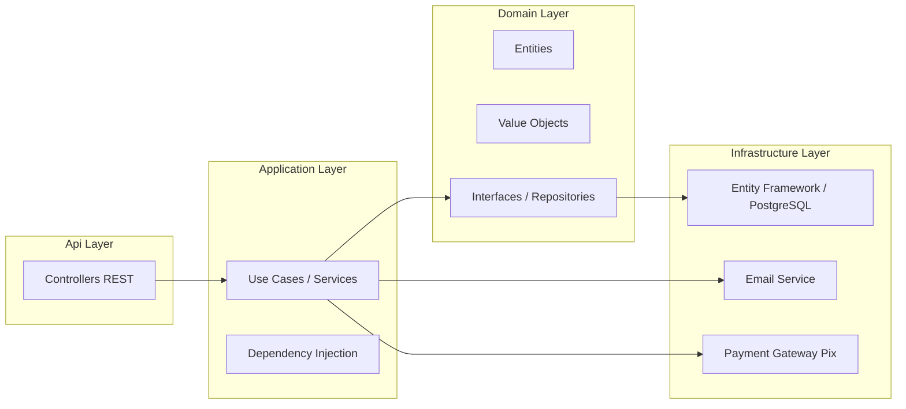
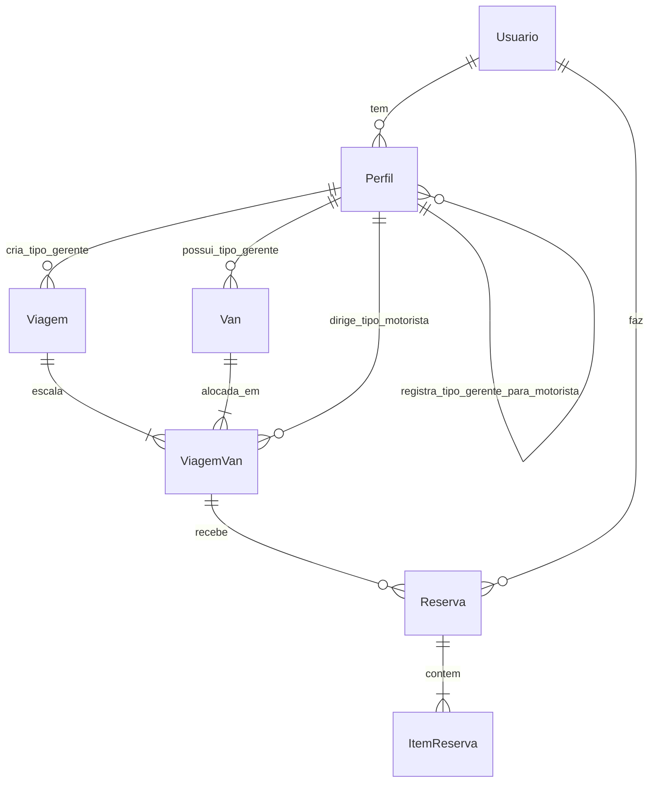
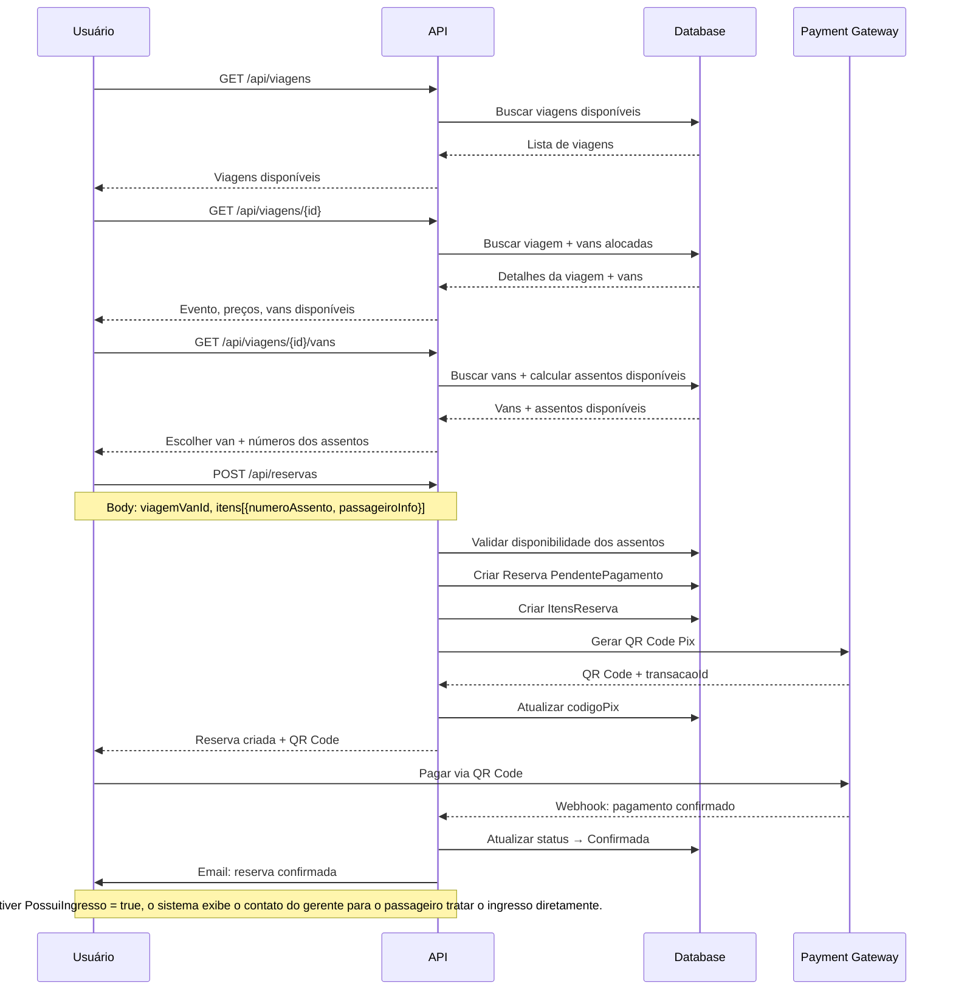
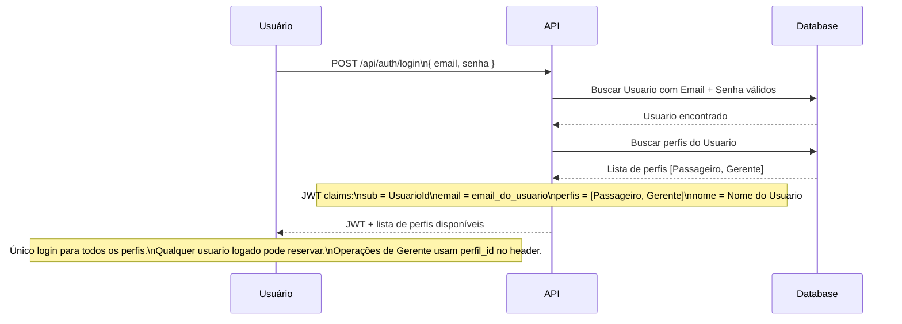
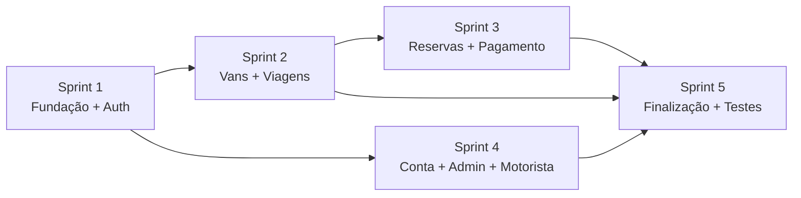

# VanBora — Plano Técnico e Arquitetura

> **Nota:** Todas as entidades e propriedades estão em português.

---

## 1. Arquitetura Geral



---

## 2. Modelo de Domínio

### 2.1. Diagrama de Entidades e Relacionamentos



> **Nota sobre Perfil auto-relacionamento:** Um Perfil do tipo Gerente "registra" Perfis do tipo Motorista. Na prática, o Perfil do Motorista possui uma FK `CriadoPorPerfilId` → Perfil.Id (Gerente).

### 2.2. Entidades de Domínio

#### Usuario (Conta Única — login + pessoa física)

| Propriedade | Tipo | Descrição |
|-------------|------|-----------|
| Id | Guid | Chave primária |
| Nome | string | Nome completo |
| CPF | CPF | Value Object — **único no sistema**, imutável após cadastro |
| Email | Email? | Value Object — **único no sistema**, usado para login. `null` para Motoristas que ainda não ativaram a conta |
| SenhaHash | string? | Hash da senha (BCrypt). `null` para Motoristas que ainda não ativaram a conta |
| Telefone | Telefone? | Value Object (nullable) |
| Ativo | bool | Se a conta está ativa |
| CriadoEm | DateTime | Data de criação |

> Um **Usuario** é a **conta única** do sistema. O login é feito com Email + Senha do Usuario (apenas contas com `SenhaHash != null`). Pode ter múltiplos perfis (Passageiro, Gerente, Motorista, Admin). **Qualquer usuário logado pode reservar assentos** — independentemente do tipo de perfil.
>
> **Motorista sem login:** Quando o Gerente cadastra um Motorista, o sistema cria um Usuario com `Email = null` e `SenhaHash = null`. Este Usuario não pode fazer login até que a pessoa se registre como Passageiro (mesmo CPF) e defina email + senha. Nesse momento, o sistema ativa a conta e adiciona o Perfil Passageiro.

#### Perfil (Papel do Usuario no sistema)

| Propriedade | Tipo | Descrição |
|-------------|------|-----------|
| Id | Guid | Chave primária |
| UsuarioId | Guid | FK → Usuario |
| Tipo | TipoPerfil | Passageiro, Gerente, Motorista, Admin |
| Ativo | bool | Se o perfil está ativo |
| CriadoPorPerfilId | Guid? | FK → Perfil (Gerente que cadastrou, apenas para Tipo=Motorista) |
| CriadoEm | DateTime | Data de criação |

**Campos específicos por Tipo:**

> Perfil Passageiro não possui campos específicos — usa apenas os dados do Usuario (Nome, CPF, Email, Telefone).

| Campo | Gerente | Motorista | Admin |
|-------|---------|-----------|-------|
| Slug | ✅ (único) | ❌ | ❌ |
| TaxaPlataforma | ✅ (%) | ❌ | ❌ |
| Gratuito | ✅ (bool) | ❌ | ❌ |
| CNH | ❌ | ✅ | ❌ |

> **Nota:** Slug, TaxaPlataforma e Gratuito são propriedades específicas do Perfil Gerente. CNH é específica do Perfil Motorista. O **login** (Email + Senha) está no **Usuario**, não no Perfil.

#### Van

| Propriedade | Tipo | Descrição |
|-------------|------|-----------|
| Id | Guid | Chave primária |
| GerentePerfilId | Guid | FK → Perfil.Id (Tipo=Gerente) — dono da van |
| Nome | string | Nome/identificação |
| Placa | Placa | Value Object — formato Mercosul |
| Modelo | string | Modelo |
| Capacidade | int | Capacidade total **incluindo motorista**. Ex: 16 = 15 assentos para reserva + 1 motorista |
| Ativo | bool | Se está ativa |
| CriadoEm | DateTime | Data de criação |

#### Viagem (Trip)

| Propriedade | Tipo | Descrição |
|-------------|------|-----------|
| Id | Guid | Chave primária |
| GerentePerfilId | Guid | FK → Perfil.Id (Tipo=Gerente) |
| NomeEvento | string | Nome do evento |
| DataEvento | DateTime | Data/hora do evento |
| LocalEvento | string | Local do evento |
| DataPartida | DateTime | Data/hora de partida |
| LocalPartida | string | Local de partida |
| PrecoAssento | decimal | Preço do assento (igual para todas as vans) |
| PossuiIngresso | bool | Se a viagem oferece opção de ingresso — quando `true`, o sistema exibe o contato do gerente para o passageiro tratar a compra diretamente |
| Status | StatusViagem | Agendada, EmAndamento, Concluida, Cancelada |
| CriadoEm | DateTime | Data de criação |

#### ViagemVan (Junction — Van alocada na Viagem)

| Propriedade | Tipo | Descrição |
|-------------|------|-----------|
| Id | Guid | Chave primária |
| ViagemId | Guid | FK → Viagem |
| VanId | Guid | FK → Van |
| MotoristaPerfilId | Guid? | FK → Perfil.Id (Tipo=Motorista, opcional, alocado posteriormente) |

> **Assentos Virtuais:** A capacidade de assentos é derivada diretamente de `Van.Capacidade` (ex: 16 = 15 assentos + motorista). Não existem registros previamente criados de assentos. A disponibilidade é calculada subtraindo os `ItemReserva.NumeroAssento` já registrados para aquela `ViagemVan` do total de assentos disponíveis (`Van.Capacidade - 1`). O usuário escolhe o número do assento no momento da reserva, e o sistema valida se ele já está ocupado por outro `ItemReserva`.

#### Perfil Motorista (Driver)

> O Motorista é um **Perfil** (Tipo=Motorista) vinculado a um Usuario. Quando o Gerente cadastra o Motorista, o Usuario é criado com `Email = null` e `SenhaHash = null` — o Motorista **não possui login inicialmente**. A pessoa pode depois **ativar a conta** registrando-se como Passageiro com o mesmo CPF (define email + senha). As propriedades abaixo são os dados específicos do perfil Motorista — Nome, CPF e Telefone estão no Usuario.

| Propriedade | Específica do Perfil Motorista | Descrição |
|-------------|-------------------------------|-----------|
| CNH | string | Número da CNH |
| Ativo | bool | Se ainda trabalha com o gerente |
| CriadoPorPerfilId | Guid | FK → Perfil.Id do Gerente que cadastrou |

#### Reserva (Reservation)

| Propriedade | Tipo | Descrição |
|-------------|------|-----------|
| Id | Guid | Chave primária |
| UsuarioId | Guid | FK → Usuario (responsável pela reserva — qualquer usuário logado pode reservar) |
| ViagemVanId | Guid | FK → ViagemVan (van específica na viagem) |
| Status | StatusReserva | PendentePagamento, Confirmada, EmAndamento, Concluida, Cancelada, Expirada |
| ValorTotal | decimal | Valor total (soma dos itens) |
| TaxaPlataforma | decimal | Taxa calculada do VanBora |
| CodigoPix | string | Código/Imagem do QR Code Pix |
| TransacaoId | string? | ID da transação no gateway |
| PagoEm | DateTime? | Data de pagamento |
| CriadoEm | DateTime | Data de criação |
| ExpiraEm | DateTime | Data de expiração (CriadoEm + 10 minutos) |

#### ItemReserva (ReservationItem)

| Propriedade | Tipo | Descrição |
|-------------|------|-----------|
| Id | Guid | Chave primária |
| ReservaId | Guid | FK → Reserva |
| NumeroAssento | int | Número do assento escolhido pelo usuário. Ex: 1 a 15 (se Van.Capacidade = 16) |
| PrecoAssento | decimal | Preço do assento (snapshot) |
| NomePassageiro | string | Nome do passageiro |
| EmailPassageiro | string | Email do passageiro |
| TelefonePassageiro | string | Telefone do passageiro |
| CPFPassageiro | string | CPF do passageiro |
> **Nota sobre ingresso:** Se a viagem tiver `PossuiIngresso = true`, após o pagamento da reserva o sistema exibe o contato do gerente para o passageiro. Toda a negociação e compra do ingresso é feita diretamente entre passageiro e gerente, fora da plataforma VanBora.

### 2.3. Value Objects

Value Objects no domínio, definidos em `VanBora.Domain/ValueObjects/`:

#### `Email`
| Propriedade | Tipo | Descrição |
|-------------|------|-----------|
| Valor | string | Email validado |

- Valida formato de email na criação
- Imutável: `new Email("user@example.com")`
- Comparação por valor

#### `CPF`
| Propriedade | Tipo | Descrição |
|-------------|------|-----------|
| Valor | string | CPF com 11 dígitos |

- Valida dígitos verificadores na criação
- Armazena apenas números (sem formatação)
- Imutável: `new CPF("12345678909")`

#### `Telefone`
| Propriedade | Tipo | Descrição |
|-------------|------|-----------|
| DDD | string | 2 dígitos |
| Numero | string | 8 ou 9 dígitos |
| ValorCompleto | string | Retorna "11999999999" |

- Valida DDD e quantidade de dígitos
- Imutável: `new Telefone("11", "999999999")`

#### `Placa`
| Propriedade | Tipo | Descrição |
|-------------|------|-----------|
| Valor | string | Placa formato Mercosul |

- Valida formato ABC1D23 na criação
- Imutável: `new Placa("ABC1D23")`

#### `Dinheiro`
| Propriedade | Tipo | Descrição |
|-------------|------|-----------|
| Valor | decimal | Valor monetário |
| Moeda | string | "BRL" (padrão) |

- Garante valor não negativo
- Arredondamento para 2 casas decimais
- Suporta operações: Somar, Subtrair, Multiplicar, Percentual
- Imutável: `new Dinheiro(150.00m)`

### 2.4. Enums

```csharp
public enum TipoPerfil
{
    Passageiro,
    Gerente,
    Motorista,
    Admin
}

public enum StatusViagem
{
    Agendada,
    EmAndamento,
    Concluida,
    Cancelada
}

public enum StatusReserva
{
    PendentePagamento,
    Confirmada,
    EmAndamento,
    Concluida,
    Cancelada,
    Expirada
}

```

---

## 3. Endpoints da API

### 3.1. Autenticação e Perfil

> **Modelo:** Login único com Email + Senha do **Usuario**. Perfis (Passageiro, Gerente, Admin) definem capacidades. Qualquer usuário logado pode reservar assentos.

| Método | Rota | Descrição |
|--------|------|-----------|
| POST | `/api/auth/registrar` | Criar Usuario + Perfil Passageiro (cadastro simples) |
| POST | `/api/auth/login` | Login único (email + senha do Usuario) |
| POST | `/api/auth/gerente/registrar` | Criar Perfil Gerente (cria Usuario se CPF não existir, ou adiciona a Usuario existente) |
| GET | `/api/auth/me` | Dados do usuario logado + lista de perfis |
| PUT | `/api/auth/usuario` | Atualizar dados do Usuario (nome, email, telefone) |
| PUT | `/api/auth/perfil/gerente` | Atualizar Perfil Gerente (slug) |
| POST | `/api/auth/alterar-senha` | Alterar senha do Usuario |
| POST | `/api/auth/solicitar-exclusao` | Solicitar exclusão de conta (envia código por email) |
| POST | `/api/auth/confirmar-exclusao` | Confirmar exclusão da conta com código recebido |

> **Fluxo de cadastro:**
> - `POST /api/auth/registrar` → Recebe: `{ nome, email, cpf, telefone, senha }` → Cria Usuario + Perfil Passageiro automaticamente. Usuário já pode reservar assentos.
> - `POST /api/auth/gerente/registrar` → Recebe: `{ nome, email, cpf, telefone, senha, slug }` → Se CPF não existir, cria Usuario + Perfil Passageiro + Perfil Gerente. Se CPF já existir (ex: já é Passageiro), adiciona Perfil Gerente ao Usuario existente.
> - Motorista é cadastrado via endpoint de Gerente (seção 3.4)
> - **Login único:** Ambos os perfis usam o mesmo email e senha do Usuario para acessar o sistema.

### 3.2. Viagens — Público

| Método | Rota | Descrição |
|--------|------|-----------|
| GET | `/api/viagens` | Listar viagens disponíveis |
| GET | `/api/viagens/{id}` | Detalhes da viagem (inclui vans disponíveis) |
| GET | `/api/viagens/{id}/vans` | Listar vans alocadas na viagem com assentos disponíveis |

### 3.3. Gerente — Gestão de Vans

| Método | Rota | Descrição |
|--------|------|-----------|
| GET | `/api/gerente/vans` | Listar vans do gerente |
| POST | `/api/gerente/vans` | Criar van |
| PUT | `/api/gerente/vans/{id}` | Atualizar van |
| DELETE | `/api/gerente/vans/{id}` | Remover van |

### 3.4. Gerente — Gestão de Motoristas

| Método | Rota | Descrição |
|--------|------|-----------|
| GET | `/api/gerente/motoristas` | Listar motoristas do gerente |
| POST | `/api/gerente/motoristas` | Cadastrar motorista (busca Usuario por CPF ou cria + cria Perfil Motorista) |
| PUT | `/api/gerente/motoristas/{id}` | Atualizar dados do motorista |
| DELETE | `/api/gerente/motoristas/{id}` | Remover motorista |

> **Cadastro de Motorista:** O gerente informa CPF, Nome, Telefone, CNH. O sistema busca um Usuario existente com esse CPF. Se existir, cria Perfil Motorista vinculado a ele. Se não existir, cria um novo Usuario com `Email = null` e `SenhaHash = null` + Perfil Motorista. O Motorista **não possui login inicialmente**, mas pode depois **ativar a conta** registrando-se como Passageiro com o mesmo CPF.

### 3.5. Gerente — Gestão de Viagens

| Método | Rota | Descrição |
|--------|------|-----------|
| GET | `/api/gerente/viagens` | Listar viagens do gerente |
| POST | `/api/gerente/viagens` | Criar viagem |
| PUT | `/api/gerente/viagens/{id}` | Atualizar viagem |
| DELETE | `/api/gerente/viagens/{id}` | Cancelar viagem (reembolsa todas as reservas confirmadas) |
| POST | `/api/gerente/viagens/{id}/alocar-van` | Alocar uma van na viagem |
| DELETE | `/api/gerente/viagens/{id}/remover-van/{viagemVanId}` | Remover van da viagem (reembolsa reservas confirmadas da van) |
| POST | `/api/gerente/viagens/{viagemId}/alocar-motorista/{viagemVanId}` | Alocar motorista na van da viagem |
| GET | `/api/gerente/viagens/{id}/reservas` | Ver reservas de uma viagem |
| GET | `/api/gerente/viagens/{id}/relatorio` | Relatório financeiro da viagem |

### 3.6. Reservas

| Método | Rota | Descrição |
|--------|------|-----------|
| POST | `/api/reservas` | Criar reserva (informando viagemVanId) |
| GET | `/api/reservas/{id}` | Detalhes da reserva |
| GET | `/api/reservas/minhas` | Listar reservas do usuario logado |
| POST | `/api/reservas/{id}/pagar` | Gerar QR Code Pix para pagamento do assento |
| POST | `/api/reservas/{id}/cancelar` | Cancelar reserva |

> **Ingresso:** Se a viagem tiver `PossuiIngresso = true`, após o pagamento da reserva o sistema exibe o contato do gerente (WhatsApp/telefone) para o passageiro tratar a compra do ingresso diretamente. O VanBora não gerencia ingressos.

### 3.7. Admin VanBora

| Método | Rota | Descrição |
|--------|------|-----------|
| GET | `/api/admin/gerentes` | Listar gerentes |
| GET | `/api/admin/gerentes?search=termo` | Buscar gerente por nome |
| POST | `/api/admin/gerentes` | Criar gerente |
| PUT | `/api/admin/gerentes/{id}` | Atualizar gerente (taxaPlataforma, gratuito, ativo) |
| GET | `/api/admin/gerentes/{id}/reservas` | Histórico de reservas do gerente (todas as viagens) |
| GET | `/api/admin/usuarios` | Listar usuarios |
| GET | `/api/admin/usuarios?search=termo` | Buscar usuario por nome ou CPF |
| GET | `/api/admin/usuarios/{id}/reservas` | Histórico de reservas de um usuario |
| GET | `/api/admin/usuarios/{id}/perfis` | Listar perfis de um usuario |

---

## 4. Fluxo de Criação de Reserva



### 4.1. Fluxo de Login Único



---

## 5. Estrutura de Pastas

```
VanBora.sln
├── Api/                                    # Presentation Layer
│   ├── Controllers/
│   │   ├── AuthController.cs
│   │   ├── ViagensController.cs
│   │   ├── ReservasController.cs
│   │   ├── Gerente/
│   │   │   ├── VansController.cs
│   │   │   ├── MotoristasController.cs
│   │   │   └── ViagensController.cs
│   │   └── Admin/
│   │       ├── GerentesController.cs
│   │       └── UsuariosController.cs
│   ├── Middleware/
│   └── Program.cs
│
├── VanBora.Application/
│   ├── Interfaces/
│   │   ├── IViagemService.cs
│   │   ├── IReservaService.cs
│   │   ├── IVanService.cs
│   │   ├── IMotoristaService.cs
│   │   └── IAuthService.cs
│   ├── Services/
│   ├── DTOs/                               # Request/Response DTOs
│   └── Mappings/
│
├── VanBora.Domain/
│   ├── Entities/
│   │   ├── Usuario.cs
│   │   ├── Perfil.cs
│   │   ├── Van.cs
│   │   ├── Viagem.cs
│   │   ├── ViagemVan.cs
│   │   ├── Reserva.cs
│   │   └── ItemReserva.cs
│   ├── ValueObjects/
│   │   ├── Email.cs
│   │   ├── CPF.cs
│   │   ├── Telefone.cs
│   │   ├── Placa.cs
│   │   └── Dinheiro.cs
│   ├── Enums/
│   │   ├── TipoPerfil.cs
│   │   ├── StatusViagem.cs
│   │   └── StatusReserva.cs
│   └── Interfaces/
│       ├── IUsuarioRepository.cs
│       ├── IPerfilRepository.cs
│       ├── IVanRepository.cs
│       ├── IViagemRepository.cs
│       ├── IViagemVanRepository.cs
│       ├── IReservaRepository.cs
│       └── IUnitOfWork.cs
│
└── VanBora.Infrastructure/
    ├── Data/
    │   ├── AppDbContext.cs
    │   ├── Configurations/
    │   └── Migrations/
    ├── Repositories/
    ├── Services/
    │   ├── EmailService.cs
    │   └── PagamentoService.cs
    └── Extensions/
        └── ServiceCollectionExtensions.cs
```

> **Mudanças na estrutura:**
> - Removido: `Gerente.cs`, `Motorista.cs` (substituídos por Perfil.cs com TipoPerfil)
> - Removido: `IGerenteRepository.cs`, `IMotoristaRepository.cs` (substituídos por IPerfilRepository.cs)
> - Adicionado: `Usuario.cs` (unificado), `Perfil.cs`, `TipoPerfil.cs`
> - Adicionado: `Admin/UsuariosController.cs`
> - Renomeado: `AuthService` agora lida com Perfis, não entidades separadas
>
> **Decisões de implementação:**
> - **Login único:** Email + Senha no Usuario. Todos os perfis compartilham o mesmo login
> - **Reserva para todos:** Qualquer usuário logado pode reservar assentos, independente do tipo de perfil (Passageiro, Gerente, Admin)
> - **CPF:** Todos os cadastros (Passageiro, Gerente, Motorista) reutilizam Usuario existente pelo CPF
> - **Soft delete:** Todas as exclusões são lógicas (Ativo = false), nunca exclusão física
> - **0800:** Primeiros 2 gerentes do sistema recebem gratuito = true automaticamente; Admin pode ajustar taxas individualmente via `PUT /api/admin/gerentes/{id}`
> - **Reembolso:** Automático via Pix quando gerente cancela viagem ou remove van com reservas
> - **Capacidade da van:** Imutável após criação, sem exceções
> - **Ingresso:** VanBora apenas exibe o contato do gerente (WhatsApp/telefone) para o passageiro quando `PossuiIngresso = true`. Toda negociação e compra do ingresso é feita diretamente entre passageiro e gerente, fora da plataforma
> - **Pagamento:** Apenas o assento é pago via Pix VanBora. Ingresso é tratado externamente

---

## 6. Pacotes NuGet

| Pacote | Projeto | Finalidade |
|--------|---------|------------|
| `Npgsql.EntityFrameworkCore.PostgreSQL` | Infrastructure | Provider PostgreSQL |
| `Microsoft.EntityFrameworkCore.Design` | Infrastructure | Migrations |
| `Microsoft.AspNetCore.Authentication.JwtBearer` | Api | JWT |
| `BCrypt.Net-Next` | Infrastructure | Hash de senhas |
| `FluentValidation` | Application | Validação de DTOs |
| `AutoMapper` | Application | Mapping de entidades |
| `Swashbuckle.AspNetCore` | Api | Swagger/OpenAPI |

---

## 7. Result Pattern (Tratamento de Erros)

> O projeto usará **Result Pattern** como abordagem padrão para tratamento de erros em todas as camadas. Isso substitui o uso de exceções para fluxos esperados (validações, regras de negócio, autorização), reservando exceções apenas para erros inesperados (falha de infraestrutura, bug).

### 7.1. Estrutura Base

```csharp
public class Result<T>
{
    public bool IsSuccess { get; }
    public bool IsFailure => !IsSuccess;
    public T Value { get; }
    public Error Error { get; }

    private Result(T value) { IsSuccess = true; Value = value; Error = null; }
    private Result(Error error) { IsSuccess = false; Error = error; Value = default; }

    public static Result<T> Success(T value) => new(value);
    public static Result<T> Failure(Error error) => new(error);
    public static implicit operator Result<T>(T value) => Success(value);
    public static implicit operator Result<T>(Error error) => Failure(error);
}

public class Error
{
    public string Code { get; }
    public string Message { get; }
    public ErrorType Type { get; }

    public Error(string code, string message, ErrorType type = ErrorType.Validation)
    {
        Code = code;
        Message = message;
        Type = type;
    }
}

public enum ErrorType
{
    Validation,
    NotFound,
    Conflict,
    Unauthorized,
    Forbidden,
    Failure
}
```

### 7.2. Como será aplicado por camada

| Camada | Uso |
|--------|-----|
| **Domain** | Value Objects retornam `Result<T>` em vez de lançar exceções em validação. Entidades podem usar Result para validar regras de negócio. |
| **Application** | Services retornam `Result<T>` ou `Result<TResponse>`. Erros de validação, não encontrado, conflito, etc. são expressos via Error. |
| **Infrastructure** | Repositórios retornam `T?` ou `Result<T>` quando há validação de integridade. |
| **API** | Middleware converte `Result<T>` automaticamente para respostas HTTP apropriadas (400, 404, 409, etc.) com base no `ErrorType`. |

### 7.3. Exemplo de uso em Application Service

```csharp
public class ReservaService
{
    public async Task<Result<ReservaResponse>> CriarReserva(CriarReservaRequest request)
    {
        var viagemVan = await _viagemVanRepo.GetByIdAsync(request.ViagemVanId);
        if (viagemVan == null)
            return new Error("VIAGEMVAN_NAO_ENCONTRADA", "Van/Viagem não encontrada", ErrorType.NotFound);

        var assentosOcupados = await _reservaRepo.GetAssentosOcupadosAsync(request.ViagemVanId);
        var assentosDisponiveis = (viagemVan.Van.Capacidade - 1) - assentosOcupados.Count;

        if (request.Itens.Count > assentosDisponiveis)
            return new Error("ASSENTOS_INSUFICIENTES", $"Apenas {assentosDisponiveis} assento(s) disponível(is)", ErrorType.Validation);

        // ... fluxo normal
        return new ReservaResponse { Id = reserva.Id };
    }
}
```

### 7.4. ResultMiddleware — Conversão de Result<T> para HTTP

```csharp
// Middleware que intercepta Result<T> retornado pelos controllers
// e converte para respostas REST apropriadas:
// - Success → 200 OK
// - ErrorType.Validation → 400 Bad Request
// - ErrorType.NotFound → 404 Not Found
// - ErrorType.Conflict → 409 Conflict
// - ErrorType.Unauthorized → 401 Unauthorized
// - ErrorType.Forbidden → 403 Forbidden
// - ErrorType.Failure → 500 Internal Server Error
```

### 7.5. ExceptionMiddleware — Tratamento de Exceções Inesperadas

```csharp
// Middleware que captura exceções não tratadas (unhandled exceptions)
// e retorna 500 Internal Server Error com log do erro.
// DIFERENÇA: Result pattern = erros de fluxo esperados.
//             ExceptionMiddleware = erros inesperados (bugs, falha de BD, etc.)
//
// Comportamento:
// - Captura Exception não tratada em qualquer camada
// - Loga o erro completo (stack trace, inner exception)
// - Retorna 500 com mensagem genérica (evita vazar detalhes internos)
// - Em desenvolvimento, pode incluir detalhes do erro na response
```

### 7.6. Resumo — Result Pattern vs ExceptionMiddleware

| Característica | Result Pattern | ExceptionMiddleware |
|----------------|---------------|-------------------|
| **Propósito** | Erros de fluxo esperados | Exceções inesperadas |
| **Onde ocorre** | Domain/Application Services | Qualquer camada |
| **Resposta HTTP** | Variável (400, 404, 409, etc.) | 500 Internal Server Error |
| **Exemplo** | "Email já cadastrado", "Viagem não encontrada" | NullReferenceException, falha de conexão |
| **Como é ativado** | Retorno explícito de `Result<T>.Failure(erro)` | Lançamento não tratado de `Exception` |

### 7.7. Definições durante a implementação

> Os tipos de erro específicos, nomes dos Error Codes, e a localização exata dos arquivos serão definidos durante a implementação em Code mode, conforme o usuário especificar onde aplicar em cada parte do sistema.

---

## 8. Plano de Implementação — Scrum (3 Devs, Sprints de 1 semana)

> **Equipe:** 3 integrantes | **Sprint:** 1 semana | **Total estimado:** ~105 story points

---

### Sprint 1 — Fundação + Autenticação
**Objetivo:** Base do sistema pronta — Domain, Infra, Auth. Ao final, é possível cadastrar e logar como gerente ou passageiro.

**Dependências:** Nenhuma (Sprint inicial)
**Definition of Done:** Domain entities criadas, Value Objects validados, DbContext configurado, migrations rodando, endpoints de auth respondendo, Result Pattern funcional, JWT emitindo tokens.

| # | US/Task | SP | Responsável | Sub-tasks (arquivos a criar) |
|---|---------|----|-------------|------------------------------|
| 1.1 | **Setup técnico** | 5 | **Dev 1** | `Domain/ValueObjects/Email.cs`, `CPF.cs`, `Telefone.cs`, `Placa.cs`, `Dinheiro.cs`; `Domain/Enums/TipoPerfil.cs`, `StatusViagem.cs`, `StatusReserva.cs`; `Domain/Entities/Usuario.cs`, `Perfil.cs`, `Van.cs`, `Viagem.cs`, `ViagemVan.cs`, `Reserva.cs`, `ItemReserva.cs`; `Domain/Interfaces/I*.cs` (todos os repositórios + IUnitOfWork) |
| 1.2a | **Result Pattern** | 2 | **Dev 1** | `Domain/Common/Result.cs`, `Error.cs`, `ErrorType.cs` |
| 1.2b | **ResultMiddleware** (conversão Result → HTTP) | 1 | **Dev 1** | `Api/Middleware/ResultMiddleware.cs` |
| 1.2c | **ExceptionMiddleware** (exceções inesperadas → 500) | 1 | **Dev 1** | `Api/Middleware/ExceptionMiddleware.cs` |
| 1.3 | **US03 — Cadastro Passageiro** | 8 | **Dev 2** | `Application/DTOs/Auth/RegistrarRequest.cs`, `RegistrarResponse.cs`; `Application/Services/AuthService.cs` (método Registrar); `Application/Validators/RegistrarValidator.cs`; `Infrastructure/Data/AppDbContext.cs`, `Configurations/UsuarioConfiguration.cs`, `PerfilConfiguration.cs`; `Infrastructure/Repositories/UsuarioRepository.cs`, `PerfilRepository.cs`, `UnitOfWork.cs`; `Api/Controllers/AuthController.cs` (POST /api/auth/registrar) |
| 1.4 | **US01 — Cadastro Gerente** | 8 | **Dev 3** | `Application/DTOs/Auth/RegistrarGerenteRequest.cs`, `RegistrarGerenteResponse.cs`; `Application/Services/AuthService.cs` (método RegistrarGerente); `Application/Validators/RegistrarGerenteValidator.cs`; `Application/Services/AuthService.cs` (método Login); `Api/Controllers/AuthController.cs` (POST /api/auth/gerente/registrar, POST /api/auth/login); `Application/Mappings/AuthProfile.cs` (AutoMapper); `Infrastructure/Extensions/ServiceCollectionExtensions.cs` (DI) |
| 1.5 | **US02+US04 — Login** | 3 | **Dev 3** | JWT config em `Api/Program.cs`; `Api/appsettings.json` (JWT Secret, expiração) |

> **Sprint Review:** Demo dos endpoints: `POST /api/auth/registrar`, `POST /api/auth/gerente/registrar`, `POST /api/auth/login` — todos funcionando com JWT.

---

### Sprint 2 — Gestão de Vans e Viagens
**Objetivo:** Gerente pode cadastrar vans, criar viagens, alocar vans, e visualizar viagens publicamente.

**Dependências:** Sprint 1 (precisa de gerente logado para criar vans/viagens)
**Definition of Done:** CRUD de vans completo, criação de viagem com validações, alocação/desalocação de vans, listagem pública de viagens calculando assentos disponíveis.

| # | US/Task | SP | Responsável | Sub-tasks |
|---|---------|----|-------------|-----------|
| 2.1 | **US05 — Cadastrar Van** | 3 | **Dev 1** | `Application/DTOs/Vans/CriarVanRequest.cs`, `VanResponse.cs`; `Application/Services/VanService.cs` (CRUD); `Application/Validators/CriarVanValidator.cs`; `Infrastructure/Repositories/VanRepository.cs`; `Api/Controllers/Gerente/VansController.cs` (GET, POST, PUT, DELETE) |
| 2.2 | **US17 — Atualizar Van** | 2 | **Dev 1** | Junto com US05 (mesmo VanService + VansController); Regra: capacidade é imutável |
| 2.3 | **US06 — Criar Viagem** | 5 | **Dev 2** | `Application/DTOs/Viagens/CriarViagemRequest.cs`, `ViagemResponse.cs`; `Application/Services/ViagemService.cs` (CRUD); `Application/Validators/CriarViagemValidator.cs` (valida dataPartida < dataEvento); `Infrastructure/Repositories/ViagemRepository.cs`; `Api/Controllers/Gerente/ViagensController.cs` (POST) |
| 2.4 | **US07 — Alocar Van** | 5 | **Dev 2** | `Application/DTOs/Viagens/AlocarVanRequest.cs`; `Application/Services/ViagemService.cs` (método AlocarVan, RemoverVan); `Application/Validators/AlocarVanValidator.cs`; `Infrastructure/Repositories/ViagemVanRepository.cs`; `Api/Controllers/Gerente/ViagensController.cs` (POST alocar-van) |
| 2.5 | **US08 — Visualizar Viagens** | 5 | **Dev 3** | `Application/DTOs/Viagens/ViagemListaResponse.cs`, `ViagemDetalheResponse.cs`; `Application/Services/ViagemService.cs` (métodos ListarDisponiveis, ObterDetalhes); `Api/Controllers/ViagensController.cs` (GET /api/viagens, GET /api/viagens/{id}) |
| 2.6 | **US15 — Remover Van** | 3 | **Dev 3** | `Api/Controllers/Gerente/ViagensController.cs` (DELETE remover-van/{viagemVanId}); Lógica de reembolso/cancelamento de reservas |
| 2.7 | **US16 — Fluxo 0800** | 2 | **Dev 3** | `Application/Services/AuthService.cs` (contador de gerentes ao criar); Lógica: primeiros 2 recebem gratuito=true |

> **Sprint Review:** Demo dos endpoints de van (POST/GET/PUT), viagem (POST), alocar van, visualizar viagens publicamente com assentos disponíveis.

---

### Sprint 3 — Reservas e Pagamento
**Objetivo:** Fluxo completo de reserva — criar, pagar (Pix mock), cancelar, ver minhas reservas, relatório financeiro.

**Dependências:** Sprint 2 (precisa de viagens com vans alocadas)
**Definition of Done:** Reserva criada com validação de assentos, Pix mock gerando QR Code, webhook de pagamento, cancelamento liberando assentos, relatório financeiro calculando taxas.

| # | US/Task | SP | Responsável | Sub-tasks |
|---|---------|----|-------------|-----------|
| 3.1 | **US09 — Criar Reserva** | 8 | **Dev 1** | `Application/DTOs/Reservas/CriarReservaRequest.cs`, `ReservaResponse.cs`; `Application/Services/ReservaService.cs` (Criar: validar assentos, calcular valor+taxa, gerar Pix, criar itens); `Application/Validators/CriarReservaValidator.cs`; `Infrastructure/Repositories/ReservaRepository.cs`, `ItemReservaRepository.cs`; `Api/Controllers/ReservasController.cs` (POST /api/reservas); Regra: expira em 10min |
| 3.2 | **US14 — Ver Minhas Reservas** | 2 | **Dev 1** | `Application/DTOs/Reservas/MinhasReservasResponse.cs`; `ReservaService.cs` (ListarMinhas); `Api/Controllers/ReservasController.cs` (GET /api/reservas/minhas, GET /api/reservas/{id}) |
| 3.3 | **US10 — Pagar Reserva** | 8 | **Dev 2** | `Application/Interfaces/IPagamentoGateway.cs`; `Infrastructure/Services/PagamentoService.cs` (mock — gera QR Code fake); `Application/Services/ReservaService.cs` (GerarPagamento); `Api/Controllers/ReservasController.cs` (POST /api/reservas/{id}/pagar); `Api/Controllers/WebhooksController.cs` (POST /api/webhooks/pix — atualiza status para Confirmada, envia email) |
| 3.4 | **US11 — Cancelar Reserva** | 3 | **Dev 2** | `Application/Services/ReservaService.cs` (Cancelar); `Api/Controllers/ReservasController.cs` (POST /api/reservas/{id}/cancelar); Regra: libera assentos |
| 3.5 | **US12 — Relatório Financeiro** | 3 | **Dev 3** | `Application/DTOs/Viagens/RelatorioResponse.cs`; `Application/Services/ViagemService.cs` (GerarRelatorio); `Api/Controllers/Gerente/ViagensController.cs` (GET /api/gerente/viagens/{id}/relatorio) |
| 3.6 | **US18 — Atualizar Usuario** | 2 | **Dev 3** | `Application/DTOs/Auth/AtualizarUsuarioRequest.cs`; `Application/Services/AuthService.cs` (AtualizarUsuario); `Api/Controllers/AuthController.cs` (PUT /api/auth/usuario); Regra: CPF imutável |
| 3.7 | **Serviço de Email (mock)** | 2 | **Dev 3** | `Application/Interfaces/IEmailService.cs`; `Infrastructure/Services/EmailService.cs` (mock — log no console) |

> **Sprint Review:** Demo do fluxo completo: criar reserva → gerar Pix → simular pagamento (webhook) → ver status confirmada → cancelar → relatório financeiro.

---

### Sprint 4 — Conta, Admin e Motorista
**Objetivo:** Gestão de conta do usuário, administração do sistema, e cadastro/alocação de motoristas.

**Dependências:** Sprint 1 (precisa de auth), Sprint 3 (precisa de reservas para histórico)
**Definition of Done:** Alteração de senha, desativação de conta com código email, soft delete de perfil, CRUD admin completo, cadastro de motorista com/sem CPF existente, alocação de motorista em viagem.

| # | US/Task | SP | Responsável | Sub-tasks |
|---|---------|----|-------------|-----------|
| 4.1 | **US21 — Alterar Senha** | 2 | **Dev 1** | `Application/DTOs/Auth/AlterarSenhaRequest.cs`; `Application/Services/AuthService.cs` (AlterarSenha); `Api/Controllers/AuthController.cs` (POST /api/auth/alterar-senha) |
| 4.2 | **US19 — Atualizar Perfil Gerente** | 2 | **Dev 1** | `Application/DTOs/Auth/AtualizarPerfilGerenteRequest.cs`; `Application/Services/AuthService.cs` (AtualizarPerfilGerente); `Api/Controllers/AuthController.cs` (PUT /api/auth/perfil/gerente); Regra: slug único |
| 4.3 | **US20 — Desativar Conta** | 5 | **Dev 1** | `Application/Services/AuthService.cs` (SolicitarExclusao — gera código, envia email; ConfirmarExclusao — valida código, soft delete); `Api/Controllers/AuthController.cs` (POST /api/auth/solicitar-exclusao, POST /api/auth/confirmar-exclusao); Regra: gerente com reservas ativas não pode desativar |
| 4.4 | **US13 — Admin: Gerenciar Gerentes** | 5 | **Dev 2** | `Application/DTOs/Admin/GerenteResponse.cs`, `AtualizarGerenteRequest.cs`; `Application/Services/AdminService.cs` (CRUD gerentes); `Api/Controllers/Admin/GerentesController.cs`; Regra: taxa alterada só afeta novas reservas |
| 4.5 | **US22 — Admin: Buscar Usuarios** | 3 | **Dev 2** | `Application/DTOs/Admin/UsuarioResponse.cs`; `Application/Services/AdminService.cs` (BuscarUsuarios); `Api/Controllers/Admin/UsuariosController.cs` (GET /api/admin/usuarios?search=); GET /api/admin/usuarios/{id}/perfis |
| 4.6 | **US23 — Admin: Histórico Reservas** | 3 | **Dev 2** | `Application/DTOs/Admin/ReservaHistoricoResponse.cs`; `Application/Services/AdminService.cs` (HistoricoReservasUsuario, HistoricoReservasGerente); `Api/Controllers/Admin/UsuariosController.cs` (GET .../reservas); `Api/Controllers/Admin/GerentesController.cs` (GET .../reservas) |
| 4.7 | **US24 — Cadastrar Motorista** | 5 | **Dev 3** | `Application/DTOs/Motoristas/CriarMotoristaRequest.cs`, `MotoristaResponse.cs`; `Application/Services/MotoristaService.cs` (CRUD); `Application/Validators/CriarMotoristaValidator.cs`; `Infrastructure/Repositories/PerfilRepository.cs` (já existe); `Api/Controllers/Gerente/MotoristasController.cs`; Regra: busca Usuario por CPF, cria com SenhaHash=null se não existir |
| 4.8 | **US25 — Alocar Motorista** | 3 | **Dev 3** | `Application/Services/ViagemService.cs` (AlocarMotorista, DesalocarMotorista); `Api/Controllers/Gerente/ViagensController.cs` (POST alocar-motorista); Regra: motorista inativo ou de outro gerente → erro |

> **Sprint Review:** Demo de alterar senha, desativar conta, admin buscando usuarios/gerentes, cadastrar motorista, alocar motorista em viagem.

---

### Sprint 5 — Finalização e Testes
**Objetivo:** Finalizar funcionalidades pendentes, implementar exibição do contato do gerente e testes integrados.

**Dependências:** Sprint 3 (precisa de reserva confirmada)
**Definition of Done:** Exibição do contato do gerente na confirmação da reserva, CRUD de viagens do gerente completo, testes integrados passando.

| # | US/Task | SP | Responsável | Sub-tasks |
|---|---------|----|-------------|-----------|
| 5.1 | **Exibir contato do gerente** | 3 | **Dev 1** | `Application/Services/ReservaService.cs` (método ObterContatoGerente — retorna WhatsApp/telefone do gerente quando `PossuiIngresso = true`); `Api/Controllers/ReservasController.cs` (GET /api/reservas/{id}/contato-gerente — retorna dados de contato do gerente) |
| 5.2 | **US26 — Listar Viagens do Gerente** | 3 | **Dev 2** | `Api/Controllers/Gerente/ViagensController.cs` (GET /api/gerente/viagens — listar com total de reservas) |
| 5.3 | **Testes Integrados** | 5 | **Dev 3** | Testar fluxos principais via Swagger/Postman: cadastro → login → criar van → criar viagem → alocar van → reservar → pagar → ver contato do gerente; Testar cenários de erro (assento ocupado, email duplicado, etc.) |

> **Sprint Review:** Demo completo dos fluxos: cadastro → criar van/viagem → reservar → pagar → ver contato do gerente (se possuiIngresso). Todos os endpoints testados.

---

### Mapa de Dependências entre Sprints



---

### Resumo de Story Points por Sprint

| Sprint | SP Total | Dev 1 | Dev 2 | Dev 3 |
|--------|----------|-------|-------|-------|
| Sprint 1 — Fundação + Auth | 27 | 8 | 8 | 11 |
| Sprint 2 — Vans + Viagens | 25 | 5 | 10 | 10 |
| Sprint 3 — Reservas + Pagamento | 28 | 10 | 11 | 7 |
| Sprint 4 — Conta + Admin + Motorista | 28 | 9 | 11 | 8 |
| Sprint 5 — Finalização + Testes | 11 | 3 | 3 | 5 |
| **Total** | **119** | **35** | **43** | **41** |

> **Nota:** SP (Story Points) são estimativas iniciais. Ajustar durante a Sprint Planning conforme a equipe sentir a velocidade (velocity).

### Product Backlog Priorizado

| Prioridade | US | Descrição | SP | Sprint | Depende de |
|------------|----|-----------|----|--------|------------|
| 1 | US03 | Cadastro Passageiro | 8 | Sprint 1 | — |
| 2 | US01 | Cadastro Gerente | 8 | Sprint 1 | — |
| 3 | US02 | Login | 3 | Sprint 1 | US01 |
| 4 | US04 | Login (Passageiro) | 1 | Sprint 1 | US03 |
| 5 | US05 | Cadastrar Van | 3 | Sprint 2 | US01 |
| 6 | US17 | Atualizar Van | 2 | Sprint 2 | US05 |
| 7 | US06 | Criar Viagem | 5 | Sprint 2 | US01 |
| 8 | US07 | Alocar Van | 5 | Sprint 2 | US05, US06 |
| 9 | US15 | Remover Van | 3 | Sprint 2 | US07 |
| 10 | US08 | Visualizar Viagens | 5 | Sprint 2 | US06 |
| 11 | US16 | Fluxo 0800 | 2 | Sprint 2 | US01 |
| 12 | US09 | Criar Reserva | 8 | Sprint 3 | US08 |
| 13 | US14 | Ver Minhas Reservas | 2 | Sprint 3 | US09 |
| 14 | US10 | Pagar Reserva | 8 | Sprint 3 | US09 |
| 15 | US11 | Cancelar Reserva | 3 | Sprint 3 | US09 |
| 16 | US12 | Relatório Financeiro | 3 | Sprint 3 | US09 |
| 17 | US18 | Atualizar Usuario | 2 | Sprint 3 | US01/US03 |
| 18 | US21 | Alterar Senha | 2 | Sprint 4 | US01/US03 |
| 19 | US19 | Atualizar Perfil Gerente | 2 | Sprint 4 | US01 |
| 20 | US20 | Desativar Conta | 5 | Sprint 4 | US01/US03 |
| 21 | US13 | Admin: Gerenciar Gerentes | 5 | Sprint 4 | US01 |
| 22 | US22 | Admin: Buscar Usuarios | 3 | Sprint 4 | US01/US03 |
| 23 | US23 | Admin: Histórico | 3 | Sprint 4 | US09 |
| 24 | US24 | Cadastrar Motorista | 5 | Sprint 4 | US01 |
| 25 | US25 | Alocar Motorista | 3 | Sprint 4 | US24 |
| 26 | US26 | Listar/Cancelar Viagens | 3 | Sprint 5 | US06 |
| 27 | — | Exibir contato do gerente | 3 | Sprint 5 | US09, US10 |

---

## 9. Considerações sobre Autenticação JWT

O JWT conterá as seguintes claims:

```json
{
  "sub": "guid-do-usuario",
  "email": "email-do-usuario",
  "perfis": ["Passageiro", "Gerente"],
  "nome": "João Silva"
}
```

- O login é feito com email + senha do **Usuario** (único para todos os perfis)
- O JWT lista todos os perfis que o usuário possui
- Qualquer usuário logado pode acessar endpoints de reserva (não precisa ser Passageiro)
- Endpoints de Gerente (criar viagens, gerenciar vans) exigem que o usuário tenha Perfil Gerente e informem o `perfil_id` no header da requisição
- Para usuários com múltiplos Perfis Gerente, o header `X-Perfil-Id` define qual gerente está sendo usado
