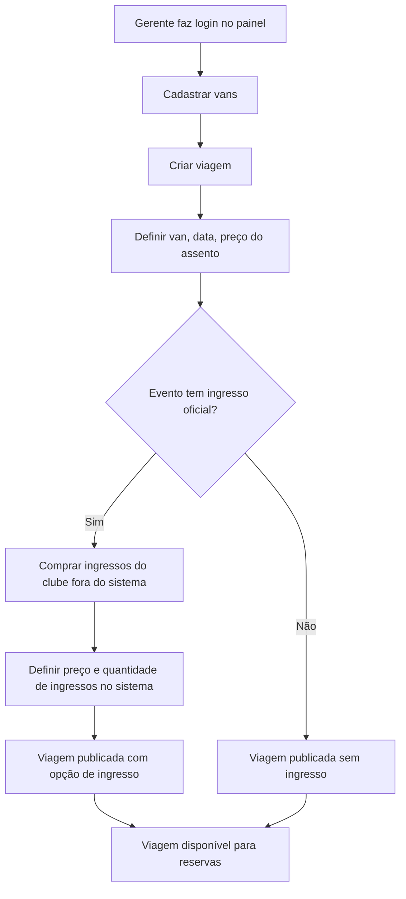
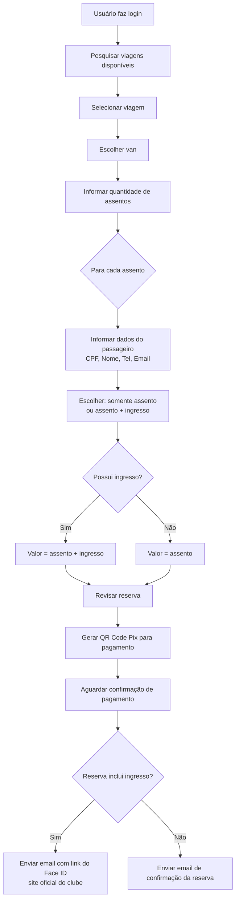
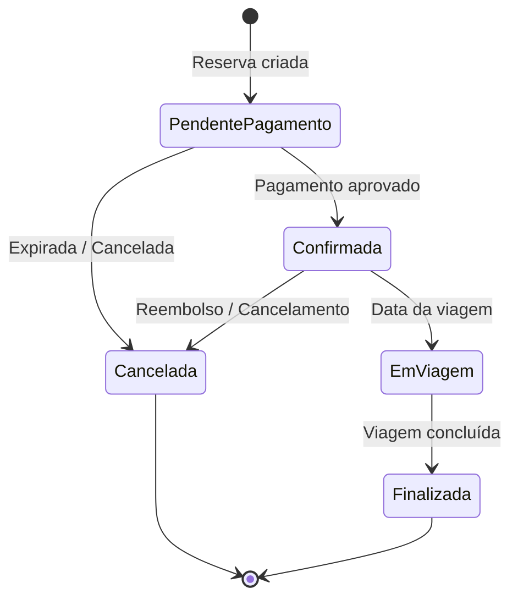

# VanBora — Sistema SaaS de Reserva de Vans

## 1. Visão Geral

O **VanBora** é uma plataforma **SaaS (Software as a Service)** que conecta passageiros a vans para transporte em eventos. O sistema permite que usuários reservem assentos em vans para qualquer tipo de evento (jogos, shows, passeios turísticos), com a opção de adquirir também o ingresso oficial do evento quando aplicável.

> **Propósito:** Oferecer uma solução completa de transporte + ingresso para eventos, onde gerentes de van criam suas viagens e usuários reservam assentos — tudo em um único lugar.

---

## 2. Modelo de Negócio (SaaS)

| Característica | Detalhe |
|----------------|---------|
| 🏢 **Modelo** | Multi-tenant — cada gerente de van é um inquilino independente |
| 💰 **Receita** | Taxa por reserva (comissão) |
| 🆓 **Primeiros clientes** | Isentos de taxa (0800) |
| 👥 **Público** | Qualquer tipo de evento: jogos, shows, passeios turísticos |

---

## 3. Atores do Sistema

| Ator | Descrição |
|------|-----------|
| **👤 Usuário (Passageiro)** | Pessoa que utiliza a plataforma para reservar assentos e opcionalmente adquirir ingressos. **Precisa criar uma conta** para fazer reservas |
| **👨‍💼 Gerente da Van** | Responsável por criar viagens, gerenciar vans, definir preços, comprar ingressos do clube e definir quantos estão disponíveis. Cada gerente opera **independentemente** (multi-tenant) |
| **🔧 Administrador VanBora** | Gerencia o sistema, tenants, taxas, e configurações globais |

---

## 4. Conceitos de Negócio

### 4.1. Tenant (Inquilino)
Cada **gerente de van** ou **empresa de transporte** é um tenant no sistema. Cada tenant:
- Gerencia suas próprias vans, viagens e preços
- Tem seu próprio painel administrativo
- Não enxerga os dados de outros tenants

### 4.2. Van
Veículo utilizado para o transporte. Cada van possui:
- Capacidade total de assentos
- Identificação (placa, modelo, etc.)
- Tenant proprietário

### 4.3. Viagem (Trip)
Rota programada para uma data/hora específica. Exemplos:

> **"Flamengo x Vasco — 15/06/2026 às 16:00"**
> **"Rock in Rio — 10/09/2026 às 14:00"**
> **"Tour Costa Verde — 20/07/2026 às 08:00"**

Cada viagem está associada a:
- Uma van específica
- Um evento (nome, data, local)
- Data e horário de partida
- Preço do assento (definido pelo gerente)
- Quantidade de ingressos oficiais disponíveis (comprados pelo gerente fora do sistema)
- Preço do ingresso (definido pelo gerente, quando aplicável)

### 4.4. Assento
Unidade individual dentro da van. O usuário pode reservar **um ou mais assentos** por reserva.

### 4.5. Reserva
Registro da intenção do usuário de ocupar assentos em uma viagem.

**Características:**

| Característica | Detalhe |
|----------------|---------|
| 👤 **Responsável** | Usuário logado que cria a reserva |
| 🪑 **Múltiplos assentos** | Pode conter 1 ou mais assentos |
| 🎫 **Ingresso opcional** | Cada assento pode ser: somente assento OU assento + ingresso |
| 🔀 **Mistura permitida** | Em uma reserva com 3 assentos: 2 com ingresso, 1 sem |
| 👥 **Passageiros** | Apenas o responsável precisa ter conta; os demais passageiros informam: **CPF, Nome, Telefone e Email** |

### 4.6. Ingresso (Ticket)
Ingresso oficial do evento. **O VanBora não vende ingressos diretamente** — o gerente da van compra os ingressos do clube/organizador fora do sistema e disponibiliza uma quantidade na plataforma.

**Fluxo do ingresso:**

```
Gerente compra ingressos do clube → Define preço e quantidade no sistema →
Usuário reserva assento + ingresso → Paga → Recebe link para Face ID →
Vai ao estádio e passa pelo Face ID para entrar
```

**Regras importantes:**

| Regra | Descrição |
|-------|-----------|
| 🚫 Ingresso sem reserva | **Não existe.** Todo ingresso está vinculado a uma reserva |
| 🛒 Origem | O gerente da van compra os ingressos do clube **fora do sistema** |
| 💰 Preço | Definido pelo gerente da van no sistema |
| 📦 Estoque | O gerente informa quantos ingressos comprou; o sistema controla quantos foram vendidos |
| 🖥️ Face ID | O gerente **não cadastra ingresso no sistema**. O usuário recebe um link para fazer Face ID no site oficial do clube |
| 🏟️ Entrada | No estádio, o usuário passa pelo **Face ID** para entrar — o ingresso está vinculado à biometria |

### 4.7. Pagamento

Processado dentro da plataforma VanBora via **QR Code (Pix)**.

**Fluxo de pagamento:**

```
Reserva criada → QR Code gerado → Usuário paga → Confirmação →
    ↓ Se assento + ingresso: link do ingresso enviado por email
    ↓ Se somente assento: confirmação de reserva enviada por email
```

---

## 5. Fluxos Principais

### 5.1. Fluxo do Gerente da Van (Tenant)



### 5.2. Fluxo do Usuário (Passageiro)



### 5.3. Diagrama de Estados da Reserva



---

## 6. Regras de Negócio

| # | Regra |
|---|-------|
| RN01 | O sistema é **multi-tenant**: cada gerente de van opera independentemente |
| RN02 | O **gerente da van** define os preços do assento e do ingresso, e cria suas próprias viagens |
| RN03 | O VanBora ganha uma **taxa por reserva**; os 2 primeiros clientes são isentos |
| RN04 | O **usuário precisa ter uma conta** para fazer uma reserva |
| RN05 | O usuário pode reservar **1 ou mais assentos** em uma única reserva |
| RN06 | Cada assento pode ter ou não um **ingresso** associado |
| RN07 | Em uma mesma reserva, é permitido **misturar** itens com e sem ingresso |
| RN08 | **Ingresso nunca existe sem uma reserva** — é sempre vinculado a um assento reservado |
| RN09 | Apenas o **responsável pela reserva** precisa estar logado; os demais passageiros informam **CPF, Nome, Telefone e Email** |
| RN10 | O **gerente da van** compra os ingressos do clube **fora do sistema** e informa quantidade e preço no VanBora |
| RN11 | O pagamento é processado via **QR Code Pix** dentro da plataforma VanBora |
| RN12 | O sistema atende **qualquer tipo de evento** (jogos, shows, passeios turísticos) |
| RN13 | O **gerente não cadastra ingressos individuais** no sistema. O usuário recebe um **link para Face ID** no site oficial do clube |
| RN14 | Se a reserva for **somente assento**, o usuário recebe apenas a confirmação da reserva |

---

## 7. Premissas Técnicas

- **Arquitetura:** Clean Architecture (.NET 9) — já iniciada
- **API:** RESTful com ASP.NET Core
- **Multi-tenant:** Isolamento por Tenant (database ou schema)
- **Banco de Dados:** **PostgreSQL**
- **ORM:** **Entity Framework Core**
- **Pagamento:** Integração com gateway Pix (QR Code)
- **Email:** Serviço de envio de emails transacionais
- **Autenticação:** JWT com Identity (separando tenants de usuários finais)

---

## 8. Glossário

| Termo | Significado |
|-------|-------------|
| **SaaS** | Software as a Service — modelo de assinatura/software sob demanda |
| **Tenant** | Inquilino — cada gerente/empresa de van no sistema |
| **Multi-tenant** | Múltiplos inquilinos isolados na mesma plataforma |
| **Passageiro** | Usuário final que reserva assentos |
| **0800** | Gratuito, sem custo |
| **Face ID** | Autenticação biométrica para acesso ao estádio/evento |
| **QR Code** | Código para pagamento via Pix |

---

## 9. Próximos Passos

1. ✅ Documento base criado e revisado
2. ⬜ Detalhar entidades de domínio (Domain layer)
3. ⬜ Mapear relacionamentos entre entidades
4. ⬜ Definir endpoints da API
5. ⬜ Criar plano de implementação com tasks detalhadas
