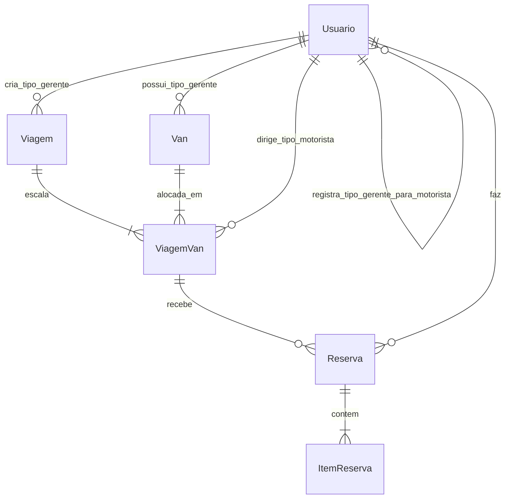
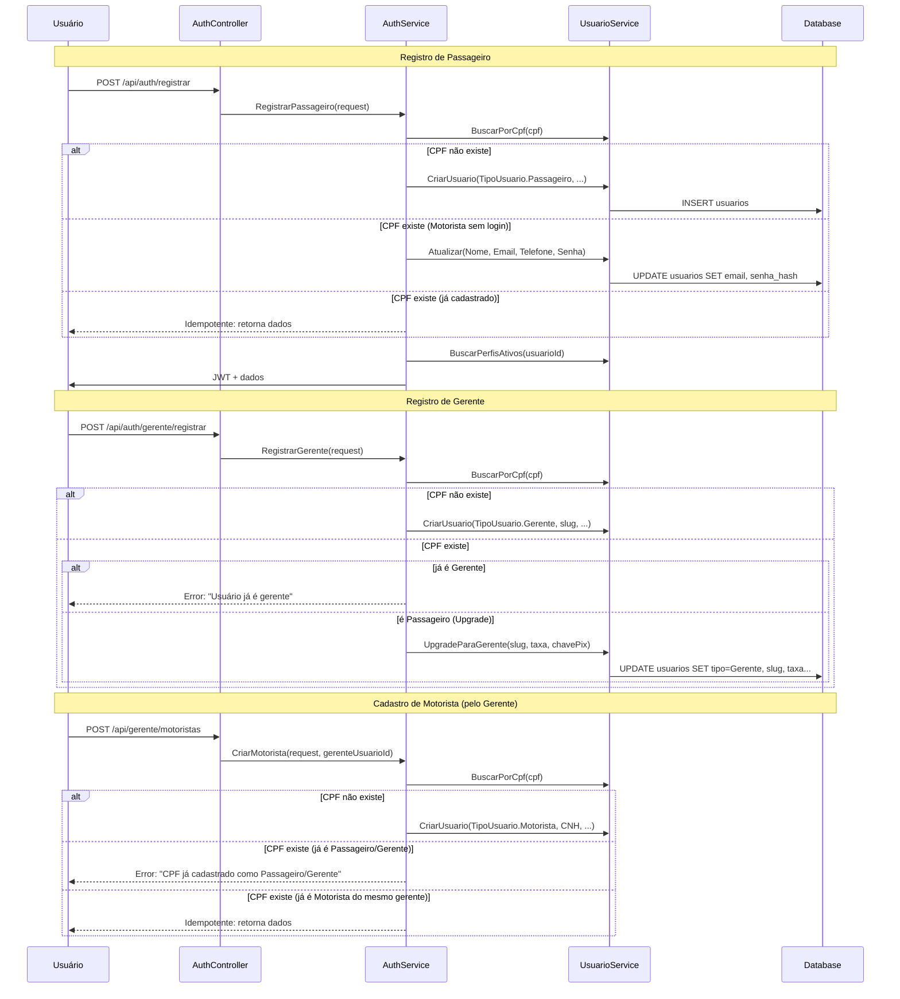
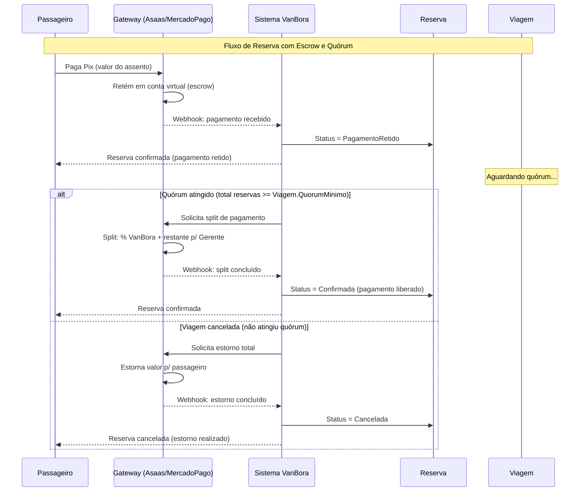

# Plano Técnico — Novo Modelo de Entidades e Relacionamentos

> **Baseado nas decisões tomadas em conversa com o usuário.**
> Status do pagamento: ✅ Definido — Gateway c/ escrow, quórum mínimo e split automático

---

## Sumário de Decisões

| # | Decisão | Status |
|---|---------|--------|
| 1 | **Opção 1**: Tudo no Usuario, entidade Perfil removida | ✅ |
| 2 | **TipoUsuario único**: Um Usuario = um tipo (Passageiro, Gerente, Motorista, Admin) | ✅ |
| 3 | **Reserva universal**: Qualquer Usuario pode reservar (já usa UsuarioId) | ✅ |
| 4 | **Só Gerente cria viagens/vans** | ✅ |
| 5 | **Motorista como registro** (sem login, cadastrado pelo Gerente) | ✅ |
| 6 | **Gateway de pagamento** com escrow, quórum mínimo e split automático | ✅ |
| 7 | **Ingresso**: Já simplificado (exibe contato do Gerente) | ✅ |

---

## 1. Mudanças no Modelo de Domínio

### 1.1. Antes vs Depois (Visão Geral)

| Aspecto | Antes (Atual) | Depois (Novo) |
|---------|---------------|---------------|
| Enum | `TipoPerfil` (Passageiro, Gerente, Motorista, Admin) | `TipoUsuario` (Passageiro, Gerente, Motorista, Admin) |
| Usuario | Sem tipo. 1:N com Perfil | Tem `TipoUsuario Tipo` diretamente |
| Perfil | Entidade separada com FK → Usuario | **Removida** |
| Slug | `Perfil.Slug` (nullable, só Gerente) | `Usuario.Slug` (nullable, só Tipo=Gerente) |
| TaxaPlataforma | `Perfil.TaxaPlataforma` (nullable, só Gerente) | `Usuario.TaxaPlataforma` (nullable, só Tipo=Gerente) |
| Gratuito | `Perfil.Gratuito` (nullable, só Gerente) | `Usuario.Gratuito` (nullable, só Tipo=Gerente) |
| CNH | `Perfil.CNH` (nullable, só Motorista) | `Usuario.CNH` (nullable, só Tipo=Motorista) |
| CriadoPor | `Perfil.CriadoPorPerfilId` (FK→Perfil, Motorista) | `Usuario.CriadoPorUsuarioId` (FK→Usuario, só Tipo=Motorista) |
| ChavePix | ❌ Não existe | `Usuario.ChavePix` (nullable, só Tipo=Gerente) — chave da conta VanBora no gateway |
| Login | Email+Senha no Usuario, Perfis definem capacidades | Email+Senha no Usuario, `TipoUsuario` define capacidade |
| Van.GerentePerfilId | FK → Perfil.Id | FK → Usuario.Id |
| Viagem.GerentePerfilId | FK → Perfil.Id | FK → Usuario.Id |
| ViagemVan.MotoristaPerfilId | FK → Perfil.Id | FK → Usuario.Id |
| Reserva.UsuarioId | FK → Usuario.Id ✅ | **Sem mudança** ✅ |

### 1.2. Novo Diagrama ER



### 1.3. Novo Usuario (Entidade Unificada)

```csharp
public class Usuario
{
    // Identity (todo usuário)
    public Guid Id { get; private set; }
    public TipoUsuario Tipo { get; private set; }   // Passageiro, Gerente, Motorista, Admin
    public string Nome { get; private set; }
    public CPF CPF { get; private set; }            // Value Object — único no sistema
    public Email? Email { get; private set; }        // Value Object — único, usado para login
    public string? SenhaHash { get; private set; }   // BCrypt. null para Motoristas (sem login)
    public Telefone? Telefone { get; private set; }  // Value Object
    public bool Ativo { get; private set; }
    public DateTime CriadoEm { get; private set; }

    // Gerente-specific (nullable, only when Tipo == Gerente)
    public string? Slug { get; private set; }             // Único no sistema
    public decimal? TaxaPlataforma { get; private set; }  // Percentual
    public bool? Gratuito { get; private set; }           // Se taxa = 0
    public string? ChavePix { get; private set; }         // Pix key for receiving payments

    // Motorista-specific (nullable, only when Tipo == Motorista)
    public CNH? CNH { get; private set; }                 // Value Object
    public Guid? CriadoPorUsuarioId { get; private set; } // FK → Usuario.Id (Gerente que cadastrou)

    // Navigation properties
    public Usuario? CriadoPorUsuario { get; private set; } = null!;
    private readonly List<Usuario> _motoristasCriados = [];
    public IReadOnlyCollection<Usuario> MotoristasCriados => _motoristasCriados.AsReadOnly();

    private readonly List<Van> _vans = [];
    public IReadOnlyCollection<Van> Vans => _vans.AsReadOnly();

    private readonly List<Viagem> _viagens = [];
    public IReadOnlyCollection<Viagem> Viagens => _viagens.AsReadOnly();

    // Factory methods
    public static Usuario CriarPassageiro(string nome, CPF cpf, Email email, string senhaHash, Telefone? telefone);
    public static Usuario CriarGerente(string nome, CPF cpf, Email email, string senhaHash, 
        Telefone? telefone, string slug, decimal taxaPlataforma, bool gratuito, string? chavePix);
    public static Usuario CriarMotorista(string nome, CPF cpf, Telefone? telefone, CNH cnh, 
        Guid criadoPorUsuarioId);
    public static Usuario CriarAdmin(string nome, CPF cpf, Email email, string senhaHash);
}
```

### 1.4. Enum: TipoPerfil → TipoUsuario

```csharp
// ANTIGO: VanBora.Domain/Enums/TipoPerfil.cs
public enum TipoPerfil
{
    Passageiro,
    Gerente,
    Motorista,
    Admin
}

// NOVO: VanBora.Domain/Enums/TipoUsuario.cs
public enum TipoUsuario
{
    Passageiro,
    Gerente,
    Motorista,
    Admin
}
```

### 1.5. FK Reference Changes (Entidades Impactadas)

#### Van.cs
| Campo | Antes | Depois |
|-------|-------|--------|
| `GerentePerfilId` | `Guid` → FK Perfil.Id | `Guid GerenteUsuarioId` → FK Usuario.Id |
| Navigation | `Perfil GerentePerfil` | `Usuario GerenteUsuario` |

#### Viagem.cs
| Campo | Antes | Depois |
|-------|-------|--------|
| `GerentePerfilId` | `Guid` → FK Perfil.Id | `Guid GerenteUsuarioId` → FK Usuario.Id |
| `QuorumMinimo` | ❌ Não existe | `int QuorumMinimo` (NOVO) — mín. de passageiros para viagem prosseguir |
| Navigation | `Perfil GerentePerfil` | `Usuario GerenteUsuario` |

#### ViagemVan.cs
| Campo | Antes | Depois |
|-------|-------|--------|
| `MotoristaPerfilId` | `Guid?` → FK Perfil.Id | `Guid? MotoristaUsuarioId` → FK Usuario.Id |
| Navigation | `Perfil? MotoristaPerfil` | `Usuario? MotoristaUsuario` |

#### Reserva.cs
| Campo | Antes | Depois |
|-------|-------|--------|
| `UsuarioId` | `Guid` → FK Usuario.Id ✅ | **Sem mudança** ✅ |

#### ItemReserva.cs
**Sem mudanças.** Mantém NomePassageiro, EmailPassageiro, TelefonePassageiro, CPFPassageiro como dados snapshot do passageiro.

---

## 2. Arquivos para Criar, Modificar e Excluir

### 2.1. ARQUIVOS A CRIAR

| # | Arquivo | Descrição |
|---|---------|-----------|
| 1 | `VanBora.Domain/Enums/TipoUsuario.cs` | Novo enum (cópia de TipoPerfil com rename) |

### 2.2. ARQUIVOS A MODIFICAR

| # | Arquivo | O que muda |
|---|---------|------------|
| 1 | `VanBora.Domain/Entities/Usuario.cs` | **REESCREVER** — adicionar `TipoUsuario Tipo`, propriedades Gerente/Motorista, factory methods, remover `_perfis`/`AdicionarPerfil()` |
| 2 | `VanBora.Domain/Entities/Van.cs` | `GerentePerfilId` → `GerenteUsuarioId`, navigation `Perfil` → `Usuario` |
| 3 | `VanBora.Domain/Entities/Viagem.cs` | `GerentePerfilId` → `GerenteUsuarioId`, navigation `Perfil` → `Usuario` |
| 4 | `VanBora.Domain/Entities/ViagemVan.cs` | `MotoristaPerfilId` → `MotoristaUsuarioId`, navigation `Perfil?` → `Usuario?` |
| 5 | `VanBora.Infrastructure/Data/Configurations/UsuarioConfiguration.cs` | **REESCREVER** — adicionar TipoUsuario, Slug, TaxaPlataforma, Gratuito, ChavePix, CNH, CriadoPorUsuarioId. Remover HasMany(Perfis). |
| 6 | `VanBora.Infrastructure/Data/AppDbContext.cs` | Remover `DbSet<Perfil> Perfis`, remover `PerfilConfiguration`, remover ignores do Perfil, adicionar `DbSet<Usuario> Usuarios` (já existe) |
| 7 | `VanBora.Application/Services/AuthService.cs` | **REESCREVER** — remover dependência de `IPerfilService`, usar `TipoUsuario` diretamente, criar Usuario com factory methods |
| 8 | `VanBora.Application/Services/UsuarioService.cs` | Simplificar — aceitar `TipoUsuario tipo`, remover lógica de Perfil |
| 9 | `VanBora.Application/Services/LoginService.cs` | Remover referências a Perfil (substituir por `usuario.Tipo`) |
| 10 | `VanBora.Application/Interfaces/IAuthService.cs` | Atualizar signatures se necessário |
| 11 | `VanBora.Application/Interfaces/IUsuarioService.cs` | Atualizar signatures |
| 12 | `VanBora.Application/DTOs/Auth/RegistrarGerenteRequest.cs` | Adicionar `ChavePix?` |
| 13 | `VanBora.Application/DTOs/Auth/RegistrarGerenteResponse.cs` | Remover `PerfilId`, adicionar `Tipo` |
| 14 | `VanBora.Application/DTOs/Auth/RegistrarPassageiroRequest.cs` | Adicionar lógica de Tipo (tela de escolha Passageiro vs Gerente) |
| 15 | `VanBora.Application/DTOs/Auth/GerenteResponse.cs` | `PerfilId` → `UsuarioId`, adicionar `ChavePix` |
| 16 | `VanBora.Application/DTOs/Auth/LoginResponse.cs` | `Perfis` (lista) → `Tipo` (único) |
| 17 | `VanBora.Application/Validators/RegistrarGerenteValidator.cs` | Atualizar regras |
| 18 | `VanBora.Application/Validators/RegistrarPassageiroRequestValidator.cs` | Atualizar regras |
| 19 | `VanBora.Application/Validators/LoginValidator.cs` | Sem mudanças significativas |
| 20 | `VanBora.Infrastructure/Extensions/ServiceCollectionExtensions.cs` | Remover DI de `IPerfilService`, `IPerfilRepository`, `PerfilService`, `PerfilRepository` |
| 21 | `docs/technical-plan.md` | Atualizar documentação completa |
| 22 | `docs/user-stories.md` | Atualizar se necessário |
| 23 | `Api/Controllers/AuthController.cs` | Atualizar rotas/respostas se necessário |

### 2.3. ARQUIVOS A EXCLUIR

| # | Arquivo | Motivo |
|---|---------|--------|
| 1 | `VanBora.Domain/Enums/TipoPerfil.cs` | Substituído por `TipoUsuario.cs` |
| 2 | `VanBora.Domain/Entities/Perfil.cs` | Entidade removida |
| 3 | `VanBora.Domain/Interfaces/IPerfilRepository.cs` | Repositório removido |
| 4 | `VanBora.Infrastructure/Repositories/PerfilRepository.cs` | Repositório removido |
| 5 | `VanBora.Infrastructure/Data/Configurations/PerfilConfiguration.cs` | Configuração removida |
| 6 | `VanBora.Application/Interfaces/IPerfilService.cs` | Service removido |
| 7 | `VanBora.Application/Services/PerfilService.cs` | Service removido |

### 2.4. ARQUIVOS QUE NÃO MUDAM

| Arquivo | Motivo |
|---------|--------|
| `VanBora.Domain/ValueObjects/Email.cs` | Sem mudanças |
| `VanBora.Domain/ValueObjects/CPF.cs` | Sem mudanças |
| `VanBora.Domain/ValueObjects/Telefone.cs` | Sem mudanças |
| `VanBora.Domain/ValueObjects/Placa.cs` | Sem mudanças |
| `VanBora.Domain/ValueObjects/Dinheiro.cs` | Sem mudanças |
| `VanBora.Domain/ValueObjects/CNH.cs` | Sem mudanças |
| `VanBora.Domain/Enums/StatusViagem.cs` | Sem mudanças |
| `VanBora.Domain/Enums/StatusReserva.cs` | **Adicionar** `PagamentoRetido` — novo status entre PendentePagamento e Confirmada |
| `VanBora.Domain/Entities/Reserva.cs` | Já usa UsuarioId ✅ |
| `VanBora.Domain/Entities/ItemReserva.cs` | Sem FK para Perfil |
| `VanBora.Domain/Common/Result.cs` | Sem mudanças |
| `VanBora.Domain/Common/Error.cs` | Sem mudanças |
| `VanBora.Domain/Common/ErrorType.cs` | Sem mudanças |
| `VanBora.Domain/Common/Guard.cs` | Sem mudanças |
| `VanBora.Domain/Interfaces/IUsuarioRepository.cs` | Pode manter-se |
| `VanBora.Domain/Interfaces/IReservaRepository.cs` | Sem mudanças |
| `VanBora.Domain/Interfaces/IVanRepository.cs` | Sem mudanças |
| `VanBora.Domain/Interfaces/IViagemRepository.cs` | Sem mudanças |
| `VanBora.Domain/Interfaces/IViagemVanRepository.cs` | Sem mudanças |
| `VanBora.Domain/Interfaces/IUnitOfWork.cs` | Sem mudanças |
| `VanBora.Infrastructure/Repositories/UsuarioRepository.cs` | Ajustes mínimos |
| `VanBora.Infrastructure/Repositories/UnitOfWork.cs` | Sem mudanças |
| `VanBora.Infrastructure/Services/TokenService.cs` | Sem mudanças |
| `Api/Program.cs` | Ajustes mínimos (registro de DI) |
| `Api/Middleware/ExceptionMiddleware.cs` | Sem mudanças |
| `Api/Middleware/ResultFilter.cs` | Sem mudanças |

---

## 3. Estratégia de Migration

### 3.1. Cenário Atual

A migration existente ([`20260514131930_InitialUsuariosPerfis.cs`](VanBora.Infrastructure/Migrations/20260514131930_InitialUsuariosPerfis.cs)) já criou as tabelas `usuarios` e `perfis` no banco.

### 3.2. Abordagem Recomendada: Nova Migration

Como o sistema ainda está em desenvolvimento inicial (sem dados reais de produção), a abordagem mais limpa é:

1. **Reverter a migration atual**: `dotnet ef database update 0`
2. **Excluir a migration**: Deletar o arquivo da migration
3. **Criar nova migration**: `dotnet ef migrations add NovaModelagem`
4. **Aplicar**: `dotnet ef database update`

Isso gera uma migration limpa com a estrutura nova:

```sql
-- Tabela usuarios (unificada, sem tabela perfis)
CREATE TABLE usuarios (
    id UUID PRIMARY KEY,
    tipo VARCHAR(20) NOT NULL,              -- Passageiro, Gerente, Motorista, Admin
    nome VARCHAR(100) NOT NULL,
    cpf VARCHAR(11) NOT NULL UNIQUE,
    email VARCHAR(254) NULL UNIQUE,
    senha_hash VARCHAR(255) NULL,
    telefone_ddd VARCHAR(2) NULL,
    telefone_numero VARCHAR(9) NULL,
    ativo BOOLEAN NOT NULL DEFAULT TRUE,
    criado_em TIMESTAMPTZ NOT NULL,

    -- Gerente-specific
    slug VARCHAR(100) NULL UNIQUE,
    taxa_plataforma NUMERIC(5,2) NULL,
    gratuito BOOLEAN NULL,
    chave_pix VARCHAR(100) NULL,

    -- Motorista-specific
    cnh VARCHAR(11) NULL,
    criado_por_usuario_id UUID NULL REFERENCES usuarios(id),

    ativo BOOLEAN NOT NULL DEFAULT TRUE,
    criado_em TIMESTAMPTZ NOT NULL
);

-- Tabela vans (FK atualizada)
CREATE TABLE vans (
    id UUID PRIMARY KEY,
    gerente_usuario_id UUID NOT NULL REFERENCES usuarios(id),
    nome VARCHAR(100) NOT NULL,
    placa VARCHAR(7) NOT NULL,
    modelo VARCHAR(100) NOT NULL,
    capacidade INT NOT NULL,
    ativo BOOLEAN NOT NULL DEFAULT TRUE,
    criado_em TIMESTAMPTZ NOT NULL
);

-- Demais tabelas seguem padrão similar
```

> ⚠️ **Importante**: As tabelas `vans`, `viagens`, `viagem_vans`, `reservas`, `item_reservas` ainda não têm migrations criadas. O ideal é criar as configurações de todas as entidades ANTES de gerar a migration, para que ela já contenha a estrutura completa.

---

## 4. Sequência de Implementação

### Fase 1: Domain Layer (sem dependências externas)

| Passo | Ação | Arquivos |
|-------|------|----------|
| 1.1 | Criar `TipoUsuario.cs` | `VanBora.Domain/Enums/TipoUsuario.cs` |
| 1.2 | Excluir `TipoPerfil.cs` | `VanBora.Domain/Enums/TipoPerfil.cs` |
| 1.3 | Reescrever `Usuario.cs` | `VanBora.Domain/Entities/Usuario.cs` |
| 1.4 | Excluir `Perfil.cs` | `VanBora.Domain/Entities/Perfil.cs` |
| 1.5 | Atualizar `Van.cs` | `VanBora.Domain/Entities/Van.cs` |
| 1.6 | Atualizar `Viagem.cs` | `VanBora.Domain/Entities/Viagem.cs` |
| 1.7 | Atualizar `ViagemVan.cs` | `VanBora.Domain/Entities/ViagemVan.cs` |
| 1.8 | Excluir `IPerfilRepository.cs` | `VanBora.Domain/Interfaces/IPerfilRepository.cs` |

### Fase 2: Infrastructure Layer

| Passo | Ação | Arquivos |
|-------|------|----------|
| 2.1 | Reescrever `UsuarioConfiguration.cs` | `VanBora.Infrastructure/Data/Configurations/UsuarioConfiguration.cs` |
| 2.2 | Excluir `PerfilConfiguration.cs` | `VanBora.Infrastructure/Data/Configurations/PerfilConfiguration.cs` |
| 2.3 | Adicionar `VanConfiguration.cs` | `VanBora.Infrastructure/Data/Configurations/VanConfiguration.cs` |
| 2.4 | Adicionar `ViagemConfiguration.cs` | `VanBora.Infrastructure/Data/Configurations/ViagemConfiguration.cs` |
| 2.5 | Adicionar `ViagemVanConfiguration.cs` | `VanBora.Infrastructure/Data/Configurations/ViagemVanConfiguration.cs` |
| 2.6 | Adicionar `ReservaConfiguration.cs` | `VanBora.Infrastructure/Data/Configurations/ReservaConfiguration.cs` |
| 2.7 | Adicionar `ItemReservaConfiguration.cs` | `VanBora.Infrastructure/Data/Configurations/ItemReservaConfiguration.cs` |
| 2.8 | Atualizar `AppDbContext.cs` | Remover Perfil, adicionar novas configurações |
| 2.9 | Excluir `PerfilRepository.cs` | `VanBora.Infrastructure/Repositories/PerfilRepository.cs` |
| 2.10 | Atualizar `ServiceCollectionExtensions.cs` | Remover DI do Perfil |

### Fase 3: Application Layer

| Passo | Ação | Arquivos |
|-------|------|----------|
| 3.1 | Excluir `IPerfilService.cs` | `VanBora.Application/Interfaces/IPerfilService.cs` |
| 3.2 | Excluir `PerfilService.cs` | `VanBora.Application/Services/PerfilService.cs` |
| 3.3 | Reescrever `AuthService.cs` | `VanBora.Application/Services/AuthService.cs` |
| 3.4 | Reescrever `UsuarioService.cs` | `VanBora.Application/Services/UsuarioService.cs` |
| 3.5 | Atualizar `LoginService.cs` | `VanBora.Application/Services/LoginService.cs` |
| 3.6 | Atualizar DTOs de Auth | `VanBora.Application/DTOs/Auth/*.cs` |

### Fase 4: API Layer + Migration

| Passo | Ação | Arquivos |
|-------|------|----------|
| 4.1 | Atualizar `AuthController.cs` | `Api/Controllers/AuthController.cs` |
| 4.2 | Atualizar `Program.cs` (se necessário) | `Api/Program.cs` |
| 4.3 | Reverter migration antiga | CLI: `dotnet ef database update 0` |
| 4.4 | Remover arquivos da migration antiga | `VanBora.Infrastructure/Migrations/20260514131930_*.cs` |
| 4.5 | Criar nova migration | CLI: `dotnet ef migrations add NovaModelagem` |
| 4.6 | Aplicar migration | CLI: `dotnet ef database update` |

### Fase 5: Documentação

| Passo | Ação | Arquivos |
|-------|------|----------|
| 5.1 | Atualizar `docs/technical-plan.md` | Documento completo |
| 5.2 | Atualizar `docs/user-stories.md` | Se necessário |
| 5.3 | Atualizar `docs/inicial.md` | Se necessário |

---

## 5. Detalhamento do Novo Usuario.cs

### 5.1. Propriedades

```csharp
public class Usuario
{
    // Core identity
    public Guid Id { get; private set; }
    public TipoUsuario Tipo { get; private set; }
    public string Nome { get; private set; }
    public CPF CPF { get; private set; }
    public Email? Email { get; private set; }
    public string? SenhaHash { get; private set; }
    public Telefone? Telefone { get; private set; }
    public bool Ativo { get; private set; }
    public DateTime CriadoEm { get; private set; }

    // Gerente-specific
    public string? Slug { get; private set; }
    public decimal? TaxaPlataforma { get; private set; }
    public bool? Gratuito { get; private set; }
    public string? ChavePix { get; private set; }

    // Motorista-specific
    public CNH? CNH { get; private set; }
    public Guid? CriadoPorUsuarioId { get; private set; }

    // Navigation — APENAS auto-relacionamento Motorista → Gerente
    public Usuario? CriadoPorUsuario { get; private set; }

    // Domain methods
    public void UpgradeParaGerente(string slug, decimal taxaPlataforma, bool gratuito, string? chavePix)
    {
        Guard.AgainstInvalidState(Tipo == TipoUsuario.Passageiro, "Apenas Passageiros podem fazer upgrade para Gerente.");
        // ... valida slug, seta campos
        Tipo = TipoUsuario.Gerente;
        Slug = slug;
        TaxaPlataforma = taxaPlataforma;
        Gratuito = gratuito;
        ChavePix = chavePix;
    }
}
```

> **Decisão de design:** O Usuario NÃO possui navigation collections para Vans, Viagens, ViagemVans, MotoristasCriados ou Reservas. Essas relações são acessadas exclusivamente via repositórios (ex: `IViagemRepository.GetByGerenteIdAsync(usuarioId)`). A FK está sempre na entidade dependente (Van.GerenteUsuarioId, Viagem.GerenteUsuarioId, ViagemVan.MotoristaUsuarioId), nunca no Usuario.

### 5.2. Navigation Properties

O Usuario mantém **apenas uma** navigation property: `CriadoPorUsuario` (auto-relacionamento para Motorista → Gerente que o cadastrou). Todas as demais relações são unidirecionais, com a FK na entidade dependente:

| Entidade | FK | Navigation |
|----------|----|------------|
| [`Van`](VanBora.Domain/Entities/Van.cs) | `GerenteUsuarioId` | `public Usuario GerenteUsuario { get; set; }` |
| [`Viagem`](VanBora.Domain/Entities/Viagem.cs) | `GerenteUsuarioId` | `public Usuario GerenteUsuario { get; set; }` |
| [`ViagemVan`](VanBora.Domain/Entities/ViagemVan.cs) | `MotoristaUsuarioId` | `public Usuario? MotoristaUsuario { get; set; }` |
| [`Usuario`](VanBora.Domain/Entities/Usuario.cs) | `CriadoPorUsuarioId` | `public Usuario? CriadoPorUsuario { get; set; }` |

Acesso aos dados via repositórios (navegação inversa não existe no Usuario):

| Query | Repositório |
|-------|-------------|
| Listar vans de um gerente | `_vanRepo.GetByGerenteId(gerenteId)` |
| Listar viagens de um gerente | `_viagemRepo.GetByGerenteId(gerenteId)` |
| Listar motoristas de um gerente | `_usuarioRepo.GetMotoristasByGerenteId(gerenteId)` |
| Listar reservas de um usuario | `_reservaRepo.GetByUsuarioId(usuarioId)` |

### 5.3. Factory Methods

```csharp
public static Usuario CriarPassageiro(string nome, CPF cpf, Email email, string senhaHash, Telefone? telefone)
{
    // Validações...
    return new Usuario
    {
        Id = Guid.NewGuid(),
        Tipo = TipoUsuario.Passageiro,
        Nome = nome,
        CPF = cpf,
        Email = email,
        SenhaHash = senhaHash,
        Telefone = telefone,
        Ativo = true,
        CriadoEm = DateTime.UtcNow
    };
}

public static Usuario CriarGerente(string nome, CPF cpf, Email email, string senhaHash,
    Telefone? telefone, string slug, decimal taxaPlataforma, bool gratuito, string? chavePix)
{
    // Slug validado (trim, lowercase)
    return new Usuario
    {
        Id = Guid.NewGuid(),
        Tipo = TipoUsuario.Gerente,
        Nome = nome,
        CPF = cpf,
        Email = email,
        SenhaHash = senhaHash,
        Telefone = telefone,
        Ativo = true,
        CriadoEm = DateTime.UtcNow,
        Slug = slugNormalizado,
        TaxaPlataforma = taxaPlataforma,
        Gratuito = gratuito,
        ChavePix = chavePix
    };
}

public static Usuario CriarMotorista(string nome, CPF cpf, Telefone? telefone, CNH cnh,
    Guid criadoPorUsuarioId)
{
    return new Usuario
    {
        Id = Guid.NewGuid(),
        Tipo = TipoUsuario.Motorista,
        Nome = nome,
        CPF = cpf,
        Telefone = telefone,
        // Email = null, SenhaHash = null (sem login)
        Ativo = true,
        CriadoEm = DateTime.UtcNow,
        CNH = cnh,
        CriadoPorUsuarioId = criadoPorUsuarioId
    };
}

public static Usuario CriarAdmin(string nome, CPF cpf, Email email, string senhaHash)
{
    return new Usuario
    {
        Id = Guid.NewGuid(),
        Tipo = TipoUsuario.Admin,
        Nome = nome,
        CPF = cpf,
        Email = email,
        SenhaHash = senhaHash,
        Ativo = true,
        CriadoEm = DateTime.UtcNow
    };
}
```

### 5.4. Regras de Negócio

| Regra | Descrição |
|-------|-----------|
| **Tipo imutável** | Após criação, `TipoUsuario` não pode ser alterado |
| **Slug único** | Apenas para `Tipo=Gerente`. Valida duplicidade via repositório |
| **CNH única** | Apenas para `Tipo=Motorista`. Valida duplicidade via repositório |
| **Email único** | Global, independente do tipo. Usado para login |
| **CPF único** | Global, imutável após cadastro |
| **Motorista sem login** | `Email = null` e `SenhaHash = null` |
| **Passageiro → Gerente** | Upgrade permitido: Passageiro pode virar Gerente (endpoint específico). O `Tipo` muda para `Gerente`, Slug/Taxa/ChavePix são preenchidos. Login e histórico permanecem intactos |
| **Motorista → Gerente** | ❌ **Não permitido.** Motorista não pode virar Gerente |
| **Gerente → Passageiro** | ❌ **Não permitido.** Irreversível |
| **Tipo imutável** | Após definido (ou upgrade), `TipoUsuario` não pode mais ser alterado |
| **Slug único** | Apenas para `Tipo=Gerente`. Valida duplicidade via repositório |
| **CNH única** | Apenas para `Tipo=Motorista`. Valida duplicidade via repositório |
| **Email único** | Global, independente do tipo. Usado para login |
| **CPF único** | Global, imutável após cadastro |
| **Motorista sem login** | `Email = null` e `SenhaHash = null` |
| **Motorista pode ativar conta** | Se depois se registrar como Passageiro (mesmo CPF), o sistema define Email+Senha. O `Tipo` continua `Motorista`, mas agora pode fazer login |
| **Auto-relacionamento** | `CriadoPorUsuarioId` referencia um `Usuario` com `Tipo=Gerente` |

---

## 6. Mudanças no JWT e Services

### 6.1. JWT Claims (Simplificado)

Com TipoUsuario único, o JWT não precisa mais de lista de perfis:

```json
{
  "sub": "guid-do-usuario",
  "email": "email-do-usuario",
  "tipo": "Gerente",
  "nome": "João Silva"
}
```

| Claim | Descrição |
|-------|-----------|
| `sub` | UsuarioId |
| `email` | Email do usuario |
| `tipo` | TipoUsuario (único): Passageiro, Gerente, Motorista, Admin |
| `nome` | Nome do usuario |

Regras de autorização baseadas no `tipo`:
- Endpoints de Gerente: `claim.tipo == "Gerente"`
- Endpoints de Admin: `claim.tipo == "Admin"`
- Endpoints de reserva: qualquer usuario logado (qualquer `tipo`)

### 6.2. Novo Fluxo de Registro



### 6.3. DTOs Atualizados

#### RegistrarGerenteRequest (MODIFICADO)
```csharp
public class RegistrarGerenteRequest
{
    public string Nome { get; set; }
    public string Cpf { get; set; }
    public string Email { get; set; }
    public string Senha { get; set; }
    public string? Telefone { get; set; }
    public string Slug { get; set; }
    public string? ChavePix { get; set; }  // NOVO
}
```

#### RegistrarGerenteResponse (MODIFICADO)
```csharp
public class RegistrarGerenteResponse
{
    public Guid UsuarioId { get; set; }
    public string Nome { get; set; }
    public string? Email { get; set; }
    public string? Telefone { get; set; }
    public string Cpf { get; set; }
    public string Tipo { get; set; }         // "Gerente" (simplificado)
    public GerenteResponse Gerente { get; set; }
    public string Token { get; set; }
}
```

#### GerenteResponse (MODIFICADO)
```csharp
public class GerenteResponse
{
    public Guid UsuarioId { get; set; }        // Antes: PerfilId
    public string Slug { get; set; }
    public decimal TaxaPlataforma { get; set; }
    public bool Gratuito { get; set; }
    public bool Ativo { get; set; }
    public string? ChavePix { get; set; }      // NOVO
}
```

#### LoginResponse (MODIFICADO)
```csharp
public class LoginResponse
{
    public Guid UsuarioId { get; set; }
    public string Nome { get; set; }
    public string Email { get; set; }
    public string Tipo { get; set; }            // Antes: List<string> Perfis
    public string Token { get; set; }
}
```

#### RegistrarPassageiroResponse (MODIFICADO)
```csharp
public sealed record RegistrarPassageiroResponse(
    Guid UsuarioId,
    string Tipo,           // Antes: Guid PerfilPassageiroId
    string Token);
```

---

## 7. Modelo de Pagamento (Gateway + Quórum + Split)

### 7.1. Fluxo de Pagamento



### 7.2. Novo StatusReserva

```csharp
public enum StatusReserva
{
    PendentePagamento,  // Aguardando pagamento
    PagamentoRetido,    // (NOVO) Pago, retido no gateway (escrow)
    Confirmada,         // Quórum atingido, split realizado, Gerente recebeu
    EmAndamento,
    Concluida,
    Cancelada,          // Estorno total (via cancelamento)
    Expirada
}
```

### 7.3. Impacto nas Entidades

| Entidade | Campo | Descrição |
|----------|-------|-----------|
| [`Viagem.cs`](VanBora.Domain/Entities/Viagem.cs) | `int QuorumMinimo` | Número mínimo de passageiros para viagem prosseguir |
| [`StatusReserva`](VanBora.Domain/Enums/StatusReserva.cs) | `PagamentoRetido` | Novo status — pagamento recebido mas retido em escrow |
| [`Reserva.cs`](VanBora.Domain/Entities/Reserva.cs) | Fluxo de status | `PendentePagamento → PagamentoRetido → Confirmada` |
| [`Usuario.cs`](VanBora.Domain/Entities/Usuario.cs) | `ChavePix` | Agora representa a chave Pix da **conta VanBora no gateway** |

### 7.4. Viagem — Construtor Atualizado

```csharp
public Viagem(
    Guid gerenteUsuarioId,    // Antes: gerentePerfilId
    string nomeEvento,
    DateTime dataEvento,
    string localEvento,
    DateTime dataPartida,
    string localPartida,
    decimal precoAssento,
    bool possuiIngresso,
    int quorumMinimo)         // (NOVO) mínimo de passageiros
{
    Guard.AgainstEmptyGuid(gerenteUsuarioId, nameof(gerenteUsuarioId));
    Guard.AgainstNegativeOrZero(quorumMinimo, nameof(quorumMinimo));
    // ... demais validações

    Id = Guid.NewGuid();
    GerenteUsuarioId = gerenteUsuarioId;  // Antes: GerentePerfilId
    QuorumMinimo = quorumMinimo;
    // ... demais campos
}
```

### 7.5. Regras de Negócio do Pagamento

| Regra | Descrição |
|-------|-----------|
| **Escrow** | Todo pagamento entra como `PagamentoRetido` — dinheiro fica na conta virtual do gateway |
| **Quórum** | `Viagem.QuorumMinimo` define quantas reservas são necessárias para liberar |
| **Split automático** | Quando quórum atinge, gateway divide: % VanBora + restante liberado p/ Gerente sacar |
| **Estorno total** | Se viagem cancelada antes do quórum, gateway estorna 100% para todos os passageiros |
| **ChavePix** | `Usuario.ChavePix` (Gerente) = chave da conta VanBora no gateway para split |
| **Gateway** | Integração via webhooks: recebimento, split concluído, estorno concluído |
| **Status flow** | `PendentePagamento → PagamentoRetido → Confirmada → EmAndamento → Concluida` |
| **Cancelamento** | Cancelada via estorno: `PagamentoRetido → Cancelada` |

> **Nota:** A implementação do gateway (Asaas/Mercado Pago) é uma integração externa. Este plano cobre apenas as mudanças no modelo de domínio. A integração com o gateway será feita em uma fase posterior.

---

## 8. Resumo das Alterações por Camada

| Camada | Arquivos Criados | Arquivos Modificados | Arquivos Excluídos |
|--------|-----------------|---------------------|-------------------|
| **Domain** | 1 | 4 | 2 |
| **Infrastructure** | 5 | 3 | 2 |
| **Application** | 0 | 8 | 2 |
| **API** | 0 | 2 | 0 |
| **Docs** | 0 | 2 | 0 |
| **Total** | **6** | **19** | **6** |

---

## 9. Checklist de Implementação (para Code Mode)

- [ ] **Fase 1 — Domain**
  - [ ] Criar [`VanBora.Domain/Enums/TipoUsuario.cs`](VanBora.Domain/Enums/TipoUsuario.cs)
  - [ ] Excluir [`VanBora.Domain/Enums/TipoPerfil.cs`](VanBora.Domain/Enums/TipoPerfil.cs)
  - [ ] Reescrever [`VanBora.Domain/Entities/Usuario.cs`](VanBora.Domain/Entities/Usuario.cs)
  - [ ] Excluir [`VanBora.Domain/Entities/Perfil.cs`](VanBora.Domain/Entities/Perfil.cs)
  - [ ] Atualizar [`VanBora.Domain/Entities/Van.cs`](VanBora.Domain/Entities/Van.cs) (GerentePerfilId → GerenteUsuarioId)
  - [ ] Atualizar [`VanBora.Domain/Entities/Viagem.cs`](VanBora.Domain/Entities/Viagem.cs) (GerentePerfilId → GerenteUsuarioId, + QuorumMinimo)
  - [ ] Atualizar [`VanBora.Domain/Enums/StatusReserva.cs`](VanBora.Domain/Enums/StatusReserva.cs) (adicionar PagamentoRetido)
  - [ ] Atualizar [`VanBora.Domain/Entities/ViagemVan.cs`](VanBora.Domain/Entities/ViagemVan.cs) (MotoristaPerfilId → MotoristaUsuarioId)
  - [ ] Excluir [`VanBora.Domain/Interfaces/IPerfilRepository.cs`](VanBora.Domain/Interfaces/IPerfilRepository.cs)

- [ ] **Fase 2 — Infrastructure**
  - [ ] Reescrever [`VanBora.Infrastructure/Data/Configurations/UsuarioConfiguration.cs`](VanBora.Infrastructure/Data/Configurations/UsuarioConfiguration.cs)
  - [ ] Excluir [`VanBora.Infrastructure/Data/Configurations/PerfilConfiguration.cs`](VanBora.Infrastructure/Data/Configurations/PerfilConfiguration.cs)
  - [ ] Criar `VanConfiguration.cs` (se não existir)
  - [ ] Criar `ViagemConfiguration.cs` (se não existir)
  - [ ] Criar `ViagemVanConfiguration.cs` (se não existir)
  - [ ] Criar `ReservaConfiguration.cs` (se não existir)
  - [ ] Criar `ItemReservaConfiguration.cs` (se não existir)
  - [ ] Atualizar [`VanBora.Infrastructure/Data/AppDbContext.cs`](VanBora.Infrastructure/Data/AppDbContext.cs)
  - [ ] Excluir [`VanBora.Infrastructure/Repositories/PerfilRepository.cs`](VanBora.Infrastructure/Repositories/PerfilRepository.cs)
  - [ ] Atualizar [`VanBora.Infrastructure/Extensions/ServiceCollectionExtensions.cs`](VanBora.Infrastructure/Extensions/ServiceCollectionExtensions.cs)

- [ ] **Fase 3 — Application**
  - [ ] Excluir [`VanBora.Application/Interfaces/IPerfilService.cs`](VanBora.Application/Interfaces/IPerfilService.cs)
  - [ ] Excluir [`VanBora.Application/Services/PerfilService.cs`](VanBora.Application/Services/PerfilService.cs)
  - [ ] Reescrever [`VanBora.Application/Services/AuthService.cs`](VanBora.Application/Services/AuthService.cs)
  - [ ] Reescrever [`VanBora.Application/Services/UsuarioService.cs`](VanBora.Application/Services/UsuarioService.cs)
  - [ ] Atualizar `LoginService.cs`
  - [ ] Atualizar `IAuthService.cs` / `IUsuarioService.cs`
  - [ ] Atualizar DTOs de Auth

- [ ] **Fase 4 — API + Migration**
  - [ ] Atualizar [`Api/Controllers/AuthController.cs`](Api/Controllers/AuthController.cs)
  - [ ] Atualizar `Api/Program.cs` (DI)
  - [ ] Reverter migration antiga + remover arquivos
  - [ ] Criar nova migration + aplicar

- [ ] **Fase 5 — Documentação**
  - [ ] Atualizar [`docs/technical-plan.md`](docs/technical-plan.md)
  - [ ] Atualizar [`docs/user-stories.md`](docs/user-stories.md)

---

## 10. Observações Finais

1. **Reserva.UsuarioId** já está correto — não precisa de alteração ✅
2. **CriadoEm, Ativo** — todas as entidades mantêm padrão atual
3. **Soft delete** — todas as exclusões são lógicas (`Ativo = false`)
4. **Motorista com senha futura** — se o usuário depois quiser que Motorista tenha login, o campo `SenhaHash` e `Email` existem e são nullable — é só setar
5. **ChavePix** — representa a chave Pix da conta VanBora no gateway para split de pagamento
6. **PagamentoRetido** — novo status intermediário: pagamento recebido mas retido em escrow até quórum
7. **QuorumMinimo** — novo campo em Viagem: número mínimo de passageiros para viagem prosseguir
8. **Gateway de pagamento** — a integração com Asaas/Mercado Pago será feita em fase posterior
