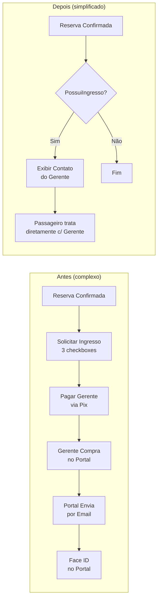

# Plano de Simplificação do Fluxo de Ingresso

## Resumo da Mudança

Após a reserva ser confirmada (paga), se a viagem tiver `PossuiIngresso = true`, o sistema **apenas exibe o contato do gerente** (WhatsApp/telefone) para o passageiro. O VanBora **não faz mais nada** relacionado a ingressos — sem solicitação, sem checkboxes, sem status de ticket, sem endpoints de ingresso.

---

## 1. Alterações em `docs/technical-plan.md`

### 1.1. Entidade Viagem (linha ~120-131)
- **Manter:** `PossuiIngresso` (bool)
- **Remover:** `PrecoIngresso` (decimal?)
- **Remover:** `PrazoCompraIngresso` (int)

### 1.2. Entidade ViagemVan (linha ~133-141)
- **Remover:** `IngressosDisponiveis` (int)
- Nota sobre assentos virtuais permanece inalterada

### 1.3. Entidade ItemReserva (linha ~170-198)
- **Remover TODOS os campos de ingresso:**
  - `PossuiIngresso` (bool)
  - `PrecoIngresso` (decimal?)
  - `StatusTicket` (StatusTicket)
  - `AutorizadoGerenteCompra` (bool)
  - `ConsentimentoSemReembolso` (bool)
  - `ConsentimentoFaceId` (bool)
  - `EmailParaIngresso` (string?)
  - `SolicitadoEm` (DateTime?)
  - `PagoGerenteEm` (DateTime?)
  - `CompradoEm` (DateTime?)
  - `EntregueEm` (DateTime?)
- **Remover as duas notas** sobre pagamento do ingresso e Face ID

### 1.4. Enum StatusTicket (linha ~279-288)
- **Remover** completamente o bloco `public enum StatusTicket`

### 1.5. Endpoints (seção 3)

#### 3.6. Reservas (linha ~361-371)
- **Remover:**
  - `POST /api/reservas/{id}/solicitar-ingressos`
  - `GET /api/reservas/{id}/ingressos`
  - `POST /api/reservas/{id}/ingressos/{itemReservaId}/confirmar-pagamento`

#### 3.7. Gerente — Gestão de Ingressos (linha ~373-381)
- **Remover a seção inteira** (5 endpoints)

### 1.6. Fluxo de Criação de Reserva — Diagrama (seção 4, linha ~400-466)
- **Remover** a parte do fluxo de ingresso (bloco `alt` — linhas ~441-465)
- **Simplificar** o diagrama para mostrar apenas o fluxo de assento
- **Adicionar** nota no final: "Após pagamento confirmado, se `PossuiIngresso = true`, o sistema exibe o contato do gerente para o passageiro tratar o ingresso diretamente."

### 1.7. Estrutura de Pastas (seção 5, linha ~491-559)
- **Remover:**
  - `Gerente/IngressosController.cs`
  - `IIngressoService.cs`
  - `IngressoService.cs`

### 1.8. Decisões de implementação (linha ~562-579)
- **Remover** as bullets sobre ingresso (split payment, max ingressos, VanBora não vende ingressos, solicitação após pagamento)
- **Adicionar** bullet: "Ingresso: VanBora apenas exibe o contato do gerente para o passageiro. Toda negociação de ingresso é feita fora da plataforma."

### 1.9. Sprint 5 (linha ~810-822)
- **Remover** tasks 5.1 a 5.4 (Solicitar Ingresso, Confirmar Pagamento, Listar Solicitações, Comprar/Entregar/Reembolsar)
- **Substituir** por tasks mais simples, se necessário (ex: exibir contato do gerente na tela de confirmação)
- **Remover** testes de ingresso da task 5.6

### 1.10. Product Backlog (linha ~857-887)
- **Remover** entradas de US28 (Solicitar Ingresso) e US29 (Gerenciar Ingressos)
- **Atualizar** numeração e dependências

### 1.11. Resumo de Story Points por Sprint (linha ~844-851)
- **Ajustar** Sprint 5 (de 26 para ~8 SP, mantendo apenas US26 + testes)

---

## 2. Alterações em `docs/inicial.md`

### 2.1. Seção 4.5 — Reserva (linha ~68-79)
- **Remover** bullet "🎫 Ingresso opcional"
- **Remover** bullet "🔀 Mistura permitida"
- **Remover** bullet "🎫 Ingresso (Ticket)"
- **Remover** todas as referências a ingresso

### 2.2. Seção 4.6 — Ingresso (linha ~81-121)
- **Substituir** completamente por texto simples:
  > "Se a viagem possui opção de ingresso, após confirmar a reserva o passageiro vê o contato do gerente (WhatsApp/telefone) para tratar a compra do ingresso diretamente. O VanBora não processa nem gerencia ingressos."

### 2.3. Seção 4.7 — Pagamento (linha ~122-144)
- **Remover** todo o fluxo de pagamento do ingresso (split payment)
- Manter apenas pagamento do assento via QR Code Pix

### 2.4. Fluxo do Gerente (seção 5.2, linha ~181-201)
- **Remover** bloco de ingresso (passos M a R)
- Simplificar: Gerente cria viagem com `possuiIngresso` opcional, mas não há mais ações relacionadas

### 2.5. Fluxo do Usuário (seção 5.3, linha ~203-229)
- **Remover** bloco de ingresso (passos N a V)
- Substituir por: após confirmação, se `possuiIngresso = true`, exibe contato do gerente

### 2.6. Regras de Negócio (seção 6, linha ~247-281)
- **Remover** as seguintes RNs:
  - RN06 (ingresso associado)
  - RN07 (misturar itens)
  - RN08 (ingresso nunca existe sem reserva)
  - RN10 (autorização do gerente)
  - RN11 (pagamento separado)
  - RN13 (Face ID)
  - RN25 (só após pagamento)
  - RN26 (máximo de ingressos)
  - RN27 (3 checkboxes)
  - RN28 (sem reembolso)
  - RN29 (prazo 24h)
  - RN30 (VanBora não se responsabiliza)
- **Atualizar** RN06 (agora: "Se a viagem tiver `PossuiIngresso = true`, o sistema exibe o contato do gerente para o passageiro. A negociação do ingresso é feita fora da plataforma.")
- **Renumerar** as RNs restantes

### 2.7. Seção 8 — Glossário (linha ~298-310)
- **Remover** verbete "Face ID"

---

## 3. Alterações em `docs/relatorio-completo.md`

### 3.1. ItemReserva (seção 5.8, linha ~243-264)
- **Remover** todos os campos de ingresso (mesma lista do technical-plan)

### 3.2. Enums (seção 7, linha ~283-292)
- **Remover** `StatusTicket`

### 3.3. Endpoints (seção 8)
- **8.6. Reservas:** Remover endpoints de ingresso
- **8.7. Gerente — Ingressos:** Remover seção inteira

### 3.4. User Stories (seção 9, linha ~389-422)
- **Remover** US28 e US29

### 3.5. Estrutura de Projeto (seção 10)
- **Remover** referências a IngressosController, IIngressoService, IngressoService, StatusTicket

### 3.6. Plano de Implementação (seção 11)
- **Remover** task 3.7 (Implementar IngressoService)
- **Remover** task 4.7 (Gerente/IngressosController)

### 3.7. Regras de Negócio (seção 4)
- **Remover** RN06, RN07, RN08, RN10, RN11, RN13, RN25-RN30
- **Atualizar** RN06 com novo texto

---

## 4. Alterações em `docs/user-stories.md`

### 4.1. US28 (linha ~1670-1778)
- **Remover** completamente (Solicitar Ingresso)

### 4.2. US29 (linha ~1782-1893)
- **Remover** completamente (Gerente: Gerenciar Ingressos)

### 4.3. Glossário de Respostas HTTP (linha ~1897-1908)
- Sem alterações necessárias (genérico)

---

## 5. Resumo Visual da Mudança

## 6. Impacto nos Arquivos

| Arquivo | Linhas Removidas | Linhas Adicionadas | Complexidade |
|---------|-----------------|-------------------|--------------|
| `docs/technical-plan.md` | ~80 | ~10 | Alta |
| `docs/inicial.md` | ~100 | ~15 | Alta |
| `docs/relatorio-completo.md` | ~60 | ~10 | Média |
| `docs/user-stories.md` | ~230 | ~0 | Média |
