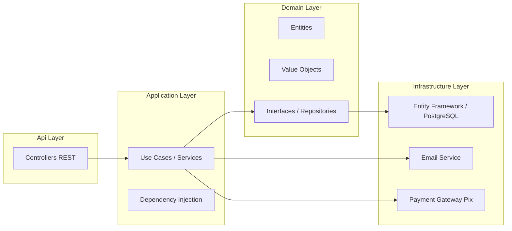
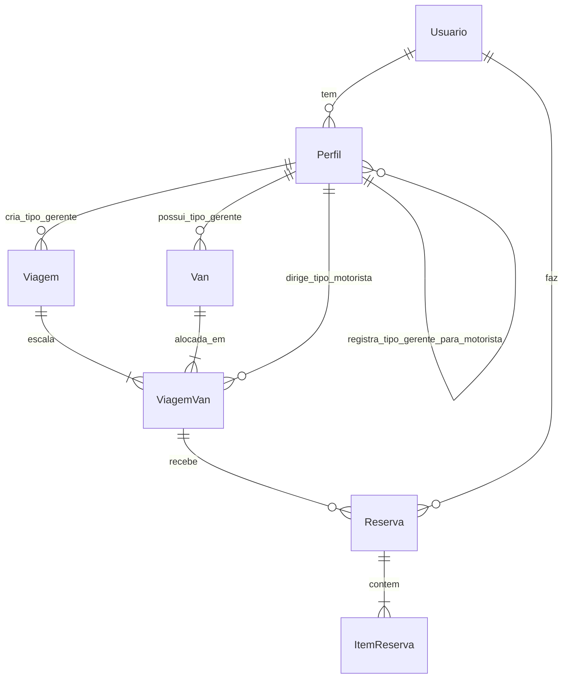
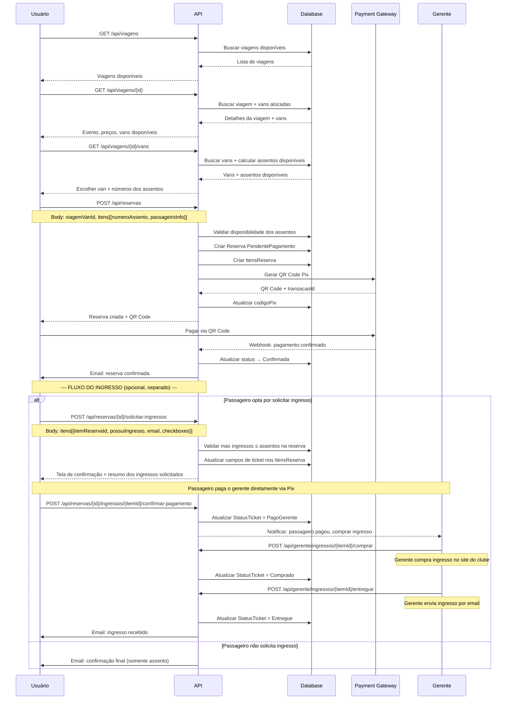
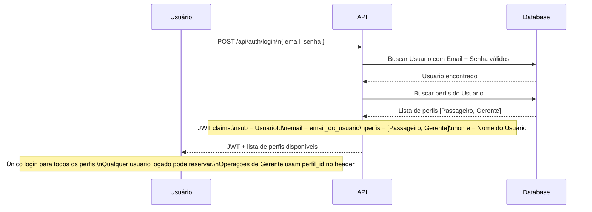

# VanBora — Plano Técnico e Arquitetura

> **Nota:** Todas as entidades e propriedades estão em português.

---

## 1. Arquitetura Geral



---

## 2. Modelo de Domínio

### 2.1. Diagrama de Entidades e Relacionamentos



> **Nota sobre Perfil auto-relacionamento:** Um Perfil do tipo Gerente "registra" Perfis do tipo Motorista. Na prática, o Perfil do Motorista possui uma FK `CriadoPorPerfilId` → Perfil.Id (Gerente).

### 2.2. Entidades de Domínio

#### Usuario (Conta Única — login + pessoa física)

| Propriedade | Tipo | Descrição |
|-------------|------|-----------|
| Id | Guid | Chave primária |
| Nome | string | Nome completo |
| CPF | CPF | Value Object — **único no sistema**, imutável após cadastro |
| Email | Email? | Value Object — **único no sistema**, usado para login. `null` para Motoristas que ainda não ativaram a conta |
| SenhaHash | string? | Hash da senha (BCrypt). `null` para Motoristas que ainda não ativaram a conta |
| Telefone | Telefone? | Value Object (nullable) |
| Ativo | bool | Se a conta está ativa |
| CriadoEm | DateTime | Data de criação |

> Um **Usuario** é a **conta única** do sistema. O login é feito com Email + Senha do Usuario (apenas contas com `SenhaHash != null`). Pode ter múltiplos perfis (Passageiro, Gerente, Motorista, Admin). **Qualquer usuário logado pode reservar assentos** — independentemente do tipo de perfil.
>
> **Motorista sem login:** Quando o Gerente cadastra um Motorista, o sistema cria um Usuario com `Email = null` e `SenhaHash = null`. Este Usuario não pode fazer login até que a pessoa se registre como Passageiro (mesmo CPF) e defina email + senha. Nesse momento, o sistema ativa a conta e adiciona o Perfil Passageiro.

#### Perfil (Papel do Usuario no sistema)

| Propriedade | Tipo | Descrição |
|-------------|------|-----------|
| Id | Guid | Chave primária |
| UsuarioId | Guid | FK → Usuario |
| Tipo | TipoPerfil | Passageiro, Gerente, Motorista, Admin |
| Ativo | bool | Se o perfil está ativo |
| CriadoPorPerfilId | Guid? | FK → Perfil (Gerente que cadastrou, apenas para Tipo=Motorista) |
| CriadoEm | DateTime | Data de criação |

**Campos específicos por Tipo:**

> Perfil Passageiro não possui campos específicos — usa apenas os dados do Usuario (Nome, CPF, Email, Telefone).

| Campo | Gerente | Motorista | Admin |
|-------|---------|-----------|-------|
| Slug | ✅ (único) | ❌ | ❌ |
| TaxaPlataforma | ✅ (%) | ❌ | ❌ |
| Gratuito | ✅ (bool) | ❌ | ❌ |
| CNH | ❌ | ✅ | ❌ |

> **Nota:** Slug, TaxaPlataforma e Gratuito são propriedades específicas do Perfil Gerente. CNH é específica do Perfil Motorista. O **login** (Email + Senha) está no **Usuario**, não no Perfil.

#### Van

| Propriedade | Tipo | Descrição |
|-------------|------|-----------|
| Id | Guid | Chave primária |
| GerentePerfilId | Guid | FK → Perfil.Id (Tipo=Gerente) — dono da van |
| Nome | string | Nome/identificação |
| Placa | Placa | Value Object — formato Mercosul |
| Modelo | string | Modelo |
| Capacidade | int | Capacidade total **incluindo motorista**. Ex: 16 = 15 assentos para reserva + 1 motorista |
| Ativo | bool | Se está ativa |
| CriadoEm | DateTime | Data de criação |

#### Viagem (Trip)

| Propriedade | Tipo | Descrição |
|-------------|------|-----------|
| Id | Guid | Chave primária |
| GerentePerfilId | Guid | FK → Perfil.Id (Tipo=Gerente) |
| NomeEvento | string | Nome do evento |
| DataEvento | DateTime | Data/hora do evento |
| LocalEvento | string | Local do evento |
| DataPartida | DateTime | Data/hora de partida |
| LocalPartida | string | Local de partida |
| PrecoAssento | decimal | Preço do assento (igual para todas as vans) |
| PossuiIngresso | bool | Se o gerente oferece opção de ingresso |
| PrecoIngresso | decimal? | Preço do ingresso (quanto o gerente cobrará do passageiro) |
| PrazoCompraIngresso | int | Prazo em horas para o gerente comprar o ingresso após solicitação (padrão: 24) |
| Status | StatusViagem | Agendada, EmAndamento, Concluida, Cancelada |
| CriadoEm | DateTime | Data de criação |

#### ViagemVan (Junction — Van alocada na Viagem)

| Propriedade | Tipo | Descrição |
|-------------|------|-----------|
| Id | Guid | Chave primária |
| ViagemId | Guid | FK → Viagem |
| VanId | Guid | FK → Van |
| MotoristaPerfilId | Guid? | FK → Perfil.Id (Tipo=Motorista, opcional, alocado posteriormente) |
| IngressosDisponiveis | int | Ingressos que o gerente está disposto a comprar para esta van (limite máximo de solicitações) |

> **Assentos Virtuais:** A capacidade de assentos é derivada diretamente de `Van.Capacidade` (ex: 16 = 15 assentos + motorista). Não existem registros previamente criados de assentos. A disponibilidade é calculada subtraindo os `ItemReserva.NumeroAssento` já registrados para aquela `ViagemVan` do total de assentos disponíveis (`Van.Capacidade - 1`). O usuário escolhe o número do assento no momento da reserva, e o sistema valida se ele já está ocupado por outro `ItemReserva`.

#### Perfil Motorista (Driver)

> O Motorista é um **Perfil** (Tipo=Motorista) vinculado a um Usuario. Quando o Gerente cadastra o Motorista, o Usuario é criado com `Email = null` e `SenhaHash = null` — o Motorista **não possui login inicialmente**. A pessoa pode depois **ativar a conta** registrando-se como Passageiro com o mesmo CPF (define email + senha). As propriedades abaixo são os dados específicos do perfil Motorista — Nome, CPF e Telefone estão no Usuario.

| Propriedade | Específica do Perfil Motorista | Descrição |
|-------------|-------------------------------|-----------|
| CNH | string | Número da CNH |
| Ativo | bool | Se ainda trabalha com o gerente |
| CriadoPorPerfilId | Guid | FK → Perfil.Id do Gerente que cadastrou |

#### Reserva (Reservation)

| Propriedade | Tipo | Descrição |
|-------------|------|-----------|
| Id | Guid | Chave primária |
| UsuarioId | Guid | FK → Usuario (responsável pela reserva — qualquer usuário logado pode reservar) |
| ViagemVanId | Guid | FK → ViagemVan (van específica na viagem) |
| Status | StatusReserva | PendentePagamento, Confirmada, EmAndamento, Concluida, Cancelada, Expirada |
| ValorTotal | decimal | Valor total (soma dos itens) |
| TaxaPlataforma | decimal | Taxa calculada do VanBora |
| CodigoPix | string | Código/Imagem do QR Code Pix |
| TransacaoId | string? | ID da transação no gateway |
| PagoEm | DateTime? | Data de pagamento |
| CriadoEm | DateTime | Data de criação |
| ExpiraEm | DateTime | Data de expiração (CriadoEm + 10 minutos) |

#### ItemReserva (ReservationItem)

| Propriedade | Tipo | Descrição |
|-------------|------|-----------|
| Id | Guid | Chave primária |
| ReservaId | Guid | FK → Reserva |
| NumeroAssento | int | Número do assento escolhido pelo usuário. Ex: 1 a 15 (se Van.Capacidade = 16) |
| PrecoAssento | decimal | Preço do assento (snapshot) |
| NomePassageiro | string | Nome do passageiro |
| EmailPassageiro | string | Email do passageiro |
| TelefonePassageiro | string | Telefone do passageiro |
| CPFPassageiro | string | CPF do passageiro |
| **Campos de Ingresso (preenchidos após pagamento, se solicitado)** |
| PossuiIngresso | bool | Se o passageiro solicitou ingresso para este assento |
| PrecoIngresso | decimal? | Preço do ingresso (snapshot no momento da solicitação) |
| StatusTicket | StatusTicket | NaoSolicitado, AguardandoPagamento, PagoGerente, EmCompra, Comprado, Entregue, Reembolsado |
| AutorizadoGerenteCompra | bool | Checkbox 1: autoriza gerente a comprar em seu nome |
| ConsentimentoSemReembolso | bool | Checkbox 2: concorda que não há reembolso após receber |
| ConsentimentoFaceId | bool | Checkbox 3: autoriza cadastro de Face ID |
| EmailParaIngresso | string? | Email onde receberá o ingresso (pode ser diferente do email do perfil) |
| SolicitadoEm | DateTime? | Quando o passageiro solicitou o ingresso |
| PagoGerenteEm | DateTime? | Quando o passageiro pagou o gerente |
| CompradoEm | DateTime? | Quando o gerente comprou o ingresso no site do clube |
| EntregueEm | DateTime? | Quando o gerente enviou o ingresso por email |

> **Nota sobre pagamento:** O pagamento do ingresso é feito **diretamente ao gerente** (fora do VanBora). Os campos `PagoGerenteEm` e `StatusTicket` são atualizados pelo gerente no sistema para registro e rastreamento.
>
> **Nota sobre Face ID:** O campo `ConsentimentoFaceId` registra apenas a **autorização** do passageiro para cadastro de Face ID. O cadastro em si é feito pelo **próprio passageiro no portal do evento** (site oficial de venda de ingressos), usando o link recebido por email após o gerente comprar o ingresso. O VanBora não cadastra Face ID.

### 2.3. Value Objects

Value Objects no domínio, definidos em `VanBora.Domain/ValueObjects/`:

#### `Email`
| Propriedade | Tipo | Descrição |
|-------------|------|-----------|
| Valor | string | Email validado |

- Valida formato de email na criação
- Imutável: `new Email("user@example.com")`
- Comparação por valor

#### `CPF`
| Propriedade | Tipo | Descrição |
|-------------|------|-----------|
| Valor | string | CPF com 11 dígitos |

- Valida dígitos verificadores na criação
- Armazena apenas números (sem formatação)
- Imutável: `new CPF("12345678909")`

#### `Telefone`
| Propriedade | Tipo | Descrição |
|-------------|------|-----------|
| DDD | string | 2 dígitos |
| Numero | string | 8 ou 9 dígitos |
| ValorCompleto | string | Retorna "11999999999" |

- Valida DDD e quantidade de dígitos
- Imutável: `new Telefone("11", "999999999")`

#### `Placa`
| Propriedade | Tipo | Descrição |
|-------------|------|-----------|
| Valor | string | Placa formato Mercosul |

- Valida formato ABC1D23 na criação
- Imutável: `new Placa("ABC1D23")`

#### `Dinheiro`
| Propriedade | Tipo | Descrição |
|-------------|------|-----------|
| Valor | decimal | Valor monetário |
| Moeda | string | "BRL" (padrão) |

- Garante valor não negativo
- Arredondamento para 2 casas decimais
- Suporta operações: Somar, Subtrair, Multiplicar, Percentual
- Imutável: `new Dinheiro(150.00m)`

### 2.4. Enums

```csharp
public enum TipoPerfil
{
    Passageiro,
    Gerente,
    Motorista,
    Admin
}

public enum StatusViagem
{
    Agendada,
    EmAndamento,
    Concluida,
    Cancelada
}

public enum StatusReserva
{
    PendentePagamento,
    Confirmada,
    EmAndamento,
    Concluida,
    Cancelada,
    Expirada
}

public enum StatusTicket
{
    NaoSolicitado,
    AguardandoPagamento,
    PagoGerente,
    EmCompra,
    Comprado,
    Entregue,
    Reembolsado
}
```

---

## 3. Endpoints da API

### 3.1. Autenticação e Perfil

> **Modelo:** Login único com Email + Senha do **Usuario**. Perfis (Passageiro, Gerente, Admin) definem capacidades. Qualquer usuário logado pode reservar assentos.

| Método | Rota | Descrição |
|--------|------|-----------|
| POST | `/api/auth/registrar` | Criar Usuario + Perfil Passageiro (cadastro simples) |
| POST | `/api/auth/login` | Login único (email + senha do Usuario) |
| POST | `/api/auth/gerente/registrar` | Criar Perfil Gerente (cria Usuario se CPF não existir, ou adiciona a Usuario existente) |
| GET | `/api/auth/me` | Dados do usuario logado + lista de perfis |
| PUT | `/api/auth/usuario` | Atualizar dados do Usuario (nome, email, telefone) |
| PUT | `/api/auth/perfil/gerente` | Atualizar Perfil Gerente (slug) |
| POST | `/api/auth/alterar-senha` | Alterar senha do Usuario |
| POST | `/api/auth/solicitar-exclusao` | Solicitar exclusão de conta (envia código por email) |
| POST | `/api/auth/confirmar-exclusao` | Confirmar exclusão da conta com código recebido |

> **Fluxo de cadastro:**
> - `POST /api/auth/registrar` → Recebe: `{ nome, email, cpf, telefone, senha }` → Cria Usuario + Perfil Passageiro automaticamente. Usuário já pode reservar assentos.
> - `POST /api/auth/gerente/registrar` → Recebe: `{ nome, email, cpf, telefone, senha, slug }` → Se CPF não existir, cria Usuario + Perfil Passageiro + Perfil Gerente. Se CPF já existir (ex: já é Passageiro), adiciona Perfil Gerente ao Usuario existente.
> - Motorista é cadastrado via endpoint de Gerente (seção 3.4)
> - **Login único:** Ambos os perfis usam o mesmo email e senha do Usuario para acessar o sistema.

### 3.2. Viagens — Público

| Método | Rota | Descrição |
|--------|------|-----------|
| GET | `/api/viagens` | Listar viagens disponíveis |
| GET | `/api/viagens/{id}` | Detalhes da viagem (inclui vans disponíveis) |
| GET | `/api/viagens/{id}/vans` | Listar vans alocadas na viagem com assentos disponíveis |

### 3.3. Gerente — Gestão de Vans

| Método | Rota | Descrição |
|--------|------|-----------|
| GET | `/api/gerente/vans` | Listar vans do gerente |
| POST | `/api/gerente/vans` | Criar van |
| PUT | `/api/gerente/vans/{id}` | Atualizar van |
| DELETE | `/api/gerente/vans/{id}` | Remover van |

### 3.4. Gerente — Gestão de Motoristas

| Método | Rota | Descrição |
|--------|------|-----------|
| GET | `/api/gerente/motoristas` | Listar motoristas do gerente |
| POST | `/api/gerente/motoristas` | Cadastrar motorista (busca Usuario por CPF ou cria + cria Perfil Motorista) |
| PUT | `/api/gerente/motoristas/{id}` | Atualizar dados do motorista |
| DELETE | `/api/gerente/motoristas/{id}` | Remover motorista |

> **Cadastro de Motorista:** O gerente informa CPF, Nome, Telefone, CNH. O sistema busca um Usuario existente com esse CPF. Se existir, cria Perfil Motorista vinculado a ele. Se não existir, cria um novo Usuario com `Email = null` e `SenhaHash = null` + Perfil Motorista. O Motorista **não possui login inicialmente**, mas pode depois **ativar a conta** registrando-se como Passageiro com o mesmo CPF.

### 3.5. Gerente — Gestão de Viagens

| Método | Rota | Descrição |
|--------|------|-----------|
| GET | `/api/gerente/viagens` | Listar viagens do gerente |
| POST | `/api/gerente/viagens` | Criar viagem |
| PUT | `/api/gerente/viagens/{id}` | Atualizar viagem |
| DELETE | `/api/gerente/viagens/{id}` | Cancelar viagem (reembolsa todas as reservas confirmadas) |
| POST | `/api/gerente/viagens/{id}/alocar-van` | Alocar uma van na viagem |
| DELETE | `/api/gerente/viagens/{id}/remover-van/{viagemVanId}` | Remover van da viagem (reembolsa reservas confirmadas da van) |
| POST | `/api/gerente/viagens/{viagemId}/alocar-motorista/{viagemVanId}` | Alocar motorista na van da viagem |
| GET | `/api/gerente/viagens/{id}/reservas` | Ver reservas de uma viagem |
| GET | `/api/gerente/viagens/{id}/relatorio` | Relatório financeiro da viagem |

### 3.6. Reservas

| Método | Rota | Descrição |
|--------|------|-----------|
| POST | `/api/reservas` | Criar reserva (informando viagemVanId) |
| GET | `/api/reservas/{id}` | Detalhes da reserva |
| GET | `/api/reservas/minhas` | Listar reservas do usuario logado |
| POST | `/api/reservas/{id}/pagar` | Gerar QR Code Pix para pagamento do assento |
| POST | `/api/reservas/{id}/cancelar` | Cancelar reserva |
| POST | `/api/reservas/{id}/solicitar-ingressos` | Solicitar ingressos para itens da reserva (após pagamento do assento) |
| GET | `/api/reservas/{id}/ingressos` | Status das solicitações de ingresso da reserva |
| POST | `/api/reservas/{id}/ingressos/{itemReservaId}/confirmar-pagamento` | Passageiro confirma que pagou o gerente pelo ingresso |

### 3.7. Gerente — Gestão de Ingressos

| Método | Rota | Descrição |
|--------|------|-----------|
| GET | `/api/gerente/ingressos/solicitacoes` | Listar solicitações de ingresso pendentes |
| GET | `/api/gerente/viagens/{viagemId}/ingressos` | Listar solicitações de ingresso de uma viagem |
| POST | `/api/gerente/ingressos/{itemReservaId}/comprar` | Gerente marca que comprou o ingresso no site do clube |
| POST | `/api/gerente/ingressos/{itemReservaId}/entregue` | Gerente confirma que enviou o ingresso por email |
| POST | `/api/gerente/ingressos/{itemReservaId}/reembolsar` | Gerente reembolsa o ingresso (caso não consiga comprar) |

### 3.8. Admin VanBora

| Método | Rota | Descrição |
|--------|------|-----------|
| GET | `/api/admin/gerentes` | Listar gerentes |
| GET | `/api/admin/gerentes?search=termo` | Buscar gerente por nome |
| POST | `/api/admin/gerentes` | Criar gerente |
| PUT | `/api/admin/gerentes/{id}` | Atualizar gerente (taxaPlataforma, gratuito, ativo) |
| GET | `/api/admin/gerentes/{id}/reservas` | Histórico de reservas do gerente (todas as viagens) |
| GET | `/api/admin/usuarios` | Listar usuarios |
| GET | `/api/admin/usuarios?search=termo` | Buscar usuario por nome ou CPF |
| GET | `/api/admin/usuarios/{id}/reservas` | Histórico de reservas de um usuario |
| GET | `/api/admin/usuarios/{id}/perfis` | Listar perfis de um usuario |

---

## 4. Fluxo de Criação de Reserva



### 4.1. Fluxo de Login Único



---

## 5. Estrutura de Pastas

```
VanBora.sln
├── Api/                                    # Presentation Layer
│   ├── Controllers/
│   │   ├── AuthController.cs
│   │   ├── ViagensController.cs
│   │   ├── ReservasController.cs
│   │   ├── Gerente/
│   │   │   ├── VansController.cs
│   │   │   ├── MotoristasController.cs
│   │   │   └── ViagensController.cs
│   │   └── Admin/
│   │       ├── GerentesController.cs
│   │       └── UsuariosController.cs
│   ├── Middleware/
│   └── Program.cs
│
├── VanBora.Application/
│   ├── Interfaces/
│   │   ├── IViagemService.cs
│   │   ├── IReservaService.cs
│   │   ├── IVanService.cs
│   │   ├── IMotoristaService.cs
│   │   └── IAuthService.cs
│   ├── Services/
│   ├── DTOs/                               # Request/Response DTOs
│   └── Mappings/
│
├── VanBora.Domain/
│   ├── Entities/
│   │   ├── Usuario.cs
│   │   ├── Perfil.cs
│   │   ├── Van.cs
│   │   ├── Viagem.cs
│   │   ├── ViagemVan.cs
│   │   ├── Reserva.cs
│   │   └── ItemReserva.cs
│   ├── ValueObjects/
│   │   ├── Email.cs
│   │   ├── CPF.cs
│   │   ├── Telefone.cs
│   │   ├── Placa.cs
│   │   └── Dinheiro.cs
│   ├── Enums/
│   │   ├── TipoPerfil.cs
│   │   ├── StatusViagem.cs
│   │   └── StatusReserva.cs
│   └── Interfaces/
│       ├── IUsuarioRepository.cs
│       ├── IPerfilRepository.cs
│       ├── IVanRepository.cs
│       ├── IViagemRepository.cs
│       ├── IViagemVanRepository.cs
│       ├── IReservaRepository.cs
│       └── IUnitOfWork.cs
│
└── VanBora.Infrastructure/
    ├── Data/
    │   ├── AppDbContext.cs
    │   ├── Configurations/
    │   └── Migrations/
    ├── Repositories/
    ├── Services/
    │   ├── EmailService.cs
    │   └── PagamentoService.cs
    └── Extensions/
        └── ServiceCollectionExtensions.cs
```

> **Mudanças na estrutura:**
> - Removido: `Gerente.cs`, `Motorista.cs` (substituídos por Perfil.cs com TipoPerfil)
> - Removido: `IGerenteRepository.cs`, `IMotoristaRepository.cs` (substituídos por IPerfilRepository.cs)
> - Adicionado: `Usuario.cs` (unificado), `Perfil.cs`, `TipoPerfil.cs`
> - Adicionado: `Admin/UsuariosController.cs`
> - Renomeado: `AuthService` agora lida com Perfis, não entidades separadas
>
> **Decisões de implementação:**
> - **Login único:** Email + Senha no Usuario. Todos os perfis compartilham o mesmo login
> - **Reserva para todos:** Qualquer usuário logado pode reservar assentos, independente do tipo de perfil (Passageiro, Gerente, Admin)
> - **CPF:** Todos os cadastros (Passageiro, Gerente, Motorista) reutilizam Usuario existente pelo CPF
> - **Soft delete:** Todas as exclusões são lógicas (Ativo = false), nunca exclusão física
> - **0800:** Primeiros 2 gerentes do sistema recebem gratuito = true automaticamente; Admin pode ajustar taxas individualmente via `PUT /api/admin/gerentes/{id}`
> - **Reembolso:** Automático via Pix quando gerente cancela viagem ou remove van com reservas
> - **Capacidade da van:** Imutável após criação, sem exceções
> - **Ingresso:** VanBora não vende ingressos. A solicitação ocorre após o pagamento do assento. O passageiro autoriza o gerente a comprar, paga diretamente ao gerente, e o gerente compra no site do clube
> - **Split payment:** Assento → Pix VanBora. Ingresso → Pix Gerente (fora da plataforma)
> - **Max ingressos:** O passageiro pode solicitar no máximo 1 ingresso por assento reservado

---

## 6. Pacotes NuGet

| Pacote | Projeto | Finalidade |
|--------|---------|------------|
| `Npgsql.EntityFrameworkCore.PostgreSQL` | Infrastructure | Provider PostgreSQL |
| `Microsoft.EntityFrameworkCore.Design` | Infrastructure | Migrations |
| `Microsoft.AspNetCore.Authentication.JwtBearer` | Api | JWT |
| `BCrypt.Net-Next` | Infrastructure | Hash de senhas |
| `FluentValidation` | Application | Validação de DTOs |
| `AutoMapper` | Application | Mapping de entidades |
| `Swashbuckle.AspNetCore` | Api | Swagger/OpenAPI |

---

## 7. Plano de Implementação

### Fase 1 — Setup e Domain

| # | Task | Descrição |
|---|------|-----------|
| 1.1 | Configurar projetos | Adicionar referências entre camadas, instalar pacotes NuGet |
| 1.2 | Criar Value Objects | Email, CPF, Telefone, Placa, Dinheiro (com validações) |
| 1.3 | Criar Enums | TipoPerfil, StatusViagem, StatusReserva, **StatusTicket** |
| 1.4 | Criar entidades de domínio | Usuario, Perfil, Van, Viagem, ViagemVan, Reserva, ItemReserva (usando VOs) — ItemReserva inclui campos de ticket |
| 1.5 | Criar interfaces de repositório | IUsuarioRepository, IPerfilRepository, IVanRepository, IViagemRepository, IViagemVanRepository, IReservaRepository, IItemReservaRepository, IUnitOfWork |

### Fase 2 — Infraestrutura

| # | Task | Descrição |
|---|------|-----------|
| 2.1 | Configurar DbContext | AppDbContext com DbSets e Fluent API |
| 2.2 | Criar migrations | Primeira migration para PostgreSQL |
| 2.3 | Implementar repositórios | Implementar todas as interfaces |
| 2.4 | Implementar UnitOfWork | Gerenciamento de transações |

### Fase 3 — Application

| # | Task | Descrição |
|---|------|-----------|
| 3.1 | Criar DTOs + FluentValidation | Request/Response DTOs e validadores |
| 3.2 | Implementar AuthService | Registrar (Usuario + Passageiro automático), registrar Gerente (cria ou reutiliza Usuario), login único (email + senha do Usuario), JWT com claims (sub, email, perfis[], nome) |
| 3.3 | Implementar ViagemService | CRUD de viagens + alocação de vans (inclui campo PrazoCompraIngresso) |
| 3.4 | Implementar VanService | CRUD de vans |
| 3.5 | Implementar MotoristaService | CRUD de motoristas (cria Perfil Tipo=Motorista) |
| 3.6 | Implementar ReservaService | Criar reserva, validar disponibilidade, processar pagamento do assento, enviar emails |
| 3.7 | Implementar IngressoService | Solicitar ingressos, validar limite (max = assentos), autorizações, confirmar pagamento ao gerente, notificar gerente |

### Fase 4 — API

| # | Task | Descrição |
|---|------|-----------|
| 4.1 | AuthController | Endpoints de autenticação (registro, login, alternar perfil) |
| 4.2 | ViagensController | Endpoints públicos de viagens |
| 4.3 | ReservasController | CRUD de reservas + solicitar ingressos, confirmar pagamento ao gerente |
| 4.4 | Gerente/VansController | Gestão de vans |
| 4.5 | Gerente/MotoristasController | CRUD de motoristas |
| 4.6 | Gerente/ViagensController | Gestão de viagens + alocação de vans e motoristas |
| 4.7 | Gerente/IngressosController | Listar solicitações, marcar como comprado, entregue, reembolsar |
| 4.8 | Admin/GerentesController | Gestão de gerentes |
| 4.9 | Admin/UsuariosController | Gestão de usuarios (busca, histórico, perfis) |
| 4.10 | Middleware | Exception handling |

### Fase 5 — Integrações e Testes

| # | Task | Descrição |
|---|------|-----------|
| 5.1 | Integração Pix | Mock inicial do gateway de pagamento |
| 5.2 | Serviço de Email | Implementar envio de email |
| 5.3 | Webhook Pagamento | Endpoint para confirmação do gateway |
| 5.4 | Testes básicos | Testar fluxos principais via Swagger |

---

## 8. Considerações sobre Autenticação JWT

O JWT conterá as seguintes claims:

```json
{
  "sub": "guid-do-usuario",
  "email": "email-do-usuario",
  "perfis": ["Passageiro", "Gerente"],
  "nome": "João Silva"
}
```

- O login é feito com email + senha do **Usuario** (único para todos os perfis)
- O JWT lista todos os perfis que o usuário possui
- Qualquer usuário logado pode acessar endpoints de reserva (não precisa ser Passageiro)
- Endpoints de Gerente (criar viagens, gerenciar vans) exigem que o usuário tenha Perfil Gerente e informem o `perfil_id` no header da requisição
- Para usuários com múltiplos Perfis Gerente, o header `X-Perfil-Id` define qual gerente está sendo usado
