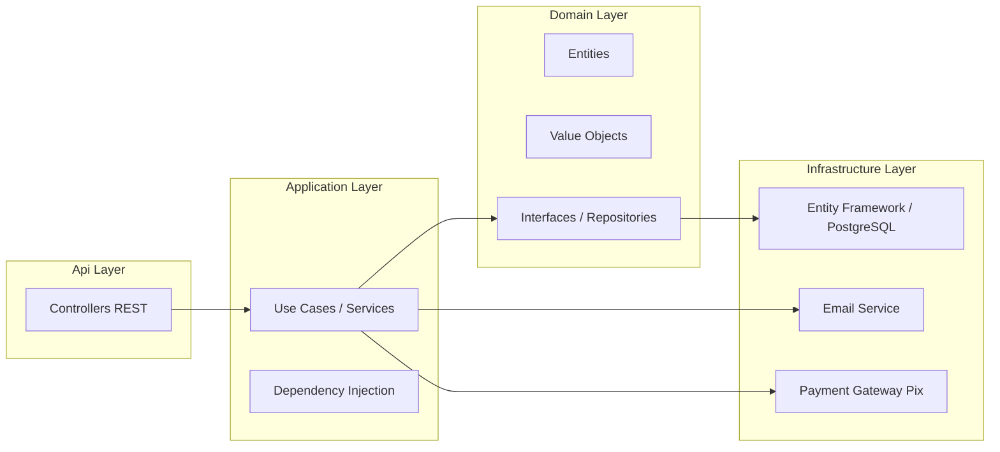
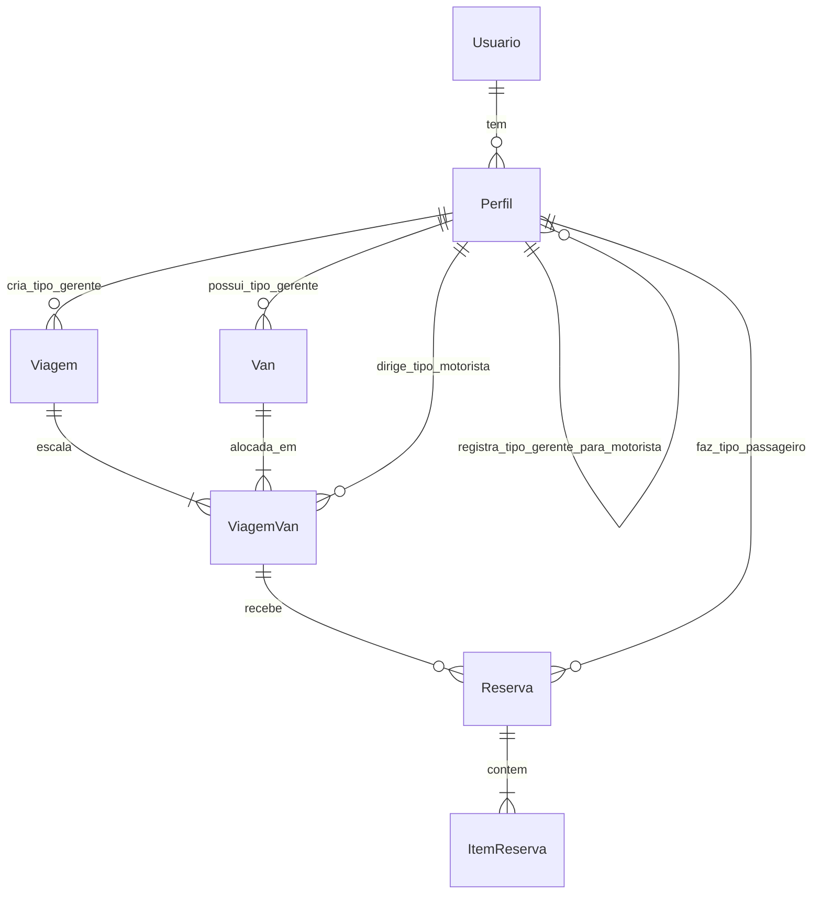
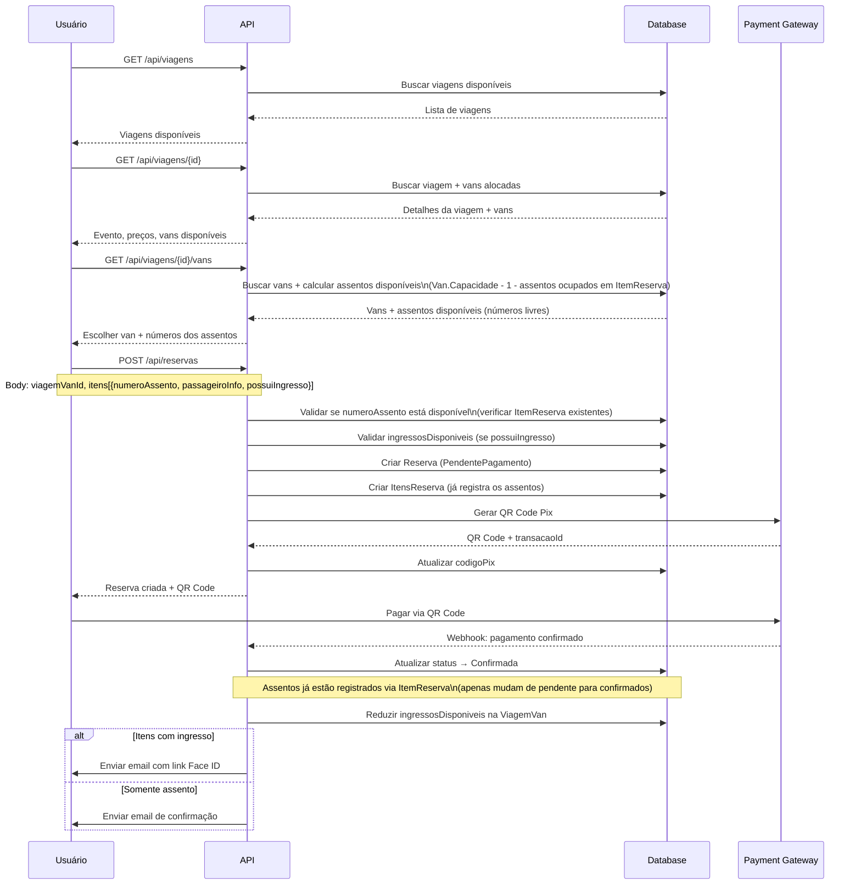
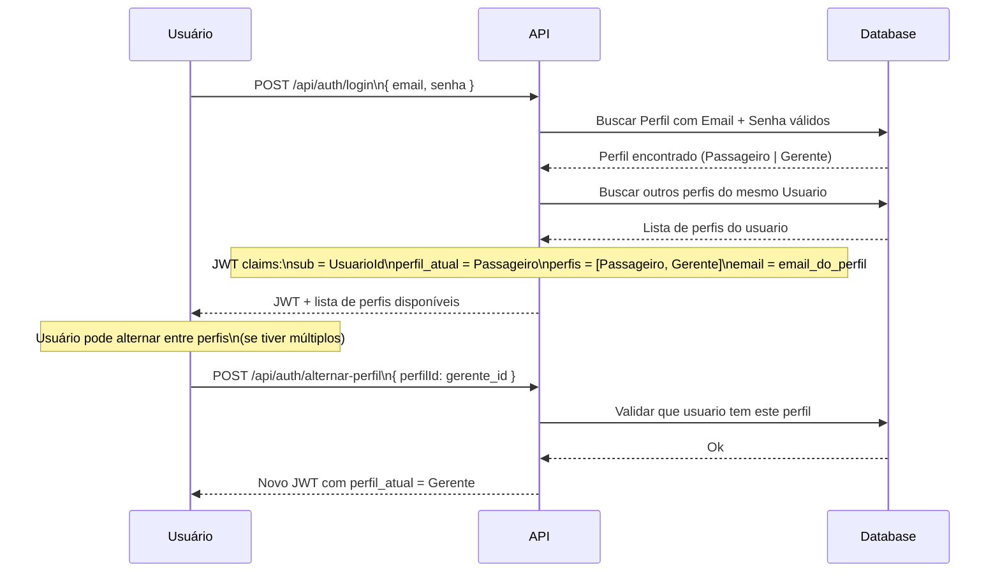

# VanBora — Plano Técnico e Arquitetura

> **Nota:** Todas as entidades e propriedades estão em português.

---

## 1. Arquitetura Geral



---

## 2. Modelo de Domínio

### 2.1. Diagrama de Entidades e Relacionamentos



> **Nota sobre Perfil auto-relacionamento:** Um Perfil do tipo Gerente "registra" Perfis do tipo Motorista. Na prática, o Perfil do Motorista possui uma FK `CriadoPorPerfilId` → Perfil.Id (Gerente).

### 2.2. Entidades de Domínio

#### Usuario (Pessoa Física — base)

| Propriedade | Tipo | Descrição |
|-------------|------|-----------|
| Id | Guid | Chave primária |
| Nome | string | Nome completo |
| CPF | CPF | Value Object — **único no sistema**, imutável após cadastro |
| CriadoEm | DateTime | Data de criação |

> Um **Usuario** representa uma **pessoa física** identificada pelo CPF. Pode ter múltiplos perfis.

#### Perfil (Papel do Usuario no sistema)

| Propriedade | Tipo | Descrição |
|-------------|------|-----------|
| Id | Guid | Chave primária |
| UsuarioId | Guid | FK → Usuario |
| Tipo | TipoPerfil | Passageiro, Gerente, Motorista, Admin |
| Email | Email | Value Object — único por Perfil, usado para login (nullable para Motorista) |
| SenhaHash | string? | Hash da senha (nullable para Motorista — não faz login) |
| Telefone | Telefone? | Value Object (nullable) |
| Ativo | bool | Se o perfil está ativo |
| CriadoPorPerfilId | Guid? | FK → Perfil (Gerente que cadastrou, apenas para Tipo=Motorista) |
| CriadoEm | DateTime | Data de criação |

**Campos específicos por Tipo:**

| Campo | Passageiro | Gerente | Motorista | Admin |
|-------|-----------|---------|-----------|-------|
| Email | ✅ (login) | ✅ (login) | ❌ | ✅ |
| SenhaHash | ✅ | ✅ | ❌ | ✅ |
| Telefone | ✅ | ✅ | ✅ | ✅ |
| Slug | ❌ | ✅ (único) | ❌ | ❌ |
| TaxaPlataforma | ❌ | ✅ (%) | ❌ | ❌ |
| Gratuito | ❌ | ✅ (bool) | ❌ | ❌ |
| CNH | ❌ | ❌ | ✅ | ❌ |

> **Nota:** Slug, TaxaPlataforma e Gratuito são propriedades específicas do Perfil Gerente. CNH é específica do Perfil Motorista.

#### Van

| Propriedade | Tipo | Descrição |
|-------------|------|-----------|
| Id | Guid | Chave primária |
| GerentePerfilId | Guid | FK → Perfil.Id (Tipo=Gerente) — dono da van |
| Nome | string | Nome/identificação |
| Placa | Placa | Value Object — formato Mercosul |
| Modelo | string | Modelo |
| Capacidade | int | Capacidade total **incluindo motorista**. Ex: 16 = 15 assentos para reserva + 1 motorista |
| Ativo | bool | Se está ativa |
| CriadoEm | DateTime | Data de criação |

#### Viagem (Trip)

| Propriedade | Tipo | Descrição |
|-------------|------|-----------|
| Id | Guid | Chave primária |
| GerentePerfilId | Guid | FK → Perfil.Id (Tipo=Gerente) |
| NomeEvento | string | Nome do evento |
| DataEvento | DateTime | Data/hora do evento |
| LocalEvento | string | Local do evento |
| DataPartida | DateTime | Data/hora de partida |
| LocalPartida | string | Local de partida |
| PrecoAssento | decimal | Preço do assento (igual para todas as vans) |
| PossuiIngresso | bool | Se oferece ingresso |
| PrecoIngresso | decimal? | Preço do ingresso (se houver) |
| Status | StatusViagem | Agendada, EmAndamento, Concluida, Cancelada |
| CriadoEm | DateTime | Data de criação |

#### ViagemVan (Junction — Van alocada na Viagem)

| Propriedade | Tipo | Descrição |
|-------------|------|-----------|
| Id | Guid | Chave primária |
| ViagemId | Guid | FK → Viagem |
| VanId | Guid | FK → Van |
| MotoristaPerfilId | Guid? | FK → Perfil.Id (Tipo=Motorista, opcional, alocado posteriormente) |
| QuantidadeIngressos | int? | Ingressos comprados pelo gerente para esta van |
| IngressosDisponiveis | int? | Ingressos ainda disponíveis nesta van |

> **Assentos Virtuais:** A capacidade de assentos é derivada diretamente de `Van.Capacidade` (ex: 16 = 15 assentos + motorista). Não existem registros previamente criados de assentos. A disponibilidade é calculada subtraindo os `ItemReserva.NumeroAssento` já registrados para aquela `ViagemVan` do total de assentos disponíveis (`Van.Capacidade - 1`). O usuário escolhe o número do assento no momento da reserva, e o sistema valida se ele já está ocupado por outro `ItemReserva`.

#### Perfil Motorista (Driver)

> O Motorista é um **Perfil** (Tipo=Motorista) vinculado a um Usuario. Não possui login. As propriedades abaixo são os dados específicos do perfil Motorista — o Nome e CPF estão no Usuario.

| Propriedade | Específica do Perfil Motorista | Descrição |
|-------------|-------------------------------|-----------|
| Telefone | Telefone? | Value Object |
| CNH | string | Número da CNH |
| Ativo | bool | Se ainda trabalha com o gerente |
| CriadoPorPerfilId | Guid | FK → Perfil.Id do Gerente que cadastrou |

#### Reserva (Reservation)

| Propriedade | Tipo | Descrição |
|-------------|------|-----------|
| Id | Guid | Chave primária |
| UsuarioId | Guid | FK → Usuario (responsável pela reserva) |
| ViagemVanId | Guid | FK → ViagemVan (van específica na viagem) |
| PerfilPassageiroId | Guid | FK → Perfil.Id (Tipo=Passageiro do responsável) |
| Status | StatusReserva | PendentePagamento, Confirmada, EmAndamento, Concluida, Cancelada, Expirada |
| ValorTotal | decimal | Valor total (soma dos itens) |
| TaxaPlataforma | decimal | Taxa calculada do VanBora |
| CodigoPix | string | Código/Imagem do QR Code Pix |
| TransacaoId | string? | ID da transação no gateway |
| PagoEm | DateTime? | Data de pagamento |
| CriadoEm | DateTime | Data de criação |
| ExpiraEm | DateTime | Data de expiração (CriadoEm + 10 minutos) |

#### ItemReserva (ReservationItem)

| Propriedade | Tipo | Descrição |
|-------------|------|-----------|
| Id | Guid | Chave primária |
| ReservaId | Guid | FK → Reserva |
| NumeroAssento | int | Número do assento escolhido pelo usuário. Ex: 1 a 15 (se Van.Capacidade = 16) |
| PossuiIngresso | bool | Se inclui ingresso |
| PrecoAssento | decimal | Preço do assento (snapshot) |
| PrecoIngresso | decimal? | Preço do ingresso (snapshot) |
| LinkIngresso | string? | Link para Face ID (enviado após pagamento) |
| NomePassageiro | string | Nome do passageiro |
| EmailPassageiro | string | Email do passageiro |
| TelefonePassageiro | string | Telefone do passageiro |
| CPFPassageiro | string | CPF do passageiro |

### 2.3. Value Objects

Value Objects no domínio, definidos em `VanBora.Domain/ValueObjects/`:

#### `Email`
| Propriedade | Tipo | Descrição |
|-------------|------|-----------|
| Valor | string | Email validado |

- Valida formato de email na criação
- Imutável: `new Email("user@example.com")`
- Comparação por valor

#### `CPF`
| Propriedade | Tipo | Descrição |
|-------------|------|-----------|
| Valor | string | CPF com 11 dígitos |

- Valida dígitos verificadores na criação
- Armazena apenas números (sem formatação)
- Imutável: `new CPF("12345678909")`

#### `Telefone`
| Propriedade | Tipo | Descrição |
|-------------|------|-----------|
| DDD | string | 2 dígitos |
| Numero | string | 8 ou 9 dígitos |
| ValorCompleto | string | Retorna "11999999999" |

- Valida DDD e quantidade de dígitos
- Imutável: `new Telefone("11", "999999999")`

#### `Placa`
| Propriedade | Tipo | Descrição |
|-------------|------|-----------|
| Valor | string | Placa formato Mercosul |

- Valida formato ABC1D23 na criação
- Imutável: `new Placa("ABC1D23")`

#### `Dinheiro`
| Propriedade | Tipo | Descrição |
|-------------|------|-----------|
| Valor | decimal | Valor monetário |
| Moeda | string | "BRL" (padrão) |

- Garante valor não negativo
- Arredondamento para 2 casas decimais
- Suporta operações: Somar, Subtrair, Multiplicar, Percentual
- Imutável: `new Dinheiro(150.00m)`

### 2.4. Enums

```csharp
public enum TipoPerfil
{
    Passageiro,
    Gerente,
    Motorista,
    Admin
}

public enum StatusViagem
{
    Agendada,
    EmAndamento,
    Concluida,
    Cancelada
}

public enum StatusReserva
{
    PendentePagamento,
    Confirmada,
    EmAndamento,
    Concluida,
    Cancelada,
    Expirada
}
```

---

## 3. Endpoints da API

### 3.1. Autenticação e Perfil

| Método | Rota | Descrição |
|--------|------|-----------|
| POST | `/api/auth/registrar` | Registrar usuario + criar Perfil Passageiro |
| POST | `/api/auth/login` | Login do passageiro (email + senha do Perfil Passageiro) |
| POST | `/api/auth/gerente/registrar` | Registrar usuario + criar Perfil Gerente (ou adicionar perfil a usuario existente) |
| POST | `/api/auth/gerente/login` | Login do gerente (email + senha do Perfil Gerente) |
| GET | `/api/auth/me` | Dados do usuario logado + lista de perfis |
| PUT | `/api/auth/usuario` | Atualizar dados do Usuario (nome) |
| PUT | `/api/auth/perfil/passageiro` | Atualizar Perfil Passageiro (email, telefone) |
| PUT | `/api/auth/perfil/gerente` | Atualizar Perfil Gerente (email, telefone, slug) |
| POST | `/api/auth/alterar-senha` | Alterar senha do perfil logado |
| POST | `/api/auth/solicitar-exclusao` | Solicitar exclusão de conta (envia código por email) |
| POST | `/api/auth/confirmar-exclusao` | Confirmar exclusão da conta com código recebido |

> **Fluxo de cadastro:**
> - `POST /api/auth/registrar` → Recebe: `{ nome, email, cpf, telefone, senha }` → Cria Usuario + Perfil Passageiro
> - `POST /api/auth/gerente/registrar` → Recebe: `{ nome, email, cpf, telefone, senha, slug }` → Busca Usuario por CPF (cria se não existir) + Cria Perfil Gerente
> - Motorista é cadastrado via endpoint de Gerente (seção 3.4)

### 3.2. Viagens — Público

| Método | Rota | Descrição |
|--------|------|-----------|
| GET | `/api/viagens` | Listar viagens disponíveis |
| GET | `/api/viagens/{id}` | Detalhes da viagem (inclui vans disponíveis) |
| GET | `/api/viagens/{id}/vans` | Listar vans alocadas na viagem com assentos disponíveis |

### 3.3. Gerente — Gestão de Vans

| Método | Rota | Descrição |
|--------|------|-----------|
| GET | `/api/gerente/vans` | Listar vans do gerente |
| POST | `/api/gerente/vans` | Criar van |
| PUT | `/api/gerente/vans/{id}` | Atualizar van |
| DELETE | `/api/gerente/vans/{id}` | Remover van |

### 3.4. Gerente — Gestão de Motoristas

| Método | Rota | Descrição |
|--------|------|-----------|
| GET | `/api/gerente/motoristas` | Listar motoristas do gerente |
| POST | `/api/gerente/motoristas` | Cadastrar motorista (busca Usuario por CPF ou cria + cria Perfil Motorista) |
| PUT | `/api/gerente/motoristas/{id}` | Atualizar dados do motorista |
| DELETE | `/api/gerente/motoristas/{id}` | Remover motorista |

> **Cadastro de Motorista:** O gerente informa CPF, Nome, Telefone, CNH. O sistema busca um Usuario existente com esse CPF. Se existir, cria Perfil Motorista vinculado a ele. Se não existir, cria um novo Usuario + Perfil Motorista. O Motorista **não tem email nem senha** — não faz login no sistema.

### 3.5. Gerente — Gestão de Viagens

| Método | Rota | Descrição |
|--------|------|-----------|
| GET | `/api/gerente/viagens` | Listar viagens do gerente |
| POST | `/api/gerente/viagens` | Criar viagem |
| PUT | `/api/gerente/viagens/{id}` | Atualizar viagem |
| DELETE | `/api/gerente/viagens/{id}` | Cancelar viagem (reembolsa todas as reservas confirmadas) |
| POST | `/api/gerente/viagens/{id}/alocar-van` | Alocar uma van na viagem |
| DELETE | `/api/gerente/viagens/{id}/remover-van/{viagemVanId}` | Remover van da viagem (reembolsa reservas confirmadas da van) |
| POST | `/api/gerente/viagens/{viagemId}/alocar-motorista/{viagemVanId}` | Alocar motorista na van da viagem |
| GET | `/api/gerente/viagens/{id}/reservas` | Ver reservas de uma viagem |
| GET | `/api/gerente/viagens/{id}/relatorio` | Relatório financeiro da viagem |

### 3.6. Reservas

| Método | Rota | Descrição |
|--------|------|-----------|
| POST | `/api/reservas` | Criar reserva (informando viagemVanId) |
| GET | `/api/reservas/{id}` | Detalhes da reserva |
| GET | `/api/reservas/minhas` | Listar reservas do usuario logado |
| POST | `/api/reservas/{id}/pagar` | Gerar QR Code Pix |
| POST | `/api/reservas/{id}/cancelar` | Cancelar reserva |

### 3.7. Admin VanBora

| Método | Rota | Descrição |
|--------|------|-----------|
| GET | `/api/admin/gerentes` | Listar gerentes |
| GET | `/api/admin/gerentes?search=termo` | Buscar gerente por nome |
| POST | `/api/admin/gerentes` | Criar gerente |
| PUT | `/api/admin/gerentes/{id}` | Atualizar gerente (taxaPlataforma, gratuito, ativo) |
| GET | `/api/admin/gerentes/{id}/reservas` | Histórico de reservas do gerente (todas as viagens) |
| GET | `/api/admin/usuarios` | Listar usuarios |
| GET | `/api/admin/usuarios?search=termo` | Buscar usuario por nome ou CPF |
| GET | `/api/admin/usuarios/{id}/reservas` | Histórico de reservas de um usuario |
| GET | `/api/admin/usuarios/{id}/perfis` | Listar perfis de um usuario |

---

## 4. Fluxo de Criação de Reserva



### 4.1. Fluxo de Login com Múltiplos Perfis



---

## 5. Estrutura de Pastas

```
VanBora.sln
├── Api/                                    # Presentation Layer
│   ├── Controllers/
│   │   ├── AuthController.cs
│   │   ├── ViagensController.cs
│   │   ├── ReservasController.cs
│   │   ├── Gerente/
│   │   │   ├── VansController.cs
│   │   │   ├── MotoristasController.cs
│   │   │   └── ViagensController.cs
│   │   └── Admin/
│   │       ├── GerentesController.cs
│   │       └── UsuariosController.cs
│   ├── Middleware/
│   └── Program.cs
│
├── VanBora.Application/
│   ├── Interfaces/
│   │   ├── IViagemService.cs
│   │   ├── IReservaService.cs
│   │   ├── IVanService.cs
│   │   ├── IMotoristaService.cs
│   │   └── IAuthService.cs
│   ├── Services/
│   ├── DTOs/                               # Request/Response DTOs
│   └── Mappings/
│
├── VanBora.Domain/
│   ├── Entities/
│   │   ├── Usuario.cs
│   │   ├── Perfil.cs
│   │   ├── Van.cs
│   │   ├── Viagem.cs
│   │   ├── ViagemVan.cs
│   │   ├── Reserva.cs
│   │   └── ItemReserva.cs
│   ├── ValueObjects/
│   │   ├── Email.cs
│   │   ├── CPF.cs
│   │   ├── Telefone.cs
│   │   ├── Placa.cs
│   │   └── Dinheiro.cs
│   ├── Enums/
│   │   ├── TipoPerfil.cs
│   │   ├── StatusViagem.cs
│   │   └── StatusReserva.cs
│   └── Interfaces/
│       ├── IUsuarioRepository.cs
│       ├── IPerfilRepository.cs
│       ├── IVanRepository.cs
│       ├── IViagemRepository.cs
│       ├── IViagemVanRepository.cs
│       ├── IReservaRepository.cs
│       └── IUnitOfWork.cs
│
└── VanBora.Infrastructure/
    ├── Data/
    │   ├── AppDbContext.cs
    │   ├── Configurations/
    │   └── Migrations/
    ├── Repositories/
    ├── Services/
    │   ├── EmailService.cs
    │   └── PagamentoService.cs
    └── Extensions/
        └── ServiceCollectionExtensions.cs
```

> **Mudanças na estrutura:**
> - Removido: `Gerente.cs`, `Motorista.cs` (substituídos por Perfil.cs com TipoPerfil)
> - Removido: `IGerenteRepository.cs`, `IMotoristaRepository.cs` (substituídos por IPerfilRepository.cs)
> - Adicionado: `Usuario.cs` (unificado), `Perfil.cs`, `TipoPerfil.cs`
> - Adicionado: `Admin/UsuariosController.cs`
> - Renomeado: `AuthService` agora lida com Perfis, não entidades separadas
>
> **Decisões de implementação:**
> - **CPF:** Todos os cadastros (Passageiro, Gerente, Motorista) reutilizam Usuario existente pelo CPF
> - **Soft delete:** Todas as exclusões são lógicas (Ativo = false), nunca exclusão física
> - **0800:** Primeiros 2 gerentes do sistema recebem gratuito = true automaticamente; Admin pode ajustar taxas individualmente via `PUT /api/admin/gerentes/{id}`
> - **Reembolso:** Automático via Pix quando gerente cancela viagem ou remove van com reservas
> - **Capacidade da van:** Imutável após criação, sem exceções

---

## 6. Pacotes NuGet

| Pacote | Projeto | Finalidade |
|--------|---------|------------|
| `Npgsql.EntityFrameworkCore.PostgreSQL` | Infrastructure | Provider PostgreSQL |
| `Microsoft.EntityFrameworkCore.Design` | Infrastructure | Migrations |
| `Microsoft.AspNetCore.Authentication.JwtBearer` | Api | JWT |
| `BCrypt.Net-Next` | Infrastructure | Hash de senhas |
| `FluentValidation` | Application | Validação de DTOs |
| `AutoMapper` | Application | Mapping de entidades |
| `Swashbuckle.AspNetCore` | Api | Swagger/OpenAPI |

---

## 7. Plano de Implementação

### Fase 1 — Setup e Domain

| # | Task | Descrição |
|---|------|-----------|
| 1.1 | Configurar projetos | Adicionar referências entre camadas, instalar pacotes NuGet |
| 1.2 | Criar Value Objects | Email, CPF, Telefone, Placa, Dinheiro (com validações) |
| 1.3 | Criar Enums | TipoPerfil, StatusViagem, StatusReserva |
| 1.4 | Criar entidades de domínio | Usuario, Perfil, Van, Viagem, ViagemVan, Reserva, ItemReserva (usando VOs) |
| 1.5 | Criar interfaces de repositório | IUsuarioRepository, IPerfilRepository, IVanRepository, IViagemRepository, IViagemVanRepository, IReservaRepository, IUnitOfWork |

### Fase 2 — Infraestrutura

| # | Task | Descrição |
|---|------|-----------|
| 2.1 | Configurar DbContext | AppDbContext com DbSets e Fluent API |
| 2.2 | Criar migrations | Primeira migration para PostgreSQL |
| 2.3 | Implementar repositórios | Implementar todas as interfaces |
| 2.4 | Implementar UnitOfWork | Gerenciamento de transações |

### Fase 3 — Application

| # | Task | Descrição |
|---|------|-----------|
| 3.1 | Criar DTOs + FluentValidation | Request/Response DTOs e validadores |
| 3.2 | Implementar AuthService | Registrar/login com Perfis, alternar perfis, JWT com claims |
| 3.3 | Implementar ViagemService | CRUD de viagens + alocação de vans |
| 3.4 | Implementar VanService | CRUD de vans |
| 3.5 | Implementar MotoristaService | CRUD de motoristas (cria Perfil Tipo=Motorista) |
| 3.6 | Implementar ReservaService | Criar reserva, validar disponibilidade, processar pagamento, enviar emails |

### Fase 4 — API

| # | Task | Descrição |
|---|------|-----------|
| 4.1 | AuthController | Endpoints de autenticação (registro, login, alternar perfil) |
| 4.2 | ViagensController | Endpoints públicos de viagens |
| 4.3 | ReservasController | CRUD de reservas |
| 4.4 | Gerente/VansController | Gestão de vans |
| 4.5 | Gerente/MotoristasController | CRUD de motoristas |
| 4.6 | Gerente/ViagensController | Gestão de viagens + alocação de vans e motoristas |
| 4.7 | Admin/GerentesController | Gestão de gerentes |
| 4.8 | Admin/UsuariosController | Gestão de usuarios (busca, histórico, perfis) |
| 4.9 | Middleware | Exception handling |

### Fase 5 — Integrações e Testes

| # | Task | Descrição |
|---|------|-----------|
| 5.1 | Integração Pix | Mock inicial do gateway de pagamento |
| 5.2 | Serviço de Email | Implementar envio de email |
| 5.3 | Webhook Pagamento | Endpoint para confirmação do gateway |
| 5.4 | Testes básicos | Testar fluxos principais via Swagger |

---

## 8. Considerações sobre Autenticação JWT

O JWT conterá as seguintes claims:

```json
{
  "sub": "guid-do-usuario",
  "email": "email-do-perfil-logado",
  "perfil_atual": "Gerente",
  "perfis": ["Passageiro", "Gerente"],
  "perfil_id": "guid-do-perfil-atual",
  "nome": "João Silva"
}
```

- O usuário faz login com email + senha de um Perfil específico
- O JWT reflete o perfil atual e lista todos os perfis disponíveis
- O endpoint `POST /api/auth/alternar-perfil` permite trocar o `perfil_atual` sem precisar fazer login novamente
- As permissões de acesso a endpoints são baseadas no `perfil_atual` claim
