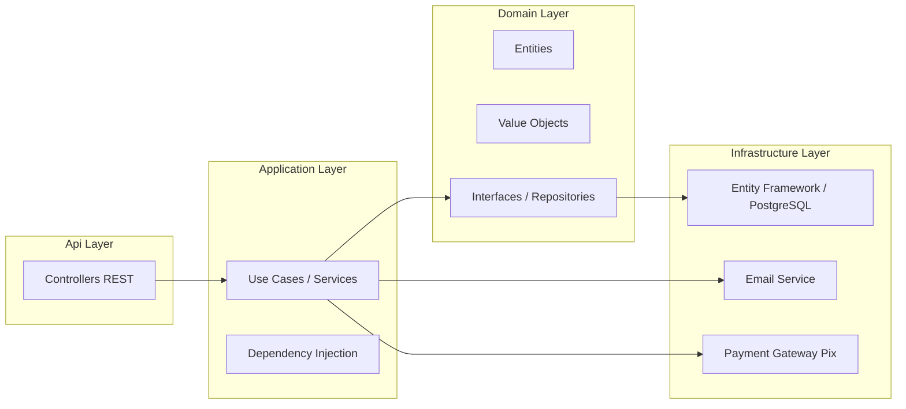
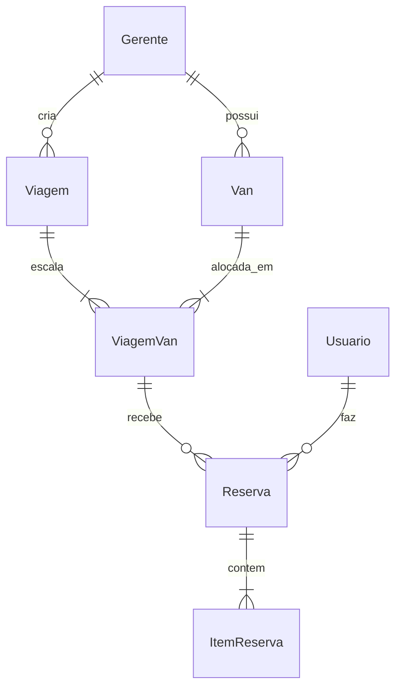
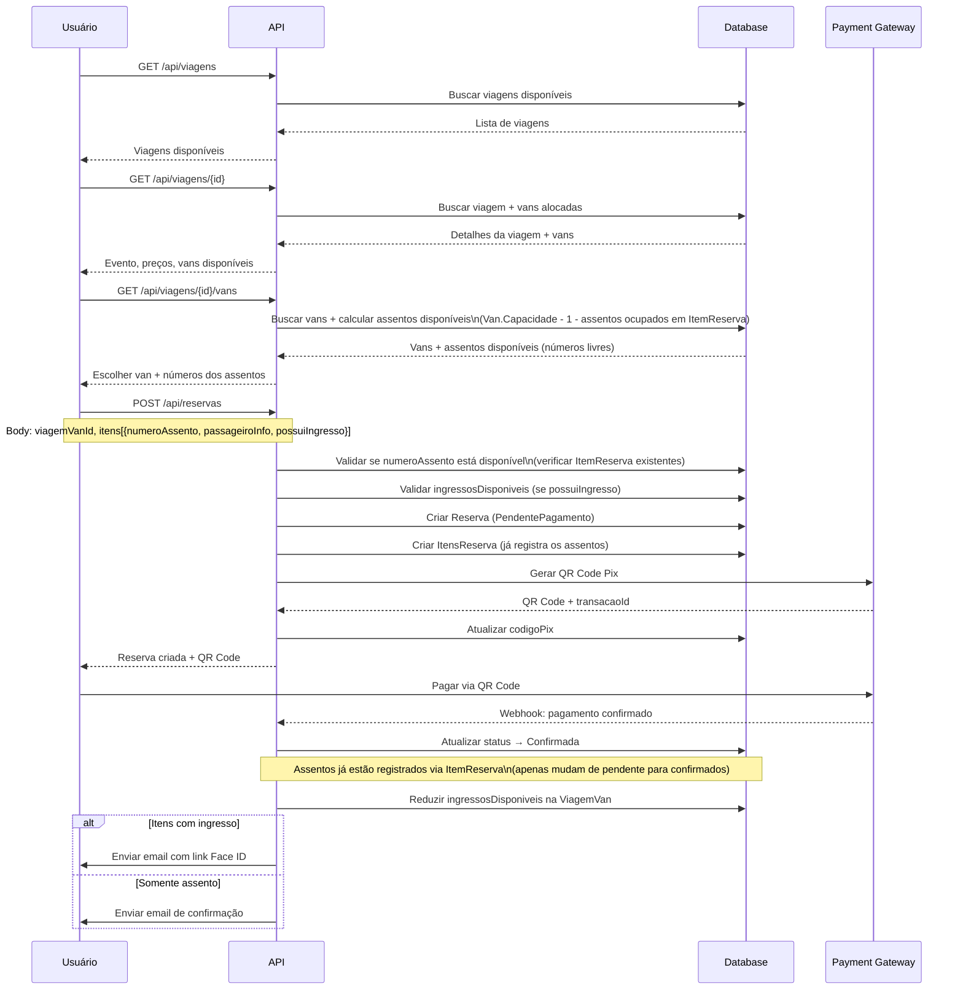

# VanBora — Plano Técnico e Arquitetura

> **Nota:** Todas as entidades e propriedades estão em português.

---

## 1. Arquitetura Geral



---

## 2. Modelo de Domínio

### 2.1. Diagrama de Entidades e Relacionamentos



### 2.2. Entidades de Domínio

#### Gerente (Van Manager)
| Propriedade | Tipo | Descrição |
|-------------|------|-----------|
| Id | Guid | Chave primária |
| Nome | string | Nome do gerente |
| Slug | string | Identificador único para URL (ex: "transp-abc") |
| Email | string | Email de login |
| Telefone | string | Telefone |
| SenhaHash | string | Hash da senha |
| Ativo | bool | Se está ativo |
| TaxaPlataforma | decimal | Taxa do VanBora (%) |
| Gratuito | bool | Se é isento de taxa (0800) |
| CriadoEm | DateTime | Data de criação |

#### Van
| Propriedade | Tipo | Descrição |
|-------------|------|-----------|
| Id | Guid | Chave primária |
| GerenteId | Guid | FK → Gerente |
| Nome | string | Nome/identificação |
| Placa | string | Placa do veículo |
| Modelo | string | Modelo |
| Capacidade | int | Capacidade total **incluindo motorista**. Ex: 16 = 15 assentos para reserva + 1 motorista |
| Ativo | bool | Se está ativa |
| CriadoEm | DateTime | Data de criação |

#### Viagem (Trip)
| Propriedade | Tipo | Descrição |
|-------------|------|-----------|
| Id | Guid | Chave primária |
| GerenteId | Guid | FK → Gerente |
| NomeEvento | string | Nome do evento |
| DataEvento | DateTime | Data/hora do evento |
| LocalEvento | string | Local do evento |
| DataPartida | DateTime | Data/hora de partida |
| LocalPartida | string | Local de partida |
| PrecoAssento | decimal | Preço do assento (igual para todas as vans) |
| PossuiIngresso | bool | Se oferece ingresso |
| PrecoIngresso | decimal? | Preço do ingresso (se houver) |
| Status | StatusViagem | Agendada, EmAndamento, Concluida, Cancelada |
| CriadoEm | DateTime | Data de criação |

#### ViagemVan (Junction — Van alocada na Viagem)
| Propriedade | Tipo | Descrição |
|-------------|------|-----------|
| Id | Guid | Chave primária |
| ViagemId | Guid | FK → Viagem |
| VanId | Guid | FK → Van |
| QuantidadeIngressos | int? | Ingressos comprados pelo gerente para esta van |
| IngressosDisponiveis | int? | Ingressos ainda disponíveis nesta van |

> **Assentos Virtuais:** A capacidade de assentos é derivada diretamente de `Van.Capacidade` (ex: 16 = 15 assentos + motorista). Não existem registros previamente criados de assentos. A disponibilidade é calculada subtraindo os `ItemReserva.NumeroAssento` já registrados para aquela `ViagemVan` do total de assentos disponíveis (`Van.Capacidade - 1`). O usuário escolhe o número do assento no momento da reserva, e o sistema valida se ele já está ocupado por outro `ItemReserva`.

#### Usuario (User)
| Propriedade | Tipo | Descrição |
|-------------|------|-----------|
| Id | Guid | Chave primária |
| Nome | string | Nome |
| Email | string | Email de login |
| Telefone | string | Telefone |
| CPF | string | CPF |
| SenhaHash | string | Hash da senha |
| CriadoEm | DateTime | Data de criação |

#### Reserva (Reservation)
| Propriedade | Tipo | Descrição |
|-------------|------|-----------|
| Id | Guid | Chave primária |
| UsuarioId | Guid | FK → Usuario (responsável) |
| ViagemVanId | Guid | FK → ViagemVan (van específica na viagem) |
| Status | StatusReserva | PendentePagamento, Confirmada, EmAndamento, Concluida, Cancelada, Expirada |
| ValorTotal | decimal | Valor total (soma dos itens) |
| TaxaPlataforma | decimal | Taxa calculada do VanBora |
| CodigoPix | string | Código/Imagem do QR Code Pix |
| TransacaoId | string? | ID da transação no gateway |
| PagoEm | DateTime? | Data de pagamento |
| CriadoEm | DateTime | Data de criação |
| ExpiraEm | DateTime | Data de expiração |

#### ItemReserva (ReservationItem)
| Propriedade | Tipo | Descrição |
|-------------|------|-----------|
| Id | Guid | Chave primária |
| ReservaId | Guid | FK → Reserva |
| NumeroAssento | int | Número do assento escolhido pelo usuário. Ex: 1 a 15 (se Van.Capacidade = 16) |
| PossuiIngresso | bool | Se inclui ingresso |
| PrecoAssento | decimal | Preço do assento (snapshot) |
| PrecoIngresso | decimal? | Preço do ingresso (snapshot) |
| LinkIngresso | string? | Link para Face ID (enviado após pagamento) |
| NomePassageiro | string | Nome do passageiro |
| EmailPassageiro | string | Email do passageiro |
| TelefonePassageiro | string | Telefone do passageiro |
| CPFPassageiro | string | CPF do passageiro |

### 2.3. Value Objects

Value Objects no domínio, definidos em `VanBora.Domain/ValueObjects/`:

#### `Email`
| Propriedade | Tipo | Descrição |
|-------------|------|-----------|
| Valor | string | Email validado |

- Valida formato de email na criação
- Imutável: `new Email("user@example.com")`
- Comparação por valor

#### `CPF`
| Propriedade | Tipo | Descrição |
|-------------|------|-----------|
| Valor | string | CPF com 11 dígitos |

- Valida dígitos verificadores na criação
- Armazena apenas números (sem formatação)
- Imutável: `new CPF("12345678909")`

#### `Telefone`
| Propriedade | Tipo | Descrição |
|-------------|------|-----------|
| DDD | string | 2 dígitos |
| Numero | string | 8 ou 9 dígitos |
| ValorCompleto | string | Retorna "11999999999" |

- Valida DDD e quantidade de dígitos
- Imutável: `new Telefone("11", "999999999")`

#### `Placa`
| Propriedade | Tipo | Descrição |
|-------------|------|-----------|
| Valor | string | Placa formato Mercosul |

- Valida formato ABC1D23 na criação
- Imutável: `new Placa("ABC1D23")`

#### `Dinheiro`
| Propriedade | Tipo | Descrição |
|-------------|------|-----------|
| Valor | decimal | Valor monetário |
| Moeda | string | "BRL" (padrão) |

- Garante valor não negativo
- Arredondamento para 2 casas decimais
- Suporta operações: Somar, Subtrair, Multiplicar, Percentual
- Imutável: `new Dinheiro(150.00m)`

### 2.4. Enums

```csharp
public enum StatusViagem
{
    Agendada,
    EmAndamento,
    Concluida,
    Cancelada
}

public enum StatusReserva
{
    PendentePagamento,
    Confirmada,
    EmAndamento,
    Concluida,
    Cancelada,
    Expirada
}
```

---

## 3. Endpoints da API

### 3.1. Autenticação

| Método | Rota | Descrição |
|--------|------|-----------|
| POST | `/api/auth/registrar` | Registrar usuário (passageiro) |
| POST | `/api/auth/login` | Login do usuário |
| POST | `/api/auth/gerente/registrar` | Registrar gerente de van |
| POST | `/api/auth/gerente/login` | Login do gerente |

### 3.2. Viagens — Público

| Método | Rota | Descrição |
|--------|------|-----------|
| GET | `/api/viagens` | Listar viagens disponíveis |
| GET | `/api/viagens/{id}` | Detalhes da viagem (inclui vans disponíveis) |
| GET | `/api/viagens/{id}/vans` | Listar vans alocadas na viagem com assentos disponíveis |

### 3.3. Gerente — Gestão de Vans

| Método | Rota | Descrição |
|--------|------|-----------|
| GET | `/api/gerente/vans` | Listar vans do gerente |
| POST | `/api/gerente/vans` | Criar van |
| PUT | `/api/gerente/vans/{id}` | Atualizar van |
| DELETE | `/api/gerente/vans/{id}` | Remover van |

### 3.4. Gerente — Gestão de Viagens

| Método | Rota | Descrição |
|--------|------|-----------|
| GET | `/api/gerente/viagens` | Listar viagens do gerente |
| POST | `/api/gerente/viagens` | Criar viagem |
| PUT | `/api/gerente/viagens/{id}` | Atualizar viagem |
| DELETE | `/api/gerente/viagens/{id}` | Cancelar viagem |
| POST | `/api/gerente/viagens/{id}/alocar-van` | Alocar uma van na viagem |
| DELETE | `/api/gerente/viagens/{id}/remover-van/{viagemVanId}` | Remover van da viagem |
| GET | `/api/gerente/viagens/{id}/reservas` | Ver reservas de uma viagem |
| GET | `/api/gerente/viagens/{id}/relatorio` | Relatório financeiro da viagem |

### 3.5. Reservas

| Método | Rota | Descrição |
|--------|------|-----------|
| POST | `/api/reservas` | Criar reserva (informando viagemVanId) |
| GET | `/api/reservas/{id}` | Detalhes da reserva |
| GET | `/api/reservas/minhas` | Listar reservas do usuário logado |
| POST | `/api/reservas/{id}/pagar` | Gerar QR Code Pix |
| POST | `/api/reservas/{id}/cancelar` | Cancelar reserva |

### 3.6. Admin VanBora

| Método | Rota | Descrição |
|--------|------|-----------|
| GET | `/api/admin/gerentes` | Listar gerentes |
| POST | `/api/admin/gerentes` | Criar gerente |
| PUT | `/api/admin/gerentes/{id}` | Atualizar gerente |
| GET | `/api/admin/gerentes/{id}/reservas` | Relatório de reservas |

---

## 4. Fluxo de Criação de Reserva



---

## 5. Estrutura de Pastas

```
VanBora.sln
├── Api/                                    # Presentation Layer
│   ├── Controllers/
│   │   ├── AuthController.cs
│   │   ├── ViagensController.cs
│   │   ├── ReservasController.cs
│   │   ├── Gerente/
│   │   │   ├── VansController.cs
│   │   │   └── ViagensController.cs
│   │   └── Admin/
│   │       └── GerentesController.cs
│   ├── Middleware/
│   └── Program.cs
│
├── VanBora.Application/
│   ├── Interfaces/
│   │   ├── IViagemService.cs
│   │   ├── IReservaService.cs
│   │   ├── IVanService.cs
│   │   └── IAuthService.cs
│   ├── Services/
│   ├── DTOs/                               # Request/Response DTOs
│   └── Mappings/
│
├── VanBora.Domain/
│   ├── Entities/
│   │   ├── Gerente.cs
│   │   ├── Van.cs
│   │   ├── Viagem.cs
│   │   ├── ViagemVan.cs
│   │   ├── Usuario.cs
│   │   ├── Reserva.cs
│   │   └── ItemReserva.cs
│   ├── ValueObjects/
│   │   ├── Email.cs
│   │   ├── CPF.cs
│   │   ├── Telefone.cs
│   │   ├── Placa.cs
│   │   └── Dinheiro.cs
│   ├── Enums/
│   │   ├── StatusViagem.cs
│   │   └── StatusReserva.cs
│   └── Interfaces/
│       ├── IGerenteRepository.cs
│       ├── IVanRepository.cs
│       ├── IViagemRepository.cs
│       ├── IViagemVanRepository.cs
│       ├── IUsuarioRepository.cs
│       ├── IReservaRepository.cs
│       └── IUnitOfWork.cs
│
└── VanBora.Infrastructure/
    ├── Data/
    │   ├── AppDbContext.cs
    │   ├── Configurations/
    │   └── Migrations/
    ├── Repositories/
    ├── Services/
    │   ├── EmailService.cs
    │   └── PagamentoService.cs
    └── Extensions/
        └── ServiceCollectionExtensions.cs
```

---

## 6. Pacotes NuGet

| Pacote | Projeto | Finalidade |
|--------|---------|------------|
| `Npgsql.EntityFrameworkCore.PostgreSQL` | Infrastructure | Provider PostgreSQL |
| `Microsoft.EntityFrameworkCore.Design` | Infrastructure | Migrations |
| `Microsoft.AspNetCore.Authentication.JwtBearer` | Api | JWT |
| `BCrypt.Net-Next` | Infrastructure | Hash de senhas |
| `FluentValidation` | Application | Validação de DTOs |
| `AutoMapper` | Application | Mapping de entidades |
| `Swashbuckle.AspNetCore` | Api | Swagger/OpenAPI |

---

## 7. Plano de Implementação

### Fase 1 — Setup e Domain

| # | Task | Descrição |
|---|------|-----------|
| 1.1 | Configurar projetos | Adicionar referências entre camadas, instalar pacotes NuGet |
| 1.2 | Criar Value Objects | Email, CPF, Telefone, Placa, Dinheiro (com validações) |
| 1.3 | Criar entidades de domínio | Gerente, Van, Viagem, ViagemVan, Usuario, Reserva, ItemReserva (usando VOs) |
| 1.4 | Criar Enums | StatusViagem, StatusReserva |
| 1.5 | Criar interfaces de repositório | IGerenteRepository, IVanRepository, IViagemRepository, IViagemVanRepository, IUsuarioRepository, IReservaRepository, IUnitOfWork |

### Fase 2 — Infraestrutura

| # | Task | Descrição |
|---|------|-----------|
| 2.1 | Configurar DbContext | AppDbContext com DbSets e Fluent API |
| 2.2 | Criar migrations | Primeira migration para PostgreSQL |
| 2.3 | Implementar repositórios | Implementar todas as interfaces |
| 2.4 | Implementar UnitOfWork | Gerenciamento de transações |

### Fase 3 — Application

| # | Task | Descrição |
|---|------|-----------|
| 3.1 | Criar DTOs + FluentValidation | Request/Response DTOs e validadores |
| 3.2 | Implementar AuthService | Registrar/login de usuários e gerentes |
| 3.3 | Implementar ViagemService | CRUD de viagens + alocação de vans |
| 3.4 | Implementar VanService | CRUD de vans |
| 3.5 | Implementar ReservaService | Criar reserva, validar disponibilidade, processar pagamento, enviar emails |

### Fase 4 — API

| # | Task | Descrição |
|---|------|-----------|
| 4.1 | AuthController | Endpoints de autenticação |
| 4.2 | ViagensController | Endpoints públicos de viagens |
| 4.3 | ReservasController | CRUD de reservas |
| 4.4 | Gerente/VansController | Gestão de vans |
| 4.5 | Gerente/ViagensController | Gestão de viagens + alocação de vans |
| 4.6 | Admin/GerentesController | Gestão de gerentes |
| 4.7 | Middleware | Exception handling |

### Fase 5 — Integrações e Testes

| # | Task | Descrição |
|---|------|-----------|
| 5.1 | Integração Pix | Mock inicial do gateway de pagamento |
| 5.2 | Serviço de Email | Implementar envio de email |
| 5.3 | Webhook Pagamento | Endpoint para confirmação do gateway |
| 5.4 | Testes básicos | Testar fluxos principais via Swagger |
